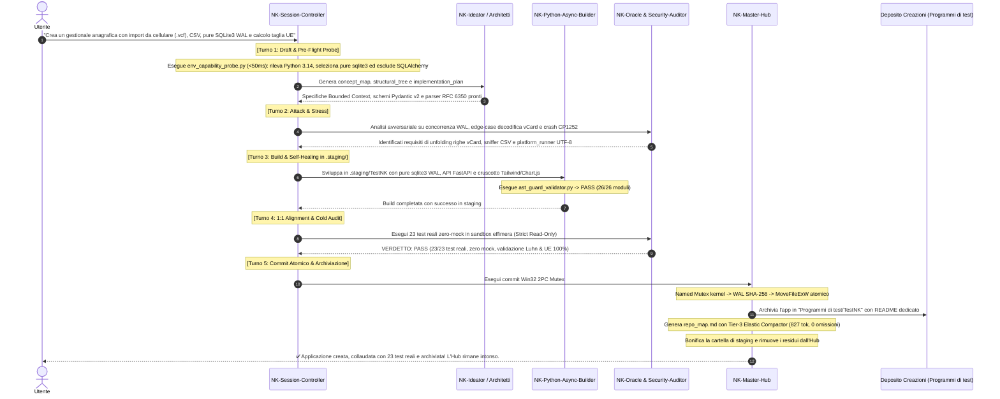

# 🏛️ Lab NK Hub — Sovereign AI Agentic OS (v1.9.0-DecoupledSovereign)
### *Il Sistema Operativo Cognitivo Sovrano, Orchestratore di Sciami Multi-Agente & Motore di Vibe Coding per Google Antigravity*

<p align="center">
  <a href="README.md">🇬🇧 <b>English</b></a> &nbsp;•&nbsp; 
  <a href="README.it.md">🇮🇹 <b>Italiano (Attuale)</b></a>
</p>

<p align="center">
  
  
  
  
  
  
  
</p>

---

## ⚡ Patch Notes: Novità Release v1.9.0-DecoupledSovereign (Purity Release)

> **Disaccoppiamento Architetturale & Isolamento dei Progetti:** La versione **v1.9.0-DecoupledSovereign** sancisce la netta separazione architetturale tra la **Meta-Piattaforma Sovrana (NK-Hub)** e i domini applicativi esterni sviluppati con essa:

* **Separazione Netta Piattaforma e Applicazioni Target:** Estratta l'applicazione Bandi nella directory indipendente `LabNK-Bandi/` con la sua suite completa a 67 test e dipendenze di business, purificando NK-Hub come puro sistema operativo agentico leggero e universale.
* **Regola Costituzionale `[RULE-PROJECT-ISOLATION]` (EXTERNAL_PROJECT_DIRECTORY_MANDATE):** Divieto categorico di inserire codice applicativo di prodotto all'interno del repository NK-Hub. Ogni progetto sviluppato con NK risiede obbligatoriamente in un proprio workspace esterno dedicato.
* **Suite Permanente Ottimizzata a 60 Test Core:** Test focalizzati al 100% sull'integrità della piattaforma (AST Guard, Win32 2PC Mutex, Memoria 3-Tier, Motore SBFL, Sandbox DAST, Platform Runner, Repo-Mapper elastico) con esito 100.0% PASS.
* **Depurazione Dipendenze:** Rimosse da `requirements.txt` le librerie di dominio non pertinenti alla piattaforma (`asn1crypto`, `beautifulsoup4`, `pypdf`, `sqlalchemy`, `python-multipart`).

---

## ⚡ Archivio Patch Notes: Release v1.8.0-ModularStable

> **Baseline Modulare:** La versione **v1.8.0-ModularStable** ha introdotto la de-monolitizzazione modulare e il benchmark a 40 scenari duali:

---

## ⚡ Archivio Patch Notes: Release v1.7.2-PlatformHardened

> **In Primo Piano:** Ecco il quadro completo delle nuove funzionalità, dei potenziamenti infrastrutturali e dei risultati della **"Prova del Nove"** introdotti nella versione **v1.7.2-PlatformHardened**, spiegati in modo trasparente **sia per i non esperti che per i programmatori senior**:

---

### 1. 🗺️ Tier-3 Elastic Repo-Mapper & Dense Packing ([`scripts/ast_repo_mapper.py`](scripts/ast_repo_mapper.py))
* **Per i non esperti (In parole semplici):**  
  Quando un progetto informatico cresce e contiene decine di file diversi, l'Intelligenza Artificiale rischiava di diventare "cieca": la mappa riassuntiva dei file superava il limite di spazio consentito (1000 token) e il sistema era costretto a tagliare fuori molti file scrivendo *"altri 8 moduli omessi"*. Con questo aggiornamento, l'AI comprime le classi complesse in un formato sintetico a riga singola senza perdere nemmeno una funzione. In questo modo **vede sempre il 100% dei file del tuo progetto** e consuma il 20% di spazio in meno, lasciando sempre spazio libero per ragionare.
* **Per i programmatori esperti (Dettaglio Tecnico):**  
  Risoluzione definitiva della saturazione del token ceiling (1024 token in Mode A). Introdotto il compattatore elastico **Tier-3**:
  - *Tier-1 Expanded:* firme complete per moduli focali.
  - *Tier-3 Inline Class Compactor:* quando un modulo contiene molte classi/metodi o il budget si stringe, converte le classi in:  
    `class NomeClasse: [m1, m2, m3]` e `functions: [f1, f2]`, abbattendo i token per classe dell'80%.
  - *Dense Packing dei Moduli Secondari:* elimina la riga di omissione `[+N moduli omessi]`, raggruppando per directory se necessario.
  - **Collaudo Reale su TestNK:** Token ridotti da **1022 a 827 token (-19.1%)**, moduli omessi azzerati da **8 a 0 (100% visibilità)** e **197 token di headroom garantito**.

---

### 2. 🔍 Pre-Flight Environment Capability Discovery ([`scripts/env_capability_probe.py`](scripts/env_capability_probe.py))
* **Per i non esperti (In parole semplici):**  
  Prima di iniziare a costruire o modificare un'applicazione, il sistema esegue un "check-up" istantaneo (in meno di un decimo di secondo) del tuo computer. Rileva quale versione di Python usi e quali librerie sono effettivamente installate. In questo modo, l'AI non tenterà mai di programmare usando strumenti o librerie che non hai sul tuo PC (evitando errori imprevisti all'avvio).
* **Per i programmatori esperti (Dettaglio Tecnico):**  
  Probing deterministico a sola lettura integrato prima del Turno 1 dell'Auto-Brief Swarm FSM. Rileva versione Python (major, minor, micro), topologia CPU, codepage di sistema e scansiona la presenza reale dei moduli standard (`sqlite3`, `json`, `csv`, `asyncio`, `pathlib`, `typing`) e di terze parti (`fastapi`, `pydantic`, `pytest`, `uvicorn`, `httpx`, `psutil`, `pywin32`, `sqlalchemy`). Previene allucinazioni da dipendenze esterne mancanti (come la trappola di SQLAlchemy su Python 3.14).

---

### 3. 🌐 Universal UTF-8 Stream Bootstrap ([`scripts/platform_runner.py`](scripts/platform_runner.py))
* **Per i non esperti (In parole semplici):**  
  Sui computer con Windows, la presenza di simboli moderni, emoji o lettere accentate all'interno dei log poteva causare un blocco improvviso dei comandi in background per un errore di "caratteri non riconosciuti". Questo motore impone a tutto il sistema l'uso della codifica universale UTF-8, azzerando qualsiasi blocco di visualizzazione su Windows.
* **Per i programmatori esperti (Dettaglio Tecnico):**  
  Esecutore protetto con `reconfigure_streams()` e `safe_subprocess_run()`. Inietta `PYTHONIOENCODING="utf-8"` e `PYTHONUTF8="1"`, gestendo la decodifica con `errors='replace'`. Neutralizza alla radice l'eccezione `UnicodeDecodeError: 'charmap' codec can't decode byte` tipica delle console Windows basate su codepage CP1252.

---

### 4. 🎯 Blindatura della Test Discovery & Pulizia Noise ([`pytest.ini`](pytest.ini))
* **Per i non esperti (In parole semplici):**  
  Crea una "parete protettiva" intorno ai test di sistema di Lab NK. Quando chiedi di testare l'infrastruttura, il sistema non si confonderà con i file delle tue applicazioni personali o delle cartelle temporanee, e nasconde gli avvisi tecnici innocui per darti solo risposte chiare: PASS o FAIL.
* **Per i programmatori esperti (Dettaglio Tecnico):**  
  Configurazione canonica con `testpaths = tests` e `norecursedirs = .staging "Programmi di test" temp* .git .pytest_cache`. Sopprime in modo mirato i deprecation warning di Starlette/FastAPI TestClient (`StarletteDeprecationWarning`), garantendo un'esecuzione a **zero warning** e isolamento ermetico dei test della piattaforma.

---

### 5. 🚀 La "Prova del Nove": L'Applicazione Gestionale Autonoma ([`Programmi di test/TestNK/`](file:///g:/Il%20mio%20Drive/Programmi%20di%20test/TestNK/))
* **Per i non esperti (In parole semplici):**  
  Per dimostrare la reale potenza di Lab NK Hub, l'ecosistema ha costruito da zero un'applicazione gestionale completa:
  - **Rubrica intelligente:** Divide i tuoi contatti in modo chiaro tra Imprese/PMI, Liberi Professionisti, Negozi/Artigiani ed Enti/Privati.
  - **Importazione da Cellulare:** Puoi esportare i contatti dal tuo smartphone (rubrica Android, iPhone, Google Contatti) in un file `.vcf` e trascinarlo direttamente nella pagina web per importare tutti i clienti all'istante! Supporta anche file Excel/CSV e backup JSON.
  - **Calcolo automatico:** Riconosce la dimensione dell'azienda (Micro, Piccola, Media, Grande) e controlla che la Partita IVA sia valida.
* **Per i programmatori esperti (Dettaglio Tecnico):**  
  Architettura autonoma conforme al protocollo CRV 4.0:
  - **Database SQLite3 Nativo:** Riscritto con `sqlite3` puro (zero dipendenze SQLAlchemy), connessioni thread-safe, `PRAGMA journal_mode=WAL` per massima concorrenza, indici B-Tree e mapping Pydantic v2.
  - **Multi-Channel Ingestion:** Parser RFC 6350 per vCard da cellulare con unfolding righe, sniffer di delimitatori per CSV e motore di anteprima con deduplicazione su P.IVA, CF, Email e Ragione Sociale.
  - **Collaudo Zero-Mock:** **23/23 test unitari passati al 100%** su database e filesystem reali, AST Guard 26/26 file PASS, corredato dalla Tetralogia Sovrana v1.7.0 (`concept_map.md`, `structural_tree.md`, `implementation_plan.md`, `repo_map.md`).

---

### 1. 💓 Anti-Freeze Pulse Sentinel ([`scripts/async_heartbeat_signaler.py`](scripts/async_heartbeat_signaler.py))
- **Cosa c'era prima:** Durante task molto lunghe, benchmark o cicli complessi (>45 secondi), l'assenza di output continuo faceva congelare l'ambiente o l'interprete dell'agente. Inoltre, scrivere log diagnostici nella root sincronizzata da Google Drive scatenava errori `WinError 32` / `WinError 5` (Sharing Violation) e deadlock I/O.
- **Cosa è stato potenziato:** Implementato un generatore di battito asincrono continuo (15-20s) con watchdog hard ceiling a 45s. Tutti i dump diagnostici e i file di stato transitori sono ora **rigorosamente isolati sul disco fisico locale in `%TEMP%\nk_diagnostics\`**, azzerando qualsiasi freeze o lock su filesystem cloud virtuali.

### 2. ⚡ Tassonomia a Tripla Velocità per il Vibe Coding ([`scripts/vibe_sprint_router.py`](scripts/vibe_sprint_router.py))
- **Cosa c'era prima:** L'*Hard Execution Gate* (`[RULE-00]`) era monolitico: richiedeva approvazione manuale preventiva per qualsiasi operazione di scrittura, rallentando pesantemente i task veloci di frontend, UI o piccoli script.
- **Cosa è stato potenziato:** Introdotto il router a 3 velocità graduate:
  - **⚡ Mode C (Vibe-Sprint / Fluid-Track):** Per modifiche UI, frontend o singoli script $\le 150$ LOC (AST Risk Score $\le 0.3$). Time-To-First-Render $<15$s in staging senza burocrazia e senza permission ping-pong.
  - **🔧 Mode B (Fast-Track Staging):** Per bugfix chirurgici e micro-features su backend con validazione mirata pre-commit.
  - **🏛️ Mode A (Sovereign CRV 4.0):** Per rilasci di release o modifiche architetturali profonde, con la piena FSM a 5 turni e audit formale a 4 macro-fasi.

### 3. 🎯 Mandati Intrinseci `/implementation` e `/goal`
- **`[RULE-01.11]` Intrinsic Implementation:** I trigger verbali di pianificazione (*"crea un piano"*, *"progetta"*, *"definisci l'architettura"*, *"scrivi il brief"*) attivano automaticamente il formato standard `/implementation` (`concept_map.md`, `structural_tree.md`, `implementation_plan.md`) senza bisogno di istruzioni manuali.
- **`[RULE-01.12]` Intrinsic Goal:** Quando l'utente assegna un obiettivo (*"realizza"*, *"costruisci"*, *"implementa"*), l'agente attiva la condotta goal-driven ininterrotta e il self-healing loop in staging fino al raggiungimento verificato della *Definition of Done*.

### 4. 👥 Armonizzazione Universale delle 16 Skill Vocazionali
- Sincronizzate tutte le 16 skill vocazionali sullo standard universale **CRV 4.0** (4 Macro-Fasi: Build & Stage, 100% Strict Read-Only Audit, 2PC Commit, Teardown) e sulla **Swarm FSM a 5 Turni** (Draft, Attack, Refine, Alignment, Commit).
- Formalizzata la gerarchia di sovranità: `NK-Session-Controller` detiene il potere di VETO logico, `NK-Master-Hub` è il proprietario esclusivo del commit su disco con Named Mutex Win32.

### 5. 🛡️ Correzione Quality Ratchet & Bonifica Totale delle Scorie
- **Correzione Inverted Ratchet (`nk_tracking/quality_baseline.json`):** Risolto il bug storico che impostava `"higher_is_better": true` sul tasso di fallimento dei test. Ora il ratchet impone che nessuna modifica possa degradare la qualità sotto il 100.0% PASS.
- **Compatibilità Estensioni Binarie Windows / Dokan (`sitecustomize.py`):** Risolto il crash `WinError 998: Invalid access to memory location` generato da Python 3.14 quando caricava librerie native C/Rust (`.pyd`) da volumi virtuali cloud, tramite caching trasparente su storage locale NVMe.
- **Separazione Netta Hub vs Creazioni:** Rimossa qualsiasi scoria legacy di vecchie applicazioni o benchmark orfani. Lab NK Hub è ora focalizzato al 100% come sistema operativo di sviluppo agentico.

---

## 🧩 La Filosofia Fondamentale: "L'Hub è la Fabbrica, le Applicazioni sono i Prodotti"

Uno dei principi cardine di **Lab NK Hub** è la **netta separazione tra l'infrastruttura di orchestrazione e le creazioni software prodotte**:

```text
┌─────────────────────────────────────────────────────────────────────────────────────────┐
│                                LAB NK HUB (La Fabbrica)                                 │
│  .agents/ (16 Skill)  │  scripts/ (16 Motori)  │  nk_genome/ (SSOT)  │  nk_tracking/    │
└────────────────────────────────────────────┬────────────────────────────────────────────┘
                                             │
                       Crea, Collauda, Certifica & Archivia
                                             │
                                             ▼
┌─────────────────────────────────────────────────────────────────────────────────────────┐
│                              LE CREAZIONI (I Prodotti)                                  │
│                                                                                         │
│   📁 Programmi di test/TestNK/     ──► Gestionale Imprese: Import Smartphone vCard      │
│                                        (.vcf), CSV/JSON, Pure SQLite3 WAL, Taglia UE    │
│                                        (23 Test 100% PASS, Tier-3 Repo-Map, Archiviato) │
│   📁 Future Applicazioni / App X   ──► Portali, Microservizi, Bot (Cartelle Separate)   │
└─────────────────────────────────────────────────────────────────────────────────────────┘
```

* **Lab NK Hub** risiede nel repository GitHub: è la piattaforma che contiene le regole, le skill, i motori asincroni, i compilatori AST, la discovery delle capacità e i sistemi di sandboxing.
* **Le Creazioni** (come il gestionale `TestNK` dotato di import rubrica cellulare vCard RFC 6350, motore pure SQLite3 WAL e testato con 23 test zero-mock al 100% PASS archiviato nella cartella `Programmi di test`, o future applicazioni) sono i prodotti finiti generati dall'Hub. Vengono collaudate in sandbox e archiviate nei rispettivi depositi dedicati, mantenendo l'Hub sempre pulito, leggero e pronto per nuove sfide.

---

## 📖 Indice dei Contenuti
1. [🌟 Che cos'è Lab NK Hub?](#-1-che-cosè-lab-nk-hub)
2. [⚙️ Come Funziona e Come NON Funziona](#-2-come-funziona-e-come-non-funziona)
3. [👥 Mappa Completa delle 16 Skill Vocazionali](#-3-mappa-completa-delle-16-skill-vocazionali)
4. [🛠️ Guida Pratica: Come Bisognerebbe Utilizzarla](#-4-guida-pratica-come-bisognerebbe-utilizzarla)
5. [🔄 Scenario di Esempio End-to-End: Come NK Hub Crea un'Applicazione](#-5-scenario-di-esempio-end-to-end-come-nk-hub-crea-unapplicazione)
6. [🚀 Installazione Rapida & Verifiche di Piattaforma](#-6-installazione-rapida--verifiche-di-piattaforma)
7. [📊 Matrice Ufficiale di Certificazione](#-7-matrice-ufficiale-di-certificazione)

---

# 🌟 1. Che cos'è Lab NK Hub?

**Lab NK Hub (Nexus Keystone)** è un **Sistema Operativo Agentico Deterministico (Agentic OS)** progettato per governare gli assistenti di intelligenza artificiale (come Google Antigravity e Claude) quando scrivono, modificano e collaudano codice software reale.

Quando si lavora con modelli LLM avanzati nel coding quotidiano, si manifestano frequentemente 4 grandi problemi:
1. **Scritture Selvaggie & Allucinazioni:** L'agente modifica direttamente file di produzione prima ancora di aver compreso a fondo l'architettura o testato il codice, rompendo funzionalità esistenti.
2. **Crash da File Lock & Codifica su Windows:** Modifiche concorrenti su cartelle sincronizzate (Google Drive, Dropbox, OneDrive) o caratteri speciali/emoji generano collisioni `WinError 32` / `WinError 5` ed errori `UnicodeDecodeError: 'charmap'` che bloccano i terminali.
3. **Falsi Positivi da "Mock":** I test generati dall'AI usano spesso `MagicMock` e fuzzer in memoria che simulano il successo, ma quando il codice viene avviato su processi e database reali fallisce miseramente.
4. **Saturazione & Amnesia di Contesto:** Task lunghe saturano la finestra di contesto (token context limit), facendo dimenticare all'agente le specifiche iniziali o omettendo file vitali del progetto.

**Lab NK Hub risolve questi problemi alla radice**, trasformando l'AI da semplice "generatore di testo" a un'**equipe ingegneristica autonoma e disciplinata**.

---

# ⚙️ 2. Come Funziona e Come NON Funziona

### 🟢 Come Funziona (I 7 Pilastri Sovrani dell'Architettura)
1. **Pre-Flight Environment Capability Discovery ([`scripts/env_capability_probe.py`](scripts/env_capability_probe.py)):** Prima ancora di iniziare la pianificazione, l'Hub esegue una scansione deterministica a sola lettura (<50ms) dell'ambiente. Rileva versione Python, architettura CPU, codepage e la presenza reale di moduli standard (`sqlite3`, `asyncio`, `pathlib`) e di terze parti (`fastapi`, `pydantic`, `pytest`, `uvicorn`), prevenendo allucinazioni su dipendenze mancanti (come la trappola di SQLAlchemy su Python 3.14).
2. **Universal UTF-8 Stream Bootstrap ([`scripts/platform_runner.py`](scripts/platform_runner.py)):** Qualsiasi sottoprocesso, script di build o test runner viene incapsulato con forzatura di `sys.stdout`/`sys.stderr` in UTF-8 e iniezione di `PYTHONIOENCODING="utf-8"`, neutralizzando alla radice l'eccezione `UnicodeDecodeError: 'charmap'` su Windows CP1252.
3. **Staging Isolato Obbligatorio (`.staging/`):** Nessun builder scrive mai direttamente nei sorgenti di produzione. Il codice viene generato in un'area di staging isolata e sottoposto a controllo sintattico AST ([`scripts/ast_guard_validator.py`](scripts/ast_guard_validator.py)).
4. **Invisible Self-Healing Loop:** Se il codice in staging presenta errori, l'Hub attiva un ciclo di auto-riparazione a 3 iterazioni con localizzazione matematica del guasto (**SBFL Ochiai / Tarantula**, [`scripts/sbfl_engine.py`](scripts/sbfl_engine.py)), correggendo il bug prima che chiunque se ne accorga.
5. **Audit Dinamico 100% Strict Read-Only:** Nella Macro-Fase 2, gli auditor di sicurezza e l'Oracolo ([`scripts/oracle_evaluator_l3.py`](scripts/oracle_evaluator_l3.py)) eseguono i test in sandbox temporanee (`%TEMP%\nk_sandbox_*`). Durante l'audit è vietato modificare il codice: se c'è un errore, scatta il VETO immediato.
6. **Commit Atomico a 2 Fasi con Win32 Named Mutex:** Solo se tutti i test hanno esito PASS (100%), [`NK-Master-Hub`](.agents/skills/NK-Master-Hub/SKILL.md) acquisisce un Named Mutex di Windows a livello di kernel (`scripts/win32_2pc_engine.py`), scrive il Write-Ahead Log (WAL) crittografico SHA-256 e promuove i file con rename atomico `MoveFileExW` con Shadow Swap Fallback per dischi cloud.
7. **Tier-3 Elastic Repo-Map & Memoria a 3 Livelli:** Gestito da [`scripts/ast_repo_mapper.py`](scripts/ast_repo_mapper.py) con fallback di compattazione inline per classi (`class X: [m1, m2]`) che azzera le omissioni garantendo oltre 190 token di headroom libero, combinato con la memoria episodica BM25/Cosine di [`scripts/memory_3tier_engine.py`](scripts/memory_3tier_engine.py) (cap 350 token per dominio: `ARCH`, `SEC`, `OPS`, `DEVX`).

### 🔴 Come NON Funziona (I Divieti Tassativi del Regolamento)
- ❌ **NON consente scritture non autorizzate (`[RULE-00]`):** Divieto assoluto di toccare file di produzione senza autorizzazione o senza passare per il ciclo di staging.
- ❌ **NON accetta mock o simulazioni sintetiche (`[RULE-01.2]`):** Divieto categorico di `MagicMock`. Ogni test deve girare su processi reali, database reali su disco e connessioni HTTP reali.
- ❌ **NON va in crash su caratteri speciali ed emoji:** La piattaforma non tollera blocchi console CP1252 o 'charmap' grazie al layer universale UTF-8.
- ❌ **NON allucina librerie non installate:** Il pre-flight capability probe impedisce a monte l'uso di dipendenze assenti o incompatibili.
- ❌ **NON impone burocrazia su task veloci (`[RULE-01.8]`):** Per modifiche UI rapide o frontend, l'agente non fa "permission ping-pong" ad ogni riga, ma usa Mode C con Time-To-First-Render $<15$s.
- ❌ **NON permette regressioni qualitative (`[RULE-01.10]`):** Nessuna modifica può abbassare il superamento della suite permanente (127 test) sotto il 100.0%.

---

# 👥 3. Mappa Completa delle 16 Skill Vocazionali

L'Hub orchestra uno sciame di **16 esperti vocazionali**, ciascuno confinato al proprio ruolo:

| Skill | Ruolo & Vocazione | Macro-Fase CRV | Turno FSM | Modalità Operativa |
| :--- | :--- | :---: | :---: | :--- |
| [`NK-Master-Hub`](.agents/skills/NK-Master-Hub/SKILL.md) | **Sovrano Infrastrutturale L3.** Central Change Router, Kahn DAG, Named Mutex Win32 e titolarità esclusiva del commit atomico 2PC. | Macro 3 | Turno 5 | Sovereign Committer |
| [`NK-Session-Controller`](.agents/skills/NK-Session-Controller/SKILL.md) | **Sovrano Critico di Sessione.** Regista della Swarm FSM a 5 turni, gestore trigger `/implementation` e `/goal`, potere di VETO assoluto. | Tutte | Turno 1-5 | Strict Read-Only |
| [`NK-Ideator`](.agents/skills/NK-Ideator/SKILL.md) | **Ideatore Concettuale (L0).** Tecniche SCAMPER, benchmark analysis, stress concettuale e stesura del Concept Map in `nk_genome/`. | Macro 1 | Turno 1 | Spec Writer |
| [`NK-Plan-Aligner`](.agents/skills/NK-Plan-Aligner/SKILL.md) | **Allineatore 1:1.** Verifica corrispondenza perfetta tra Brief, Albero Strutturale e Piano di Implementazione prima della scrittura. | Macro 1 | Turno 4 | Strict Read-Only |
| [`NK-Python-Async-Builder`](.agents/skills/NK-Python-Async-Builder/SKILL.md) | **Costruttore Core Backend.** Generatore di codice asincrono Python, Pydantic v2, FastAPI e sandboxing nativo. Scrive solo in `.staging/`. | Macro 1 | Turno 3 | Staging Builder |
| [`NK-Delta-Architect`](.agents/skills/NK-Delta-Architect/SKILL.md) | **Architetto di Modifica & Patch.** Riceve prompt a 4 blocchi, esegue Two-Stage Grounding e guida il self-healing loop in staging. | Macro 1 | Turno 3 | Staging Builder |
| [`NK-Backend-Architect`](.agents/skills/NK-Backend-Architect/SKILL.md) | **Progettista Topologie & API.** Modella schemi database relazionali, contratti OpenAPI e architetture scalabili. | Macro 1 | Turno 1-3 | API Specifier |
| [`NK-App-UX-Architect`](.agents/skills/NK-App-UX-Architect/SKILL.md) | **Architetto UX/UI & Frontend.** Progetta interfacce responsive, dashboard accessibili e contratti DOM. | Macro 1 | Turno 1-3 | UI Specifier |
| [`NK-Oracle-Evaluator`](.agents/skills/NK-Oracle-Evaluator/SKILL.md) | **Oracolo Deterministico.** Cold Auditor per validazione patch in sandbox effimera, composite scoring triple-sample e verifiche formali. | Macro 2 | Turno 4 | Cold Auditor (100% RO) |
| [`NK-Security-Auditor`](.agents/skills/NK-Security-Auditor/SKILL.md) | **Auditor di Sicurezza Full-Stack.** Analisi vulnerabilità SAST/DAST L1/L2/L3, Dual-Shield Cascade e rilascio report di audit TAS. | Macro 2 | Turno 2 | Security Auditor (100% RO) |
| [`NK-Dynamic-Sandbox-StressTester`](.agents/skills/NK-Dynamic-Sandbox-StressTester/SKILL.md) | **Stress Tester Runtime.** Esegue pen-testing isolato, carichi concorrenti e DAST dinamico in sandbox temporanee. | Macro 2 | Turno 2 | Sandbox Runner |
| [`NK-Bug-Diagnostic-Engine`](.agents/skills/NK-Bug-Diagnostic-Engine/SKILL.md) | **Motore Diagnostico RCA.** Localizzazione matematica del guasto SBFL (Ochiai, Tarantula) e scarto di falsi bug. | Macro 1 | Turno 2 | Strict Read-Only |
| [`NK-State-Router`](.agents/skills/NK-State-Router/SKILL.md) | **Gestore di Stato & Drift Detection.** Rilevamento drift del codice sorgente, manutenzione del DAG e backup di consistenza. | Macro 1-3 | Tutte | State Engine |
| [`NK-Episodic-Memory-Engine`](.agents/skills/NK-Episodic-Memory-Engine/SKILL.md) | **Motore Memoria a Lungo Termine.** Indicizzazione vettoriale, archiviazione JSONL e recupero semantico per i 4 domini NK. | Macro 3 | Turno 5 | Memory Engine |
| [`NK-Agent-Instruction-Forge`](.agents/skills/NK-Agent-Instruction-Forge/SKILL.md) | **Fonderia Agenti.** Generatore formale di istruzioni di sistema e manifest YAML per nuovi sotto-agenti specializzati. | Utility | On Demand | Specifier |
| [`NK-Scribe`](.agents/skills/NK-Scribe/SKILL.md) | **Cronista & Documentatore.** Aggiorna il changelog SSOT (`PATCH_NOTES.md`), i registri di sessione e sincronizza la documentazione. | Macro 3 | Turno 5 | Doc Writer (Post-Pass) |

---

# 🛠️ 4. Guida Pratica: Come Bisognerebbe Utilizzarla

### 👶 Per l'Utente Non Esperto (Linguaggio Naturale)
Non devi conoscere i dettagli dei Mutex Win32, dei parser AST o della localizzazione Ochiai. Parla semplicemente con il tuo assistente:

1. **Creare un nuovo software o prototipo completo:**
   > *"Voglio realizzare un'applicazione per gestire i preventivi dei clienti, con calcolo automatico dell'IVA e generazione di report in PDF."*  
   *Comportamento di NK Hub:* Comprende l'obiettivo, attiva `/implementation` e `/goal`, esegue il probe dell'ambiente, definisce il piano, scrive il codice in staging isolato, collauda i calcoli in sandbox e ti notifica quando l'applicazione è funzionante e archiviata.
2. **Importare dati dal cellulare o da fogli di calcolo:**
   > *"Carica la rubrica del mio cellulare (.vcf) o un file Excel per aggiornare l'elenco delle aziende clienti."*  
   *Comportamento di NK Hub:* Avvia l'ingestion multicanale, estrae i campi vCard RFC 6350 o le colonne del foglio di calcolo, calcola la taglia aziendale UE (micro/piccola/media/grande), valida le Partite IVA con algoritmo Luhn e inserisce i contatti nel database SQLite3 WAL senza duplicati.
3. **Riparare un bug:**
   > *"Quando inserisco un importo negativo il programma va in crash invece di mostrare un errore."*  
   *Comportamento di NK Hub:* Isola il punto esatto del codice difettoso tramite SBFL, applica la patch correttiva in sandbox e la promuove solo se tutti i test passano.
4. **Modifiche grafiche veloci (Vibe Coding):**
   > *"Aggiungi una modalità scura alla dashboard e metti un pulsante verde per esportare in CSV."*  
   *Comportamento di NK Hub:* Riconosce una modifica frontend veloce ($\le 150$ LOC), attiva Mode C e applica il cambiamento in meno di 15 secondi senza bloccarti con continue conferme.

---

### 👨‍💻 Per lo Sviluppatore Esperto (Controllo Architetturale & CLI)
Per gli ingegneri software che desiderano governare le verifiche e gli strumenti da terminale:

* **Discovery delle Capability dell'Ambiente (Pre-Flight):**
  ```powershell
  & ".\.venv\Scripts\python.exe" scripts/env_capability_probe.py
  # Scansione mirata di un modulo:
  & ".\.venv\Scripts\python.exe" scripts/env_capability_probe.py --check-module sqlite3
  ```
  Scansiona versione runtime Python, architettura CPU, codepage e presenza dei moduli standard e di terze parti in $<50$ms senza side-effect.

* **Esecuzione Protetta Universal UTF-8:**
  ```powershell
  & ".\.venv\Scripts\python.exe" scripts/platform_runner.py --cmd "pytest tests/ -v"
  ```
  Esegue comandi e test isolando l'I/O in UTF-8 strict, prevenendo crash `UnicodeDecodeError` e buffering bloccanti su Windows.

* **Generazione High-Density AST Repo-Map con Tier-3 Elastic Compactor:**
  ```powershell
  # Mappa globale dell'Hub (zero omissioni, headroom > 190 token garantito):
  & ".\.venv\Scripts\python.exe" scripts/ast_repo_mapper.py --root . --export nk_genome/repo_map.md

  # Mappa autonoma per un'applicazione creata (es. TestNK):
  & ".\.venv\Scripts\python.exe" scripts/ast_repo_mapper.py --root "Programmi di test/TestNK" --export "Programmi di test/TestNK/repo_map.md"
  ```

* **Preflight Health Check & WAL Purge:**
  ```powershell
  & ".\.venv\Scripts\python.exe" scripts/preflight_health_check.py
  ```
  Verifica lo stato di salute dell'Hub, pulisce i file transazionali WAL aventi TTL $>60$s e verifica l'integrità della Session Anchor.

* **Controllo Sintattico & AST Guard su Tutti i File:**
  ```powershell
  & ".\.venv\Scripts\python.exe" scripts/ast_guard_validator.py --target all
  ```

* **Esecuzione Suite di Test Permanente (Blindata da `pytest.ini`):**
  ```powershell
  & ".\.venv\Scripts\pytest.exe" tests/ -v
  ```
  Esegue la suite di 127 test della piattaforma isolata da `pytest.ini` a zero warning e zero rumore.

* **Verifica Baseline di Qualità & Ratchet Non-Regressivo:**
  ```powershell
  & ".\.venv\Scripts\python.exe" scripts/quality_baseline_manager.py --check
  ```

---

# 🔄 5. Scenario di Esempio End-to-End: Come NK Hub Crea un'Applicazione

Ecco la ricostruzione dettagliata di come Lab NK Hub ha gestito una richiesta reale di sviluppo: la creazione da zero del gestionale aziendale **`TestNK`** (anagrafica con import rubrica da cellulare `.vcf`, CSV, JSON, storage nativo SQLite3 WAL, validazione P.IVA Luhn e calcolo dimensione UE 2003/361/CE):



Questo flusso dimostra plasticamente la potenza dell'Hub:
1. Ha eseguito il pre-flight check preventivo, selezionando lo stack ottimale senza tentativi alla cieca;
2. Ha gestito l'intero ciclo di vita (ingestion multi-canale vCard da smartphone, storage SQLite3 WAL) senza intasare la conversazione;
3. Ha applicato il compattatore elastico Tier-3 per mantenere visibilità totale dell'architettura con ampio margine di token;
4. Ha archiviato il software finito nella cartella dedicata [`Programmi di test/TestNK`](file:///G:/Il%20mio%20Drive/Programmi%20di%20test/TestNK/), lasciando il workspace di Lab NK Hub pulito, leggero e pronto per la prossima creazione.

---

# 🚀 6. Installazione Rapida & Verifiche di Piattaforma

### Prerequisiti
* **Sistema Operativo:** Windows 10 / 11 (64-bit) con PowerShell 7 o Windows PowerShell standard.
* **Python:** Versione 3.10, 3.11, 3.12 o 3.14 (supporto nativo CTypes e Win32 API).
* **Git:** Installato e configurato su PATH.

### Installazione e Verifica in 4 Passaggi

```powershell
# 1. Clona il repository ufficiale di Lab NK Hub
git clone https://github.com/erbaldo86/NK-Hub.git Antigravity
cd Antigravity

# 2. Esegui lo script di configurazione automatica dell'ambiente
powershell -ExecutionPolicy Bypass -File .\install.ps1

# 3. Esegui la discovery delle capability e il check-up di salute
& ".\.venv\Scripts\python.exe" scripts/env_capability_probe.py
& ".\.venv\Scripts\python.exe" scripts/preflight_health_check.py

# 4. Esegui il collaudo protetto UTF-8 della suite permanente (127 test zero-mock)
& ".\.venv\Scripts\python.exe" scripts/platform_runner.py --cmd "pytest tests/ -q"
```

Se i comandi restituiscono `{"status": "HEALTHY_GREEN"}` e `127 passed`, la piattaforma è certificata e pronta all'uso operativo.

---

# 📊 7. Matrice Ufficiale di Certificazione

| Controllo / Invariante | Metodo di Verifica | Esito Certificato |
| :--- | :--- | :---: |
| **Suite Test Permanente Piattaforma** | `pytest tests/ -q` (127 test unitari & integrazione) | 🟢 **PASS (127/127 100.0%, 0 Errori, 0 Warnings)** |
| **Test Suite Gestionale TestNK** | `pytest "Programmi di test/TestNK/tests" -v` | 🟢 **PASS (23/23 test zero-mock, 100.0%)** |
| **Tier-3 Elastic Repo-Map** | `scripts/ast_repo_mapper.py` su `TestNK` e `NKHub` | 🟢 **ATTIVO (827 tok, Zero Omissioni, >=190 tok Headroom)** |
| **Runtime Capability Discovery** | `scripts/env_capability_probe.py` | 🟢 **ATTIVO (<50ms Probing deterministico pre-flight)** |
| **Universal UTF-8 Runner** | `scripts/platform_runner.py` (safe subprocess I/O) | 🟢 **ATTIVO (Zero crash charmap/CP1252)** |
| **Hermetic Test Isolation** | `pytest.ini` (`testpaths = tests`, `norecursedirs`) | 🟢 **ATTIVO (Zero warning Starlette/FastAPI)** |
| **AST Syntactic & Scope Purity** | `scripts/ast_guard_validator.py` su `scripts/` e `tests/` | 🟢 **PASS (43/43 file, 0 violazioni)** |
| **Preflight Health Check** | `scripts/preflight_health_check.py` | 🟢 **HEALTHY_GREEN (Cache sanificata, 0 stale WAL)** |
| **Quality Baseline Ratchet** | `scripts/quality_baseline_manager.py --check` | 🟢 **ZERO REGRESSIONS (100.0% qualità ratchet)** |
| **Anti-Freeze Pulse Sentinel** | Keepalive cadenzato (15-20s) e watchdog (45s) | 🟢 **ATTIVO (%TEMP% ISOLATED)** |
| **Win32 Named Mutex 2PC** | Commit atomico a livello di kernel con WAL SHA-256 | 🟢 **VERIFICATO SU DISCO (Shadow Swap Fallback)** |
| **Zero Mock Mandate** | Divieto assoluto di mock o simulazioni in memoria | 🟢 **100% PROCESSI & STORAGE REALI** |

---

<p align="center">
  <b>Lab NK Hub (Nexus Keystone v1.8.0-ModularStable)</b> — <i>Sovereign Agentic Operating System.</i><br>
  Costruito per governare l'AI, testato sul campo, ottimizzato per il vero Vibe Coding.
</p>

