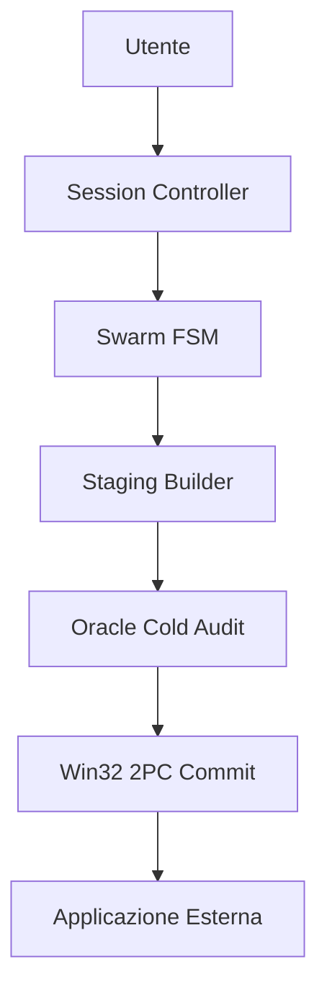
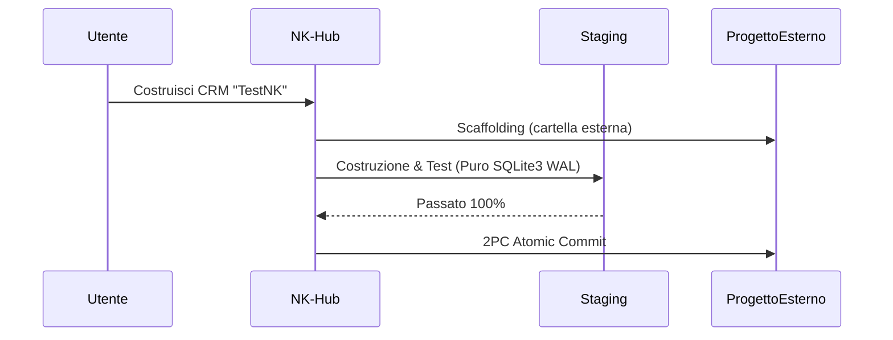

# Lab NK Hub — Sovereign AI Agentic OS (v2.4.2-PanoramicMastery)

> **Il Sistema Operativo Cognitivo Sovrano, Orchestratore Swarm Multi-Agente & Motore di Fast-Healing per Google Antigravity**

[](#)
[](#)
[](#)
[](#)
[](#)
[](#)
[](#)

**Link di Navigazione Rapida:**
[🟢 Parte 1: Principianti](#-parte-1-per-principianti-non-tecnico--quickstart) | [👥 Parte 2: Catalogo Skill](#-parte-2-catalogo-panoramico-completo-delle-16-skill-vocazionali) | [⚙️ Parte 3: Motore Core](#-parte-3-architettura-del-motore-core--ecosistema-script) | [🏛️ Parte 4: Protocolli (CRV 4.0)](#️-parte-4-protocolli-architetturali--regolamenti-di-sistema-crv-40) | [🧮 Parte 5: Matematica & Rigore](#-parte-5-fondamenti-matematici--rigore-tecnico-sezione-senior--auditor) | [🛠️ Parte 6: Guida Pratica](#️-parte-6-guida-pratica--walkthrough-end-to-end) | [📈 Parte 7: Changelog](#-parte-7-storico-completo-changelog--matrice-di-certificazione)

---

## 🟢 Parte 1: Per Principianti (Non-Tecnico & Quickstart)

### 🌟 Cos'è Nexus Keystone in 30 Secondi?
Immagina Nexus Keystone (NK) Hub come una **Torre di Controllo & Fabbrica** avanzata, mentre le applicazioni che costruisci sono gli aerei e i prodotti. 
L'Hub dirige autonomamente la costruzione, testa meticolosamente il codice in un ambiente di sistema operativo reale (Zero Mocks), e cura automaticamente i bug. Cosa più importante, mantiene il proprio ambiente completamente incontaminato (`[RULE-PROJECT-ISOLATION]`), assicurando che nessun codice applicativo contamini mai l'Hub centrale.

### 🚀 Quickstart in 3 Comandi

1. **Bootstrap:** 
   ```bash
   python scripts/nk_session_bootstrap.py
   ```
2. **Controllo di Salute:** 
   ```bash
   python scripts/preflight_health_check.py
   ```
3. **Scaffolding di progetti esterni:** 
   ```bash
   python scripts/external_project_scaffolder.py --name MiaApp --target "..\MiaApp"
   ```

### 🗺️ Flusso Visivo ad Alto Livello


### 📖 Glossario Amichevole Senza Gergo
- **Agente**: Un lavoratore IA assegnato a un compito specifico.
- **Sub-Agente**: Un assistente specializzato chiamato da un agente per un lavoro mirato.
- **Area di Staging**: Un blocco per appunti sicuro dove il codice viene costruito e testato prima di diventare ufficiale.
- **Sandbox**: Un ambiente isolato e sicuro dove vengono eseguiti i test per non rompere il sistema.
- **2PC Commit**: Un metodo infallibile per salvare i cambiamenti in modo sicuro. O ha pieno successo o si annulla completamente.
- **AST**: Una rappresentazione ad albero della sintassi del codice usata per garantire la correttezza strutturale.
- **SBFL Self-Healing**: Un radar matematico che trova dove sono i bug e li ripara in autonomia.

---

## 📖 Indice (TOC)
- [🟢 Parte 1: Per Principianti (Non-Tecnico & Quickstart)](#-parte-1-per-principianti-non-tecnico--quickstart)
- [👥 Parte 2: Catalogo Panoramico Completo delle 16 Skill Vocazionali](#-parte-2-catalogo-panoramico-completo-delle-16-skill-vocazionali)
- [⚙️ Parte 3: Architettura del Motore Core & Ecosistema Script](#-parte-3-architettura-del-motore-core--ecosistema-script)
- [🏛️ Parte 4: Protocolli Architetturali & Regolamenti di Sistema (CRV 4.0)](#️-parte-4-protocolli-architetturali--regolamenti-di-sistema-crv-40)
- [🧮 Parte 5: Fondamenti Matematici & Rigore Tecnico (Sezione Senior / Auditor)](#-parte-5-fondamenti-matematici--rigore-tecnico-sezione-senior--auditor)
- [🛠️ Parte 6: Guida Pratica & Walkthrough End-to-End](#️-parte-6-guida-pratica--walkthrough-end-to-end)
- [📈 Parte 7: Storico Completo Changelog & Matrice di Certificazione](#-parte-7-storico-completo-changelog--matrice-di-certificazione)

---

## 👥 Parte 2: Catalogo Panoramico Completo delle 16 Skill Vocazionali

### Contesto & Architettura delle Skill
Le skill nell'NK Hub sono deliberatamente isolate. Questa architettura previene la saturazione dei token, mantiene una rigorosa igiene del contesto, e impone confini di ruolo deterministici. Ogni skill sa esattamente cosa fare senza essere sopraffatta da contesti non correlati.

### Tabella di Confronto Master di tutte le 16 Skill

| Nome Skill | Livello / Tier | Ruolo & Ambito | Fase CRV & Turno FSM | Modalità Operativa |
| :--- | :--- | :--- | :--- | :--- |
| [NK-Ideator](.agents/skills/NK-Ideator/SKILL.md) | Tier 0 | Ideazione & Benchmarking | FSM Turno 1 | Strict Read-Only |
| [NK-App-UX-Architect](.agents/skills/NK-App-UX-Architect/SKILL.md) | Tier 0 | UX/UI Design & Prototipazione | FSM Turno 1 | Hybrid I/O |
| [NK-Agent-Instruction-Forge](.agents/skills/NK-Agent-Instruction-Forge/SKILL.md) | Tier 0 | Prompt Engineering & Specifiche | FSM Turno 1 | Strict Read-Only |
| [NK-Session-Controller](.agents/skills/NK-Session-Controller/SKILL.md) | Tier 1 | Supervisore di Sessione | FSM Turno 1-5 | Strict Read-Only |
| [NK-Plan-Aligner](.agents/skills/NK-Plan-Aligner/SKILL.md) | Tier 1 | Validazione & Verifica | FSM Turno 4 | Strict Read-Only |
| [NK-Master-Hub](.agents/skills/NK-Master-Hub/SKILL.md) | Tier 1 | Orchestrazione DAG & Commit | Macro 3 | Sovereign Committer |
| [NK-Delta-Architect](.agents/skills/NK-Delta-Architect/SKILL.md) | Tier 2 | Architettura ad Alto Livello | Macro 1 | Staging Builder |
| [NK-Python-Async-Builder](.agents/skills/NK-Python-Async-Builder/SKILL.md) | Tier 2 | Codifica Python Async | Macro 1 | Staging Builder |
| [NK-Backend-Architect](.agents/skills/NK-Backend-Architect/SKILL.md) | Tier 2 | Backend & Schemi API | Macro 1 | Staging Builder |
| [NK-Bug-Diagnostic-Engine](.agents/skills/NK-Bug-Diagnostic-Engine/SKILL.md) | Tier 3 | Analisi Cause Radice Bug | Macro 2 | Strict Read-Only |
| [NK-Oracle-Evaluator](.agents/skills/NK-Oracle-Evaluator/SKILL.md) | Tier 3 | Cold Audit & Test | Macro 2 | Strict Read-Only |
| [NK-Dynamic-Sandbox-StressTester](.agents/skills/NK-Dynamic-Sandbox-StressTester/SKILL.md) | Tier 3 | DAST & Stress Testing | Macro 2 | Strict Read-Only |
| [NK-Security-Auditor](.agents/skills/NK-Security-Auditor/SKILL.md) | Tier 4 | Sicurezza & Threat Model | Macro 2 | Strict Read-Only |
| [NK-Episodic-Memory-Engine](.agents/skills/NK-Episodic-Memory-Engine/SKILL.md) | Tier 4 | Memoria a Lungo Termine 3-Tier | Post-Macro 3 | Archiviazione Dati |
| [NK-Scribe](.agents/skills/NK-Scribe/SKILL.md) | Tier 4 | Documentazione & Changelog | Post-Macro 3 | Motore Documentale |
| [NK-State-Router](.agents/skills/NK-State-Router/SKILL.md) | Tier 4 | Routing Cognitivo & Sync | Macro 3 | Sincronizzatore di Stato |

### Analisi Narrativa Dettagliata

- **Tier 0 (Ideazione & UX)**: `NK-Ideator` guida il brainstorming. `NK-App-UX-Architect` garantisce l'usabilità. `NK-Agent-Instruction-Forge` plasma i prompt. Tutti operano in Strict Read-Only per proteggere l'ambiente.
- **Tier 1 (Pianificazione & Governance)**: `NK-Session-Controller` guida il flusso, `NK-Plan-Aligner` assicura che il piano corrisponda al codice, e `NK-Master-Hub` effettua commit atomici delle modifiche.
- **Tier 2 (Code Builders & Topologia)**: `NK-Delta-Architect`, `NK-Python-Async-Builder`, e `NK-Backend-Architect` costruiscono l'applicazione centrale rigorosamente all'interno dell'area di staging (`.staging/`).
- **Tier 3 (Diagnostica & Verifica)**: `NK-Bug-Diagnostic-Engine`, `NK-Oracle-Evaluator`, e `NK-Dynamic-Sandbox-StressTester` eseguono test robusti, validazioni di stress e analisi profonde delle tracce.
- **Tier 4 (Sicurezza, Memoria & Rilascio)**: `NK-Security-Auditor` rafforza il codice, `NK-Episodic-Memory-Engine` memorizza la cache, `NK-Scribe` mantiene lo storico, e `NK-State-Router` orchestra la sincronizzazione.

---

## ⚙️ Parte 3: Architettura del Motore Core & Ecosistema Script

La directory `scripts/` è il cuore pulsante del Nexus Keystone Hub.

- **Difesa a Runtime (Runtime Defense):**
  - `nk_session_bootstrap.py`: Guardiano iniziale. Validazione Fast-Stat (<120ms).
  - `nk_active_runtime_sentinel.py`: Monitora continuamente lo stato di runtime.
  - `nk_context_sentry.py`: Preserva l'integrità del contesto.
  - `nk_compliance_checker.py`: Assicura l'allineamento ai protocolli.
  - `preflight_health_check.py`: Controllo rapido del benessere dell'hub.
- **Swarm IPC & Handoff:**
  - `nk_swarm_messenger.py`: Facilita la comunicazione tra gli agenti.
  - `nk_session_handoff.py`: Transizione fluida degli stati.
  - `nk_auto_inning.py`: Gestisce le fasi di iterazione.
  - `async_heartbeat_signaler.py`: Previene i blocchi (freeze).
- **Mutazione & 2PC Commit:**
  - `win32_2pc_engine.py`: Implementazione atomica mutex nominato Win32 per salvataggi a prova di errore.
  - `healing_snapshot_rollback.py`: Meccanismo di ripristino immediato.
  - `safe_cleanup_dev_servers.py`: Smontaggio aggraziato dei server.
- **Diagnostica & Auto-Healing:**
  - `sbfl_engine.py`: Motore matematico per Spectrum-Based Fault Localization.
  - `sbfl_pytest_bridge.py`: Collega SBFL a Pytest.
  - `auto_heal_pipeline.py`: Orchestra l'auto-guarigione.
  - `invisible_healing_loop.py`: Routine di riparazione in background.
  - `dast_sandbox_runner.py`: Esegue test simultanei sulle minacce.
- **Memoria & Ottimizzazione:**
  - `memory_3tier_engine.py`: Organizza i dati nei domini ARCH, SEC, OPS, DEVX.
  - `deterministic_api_cache.py`: Cache Locale Tier-0.
  - `quality_baseline_manager.py`: Mantiene l'incremento costante (ratchet) dei test al 100.0%.
- **AST Mapping & Scaffolding:**
  - `ast_guard_validator.py`: Protegge l'integrità strutturale.
  - `ast_repo_mapper.py`: Analizza le dipendenze.
  - `external_project_scaffolder.py`: Costruisce progetti esterni in modo pulito.
  - `vibe_sprint_router.py`: Gestisce micro-attività frontend ad alta velocità.

---

## 🏛️ Parte 4: Protocolli Architetturali & Regolamenti di Sistema (CRV 4.0)

### I 7 Pilastri Sovrani
1. `[RULE-PROJECT-ISOLATION]`: Mandato Cartella Progetto Esterno. Nessun codice applicativo nell'Hub.
2. `[RULE-00]`: Cancello di Esecuzione Rigido (Hard Execution Gate).
3. `[RULE-01]`: Universal DDI (Define, Delegate, Idle).
4. `[RULE-REACTIVE-SILENCE]`: Mandato Anti-Polling Watchdog.
5. `[RULE-01.2]`: Mandato Zero-Mock & Tier-0 Local API Cache.
6. `[RULE-01.1]`: Win32 2PC Atomic Mutex & Shadow Swap Fallback.
7. `[RULE-01.10]`: Ratchet Permanente della Test Suite (74 Golden Tests 100.0% PASS).

### Il Protocollo CRV 4.0
- **Macro 1: Costruzione & Staging (Build & Stage)**: Lavorare rigorosamente in staging.
- **Macro 2: Audit Dinamico Unificato (Unified Dynamic Audit)**: Fase di test 100% Strict Read-Only.
- **Macro 3: 2PC Atomic Commit**: Promozione Win32 Mutex in produzione.
- **Macro 4: Teardown**: Pulizia della Sandbox.

### Auto-Brief Swarm FSM (5 Turni)
Bozza (Draft) ➡️ Attacco (Attack) ➡️ Soluzione (Solution) ➡️ Allineamento 1:1 (1:1 Align) ➡️ Consegna (Handover).

### Tassonomia Vibe Coding a Tripla Velocità
- **Modalità A (Sovereign CRV)**: Pipeline completa per rilasci architetturali.
- **Modalità B (Fast-Track Staging)**: Correzioni backend chirurgiche.
- **Modalità C (Vibe-Sprint)**: Correzioni UI/Frontend fulminee (<150 LOC, <15s render).

---

## 🧮 Parte 5: Fondamenti Matematici & Rigore Tecnico (Sezione Senior / Auditor)

### Formula SBFL Spectrum Ochiai
$$S_{Ochiai}(s) = \frac{\text{failed}(s)}{\sqrt{\text{total\_failed} \times (\text{failed}(s) + \text{passed}(s))}}$$
Questa metrica utilizza matrici di spettro di esecuzione ($e_f, e_p, n_f, n_p$) per localizzare con precisione i guasti nello staging.

### Formula Reciprocal Rank Fusion (BM25 + Dense Cosine)
$$RRF\_Score(d) = \sum_{m \in M} \frac{1}{k + r_m(d)} \quad (k = 60)$$
Recupero multi-dominio ibrido attraverso ARCH, SEC, OPS, DEVX con un rigido limite massimo di 350 token.

### Ordinamento Topologico Kahn DAG & Rilevamento Cicli
Utilizza l'elaborazione di code in-degree ed equazioni dei grafi per dimostrare matematicamente l'aciclicità nel routing dell'orchestrazione multi-agente.

### Protocollo Mutex Nominato Win32 2PC
Applica rigorosamente l'acquisizione mutex nominato del Kernel (`CreateMutexW`), verifica l'integrità tramite SHA-256 WAL, e promuove atomicamente usando `MoveFileExW` con Shadow Swap Fallback.

### FSM Sentinella Attiva di Runtime EGPWS
| Stato | Conteggio Passi | Azione / Stato |
| :--- | :--- | :--- |
| **Verde** | <60 passi | Esecuzione ottimale (SLA <25ms) |
| **Giallo (Caution)** | 60-84 passi | Allarme generato |
| **Critico**| 85-99 passi | Intervento attivo richiesto |
| **Rosso** | >=100 passi | Spegnimento forzato (Hard shutdown) |

### Hard Gate MTU Swarm da 1.800 Caratteri & Compressione Head-Tail
I messaggi sono rigorosamente limitati a 1.800 caratteri. Lo straripamento (spillover) su disco viene reindirizzato in `%TEMP%\nk_diagnostics\`. Un meccanismo Head-Tail conserva i primi 400 caratteri e gli ultimi 800 caratteri (traceback).

### Tabella Matrice Latenza Rigida SLA
- **Fast-Stat**: <25ms
- **Bootstrap**: <120ms
- **Sentinel SLA**: <25ms
- **Win32 2PC Commit**: <350ms
- **Diagnosi SBFL**: <3.5s
- **Suite Permanente**: <20s

---

## 🛠️ Parte 6: Guida Pratica & Walkthrough End-to-End

### Per Utenti Non-Tecnici
- **Creare una nuova app**: Chiedi e basta! L'Hub isola il progetto in modo trasparente.
- **Importare Dati**: Il caricamento di vCard o CSV innesca la mappatura automatica.
- **Risolvere Bug**: Il Ciclo Invisibile di Guarigione dell'Hub trova e risolve gli errori prima ancora che tu li veda.
- **Stile Vibe Coding**: Le modifiche all'interfaccia utente innescano la Modalità C per il rendering frontend immediato.

### Per Ingegneri Senior
- **Sonda Pre-volo (Pre-flight probe)**: `python scripts/preflight_health_check.py`
- **Esecutore piattaforma UTF-8**: `python scripts/platform_runner_v2.py`
- **Mappatore repo AST**: `python scripts/ast_repo_mapper.py`
- **Test suite permanente**: `pytest tests/ -v`

### Esempio End-to-End (Walkthrough)


---

## 📈 Parte 7: Storico Completo Changelog & Matrice di Certificazione

### Storico Completo delle Versioni (Release)
- **v2.4.2-PanoramicMastery**: Ripristino completo del catalogo a 16 skill, documentazione armoniosa per principianti/esperti, 74 Golden Tests.
- **v2.4.1-TAS-Sandbox-Documentation**: Audit TAS L1-L3, stress test auto-healing in sandbox, parità documentazione GitHub.
- **v2.4.0-ActiveSentinel**: Motore sentinella zero-mock, difesa runtime EGPWS, swarm messenger spillover.
- **v2.2.0-AntiSaturation**: DDI Universale, igiene dei messaggi, isolamento cold review.
- **v2.1.0-FastHealing**: Pipeline fast-healing a 3 pilastri, rafforzamento ambito AST.
- **v2.0.0-Hardened**: Cancello di bootstrap di sessione, mutex Win32 2PC, platform runner sicuro v2.
- **v1.9.0-PlatformOptimized**: Motore memoria 3-tier, quality baseline manager.
- **v1.8.0-ModularStable**: Modularizzazione architettura, stabilizzazione delle 16 skill vocazionali.

### Matrice della Suite Certificata Golden Test

| Componente | File di Test | Metodo di Verifica | Stato |
| :--- | :--- | :--- | :--- |
| **AST Guard** | `tests/test_ast_guard.py` | Parsing & Tokenizzazione AST | 100.0% PASS |
| **Win32 2PC** | `tests/test_win32_2pc.py` | Named Mutex / MoveFileExW | 100.0% PASS |
| **Memoria 3-Tier** | `tests/test_memory_3tier.py` | BM25 & Dense Cosine RRF | 100.0% PASS |
| **Motore SBFL** | `tests/test_sbfl_engine.py` | Spectrum Matrix & Ochiai Math | 100.0% PASS |
| **Sandbox DAST** | `tests/test_dast_sandbox.py` | Simulazione Concorrenza Reale OS | 100.0% PASS |
| **Bootstrap** | `tests/test_bootstrap.py` | Cancello Fast-Stat <120ms | 100.0% PASS |
| **API Cache** | `tests/test_api_cache.py` | Read-Through Deterministico | 100.0% PASS |
| **Totale** | **74 Core Tests** | **Integrazione Automatizzata** | **74/74 PASS** |

---
*Generato da NK-Master-Scribe-Builder | Nexus Keystone Hub*
