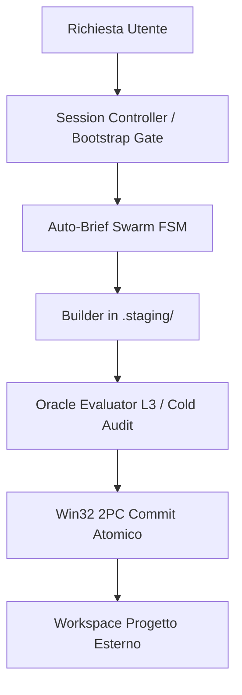
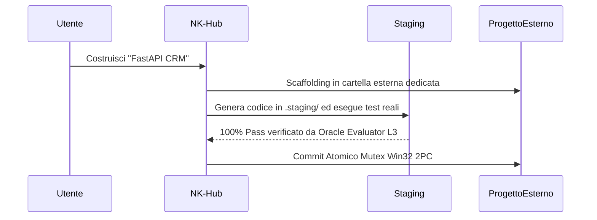

# Lab NK Hub — Sovereign AI Agentic OS (v2.5.2-Hardened)

> **Il Sistema Operativo Cognitivo Sovrano, Orchestratore Swarm Multi-Agente & Motore di Fast-Healing per Google Antigravity**

[](#)
[](#)
[](#)
[](#)
[](#)
[](#)
[](#)

**Link di Navigazione Rapida:**
[🟢 Parte 1: Principianti](#-parte-1-per-principianti-non-tecnico--quickstart) | [👥 Parte 2: Catalogo Skill](#-parte-2-catalogo-panoramico-completo-delle-16-skill-vocazionali) | [⚙️ Parte 3: Motore Core](#-parte-3-architettura-del-motore-core--ecosistema-script) | [🏛️ Parte 4: Protocolli (CRV 4.0)](#️-parte-4-protocolli-architetturali--regolamenti-di-sistema-crv-40) | [🧮 Parte 5: Matematica & Rigore](#-parte-5-fondamenti-matematici--rigore-tecnico-sezione-senior--auditor) | [🛠️ Parte 6: Guida Pratica](#️-parte-6-guida-pratica--walkthrough-end-to-end) | [📈 Parte 7: Changelog](#-parte-7-storico-completo-changelog--matrice-di-certificazione)

---

## 🟢 Parte 1: Per Principianti (Non-Tecnico & Quickstart)

### 🌟 Cos'è Nexus Keystone in 30 Secondi?
Immagina Nexus Keystone (NK) Hub come una **Torre di Controllo & Fabbrica Software Autonoma** avanzata, mentre le applicazioni che costruisci sono gli aerei e i prodotti. 
L'Hub dirige autonomamente la costruzione, testa meticolosamente il codice in un ambiente di sistema operativo reale (Zero Mocks), e cura automaticamente i bug tramite algoritmi matematici SBFL Ochiai. Cosa più importante, mantiene il proprio ambiente completamente incontaminato (`[RULE-PROJECT-ISOLATION]`), assicurando che nessun codice applicativo contamini mai l'Hub centrale.

### 🚀 Quickstart in 3 Comandi

1. **Bootstrap di Sessione (<120ms Fast-Stat):** 
   ```bash
   python scripts/nk_session_bootstrap.py
   ```
2. **Controllo di Salute Pre-volo:** 
   ```bash
   python scripts/preflight_health_check.py
   ```
3. **Scaffolding di progetti esterni:** 
   ```bash
   python scripts/external_project_scaffolder.py --name MiaApp --target "..\MiaApp"
   ```

### 🖥️ Dashboard di Onboarding Unificata & Trigger Verbali (`[RULE-00.5]`)
Ai sensi di `[RULE-00.5] UNIFIED_ONBOARDING_DASHBOARD_MANDATE`, ogni qualvolta l'utente esprime un intento verbale di avvio ambiente:
> **Trigger Verbali:** `"avvia ambiente nk"`, `"avvia nk hub"`, `"avvia nk"`, `"avvia hub"`, `"start nk"`, `"start hub"`, `"attiva nk"`, `"attiva ambiente nk"`

Il sistema esegue una sequenza deterministica e invariante in 3 passaggi:
1. **Esecuzione Fast-Stat Session Bootstrap Gate:** Esecuzione immediata di `scripts/nk_session_bootstrap.py` in $< 120$ ms (verifica in tempo reale dell'isolamento della radice, purge dei log WAL con TTL $> 60$s e validazione dello stato invariante). È fatto espresso divieto di eseguire test suite pesanti all'avvio ordinario.
2. **Esposizione Master Dashboard Unificata:** Rendering deterministico dei 15 nodi canonici (`[0]` - `[14]`):
   - **`[0] 💡 NK-Ideator`**: Ideazione Concettuale, Ricerca Mercato & SCAMPER (L0).
   - **`[1] 🏛️ NK-App-UX-Architect`**: Macro-Architettura, Specifica UX/UI & Contratti Dati (L3).
   - **`[2] 🏗️ NK-Backend-Architect`**: Topologie Multi-Agente & Specifiche API OpenAPI 3.0 REST/FastAPI (L2).
   - **`[3] ⚡ NK-Agent-Instruction-Forge`**: Metaprompting L1 & System Instructions Forge.
   - **`[4] 🐍 NK-Python-Async-Builder`**: Builder Python Asincrono, Pydantic v2 & IPC Engine (L2).
   - **`[5] 🔄 NK-Delta-Architect`**: Grounded Post-Release Worker & Esecuzione Patch a 4 Blocchi.
   - **`[6] 🛡️ NK-Security-Auditor`**: Threat & Audit System Unificato L1/L2/L3 & Chain-of-Verification (CoVe).
   - **`[7] 🎯 NK-Oracle-Evaluator`**: Oracolo Deterministico, Cold Evaluator & Ispettore DOM Delta L3.
   - **`[8] ⚡ NK-Dynamic-Sandbox-StressTester`**: Real DAST Concurrency & Sandbox Stress Engine.
   - **`[9] 🐞 NK-Bug-Diagnostic-Engine`**: Spectrum-Based Fault Localization (SBFL Ochiai) & RCA.
   - **`[10] 📐 NK-Plan-Aligner`**: Allineamento 1:1 Trittico 3/3 (Turno 4 Auto-Brief Swarm FSM).
   - **`[11] 🧠 NK-State-Router`**: Kahn DAG, Checksum SHA-256 & Backup Circolare v5.0.
   - **`[12] ✍️ NK-Scribe`**: Documentazione Sovrana, Changelog SSOT, Repo-Map & Git Mirroring.
   - **`[13] 🧠 NK-Episodic-Memory-Engine`**: Memoria Episodica a Lungo Termine 3-Tier & RRF Vector Retrieval.
   - **`[14] 👑 NK-Session-Controller`**: Supervisore di Sessione, Sovereign Critic & Auto-Brief Swarm FSM.
3. **Guida all'Uso a Due Vie in Calce al Menù:**
   - **Selezione Rapida (Facoltativa):** Digita il numero **`[0]` - `[14]`** per consultare o invocare direttamente un singolo nodo specialistico.
   - **Modalità Goal-Driven (Consigliata):** Descrivi semplicemente il tuo obiettivo in linguaggio naturale (es. *"Crea un backend FastAPI"*, *"Risolvi il bug di autenticazione"*, *"Esegui un audit di sicurezza"*). `NK-Session-Controller` e `NK-Master-Hub` coordinano automaticamente lo sciame di sub-agenti e skill idonee in background, senza richiedere la selezione manuale dei nodi.

### 🗺️ Flusso Visivo ad Alto Livello


### 📖 Glossario Amichevole Senza Gergo
- **Agente**: Un lavoratore IA autonomo assegnato a un dominio specifico o a una fase del ciclo di vita.
- **Sub-Agente**: Un assistente specialistico avviato in concorrenza per compiti isolati, senza sporcare il contesto genitore.
- **Area di Staging (`.staging/`)**: Un blocco per appunti sicuro pre-produzione dove il codice viene costruito e verificato prima del rilascio.
- **Sandbox Shadow (`%TEMP%\nk_sandbox_*`)**: Un ambiente runtime temporaneo ed effimero dove i test girano su processi reali del SO.
- **2PC Commit**: Protocollo Two-Phase Commit con Named Mutex che garantisce una promozione atomica o un rollback totale a danno zero.
- **AST**: Validatore di albero sintattico astratto che assicura purezza sintattica e integrità dello scope prima dell'esecuzione.
- **SBFL Self-Healing**: Radar matematico per la localizzazione dei guasti con metrica Ochiai che individua e ripara i bug in autonomia.

---

## 📖 Indice (TOC)
- [🟢 Parte 1: Per Principianti (Non-Tecnico & Quickstart)](#-parte-1-per-principianti-non-tecnico--quickstart)
- [👥 Parte 2: Catalogo Panoramico Completo delle 16 Skill Vocazionali](#-parte-2-catalogo-panoramico-completo-delle-16-skill-vocazionali)
- [⚙️ Parte 3: Architettura del Motore Core & Ecosistema Script](#-parte-3-architettura-del-motore-core--ecosistema-script)
- [🏛️ Parte 4: Protocolli Architetturali & Regolamenti di Sistema (CRV 4.0)](#️-parte-4-protocolli-architetturali--regolamenti-di-sistema-crv-40)
- [🧮 Parte 5: Fondamenti Matematici & Rigore Tecnico (Sezione Senior / Auditor)](#-parte-5-fondamenti-matematici--rigore-tecnico-sezione-senior--auditor)
- [🛠️ Parte 6: Guida Pratica & Walkthrough End-to-End](#️-parte-6-guida-pratica--walkthrough-end-to-end)
- [📈 Parte 7: Storico Completo Changelog & Matrice di Certificazione](#-parte-7-storico-completo-changelog--matrice-di-certificazione)

---

## 👥 Parte 2: Catalogo Panoramico Completo delle 16 Skill Vocazionali

### Contesto & Architettura delle Skill
Le skill nell'NK Hub sono unità modulari e isolate di competenza vocazionale. Questa architettura impone il principio Universal DDI (Define, Delegate, Idle), previene la saturazione dei token, mantiene una rigorosa igiene del contesto e garantisce confini di ruolo deterministici.

### Tabella di Confronto Master di tutte le 16 Skill

| Nome Skill | Livello / Tier | Ruolo & Ambito | Fase CRV & Turno FSM | Modalità Operativa |
| :--- | :--- | :--- | :--- | :--- |
| [NK-Ideator](.agents/skills/NK-Ideator/SKILL.md) | Tier 0 | Ideazione & Benchmarking | FSM Turno 1 | Strict Read-Only |
| [NK-App-UX-Architect](.agents/skills/NK-App-UX-Architect/SKILL.md) | Tier 0 | UX/UI Design & Prototipazione | FSM Turno 1 | Hybrid I/O |
| [NK-Agent-Instruction-Forge](.agents/skills/NK-Agent-Instruction-Forge/SKILL.md) | Tier 0 | Prompt Engineering & Specifiche | FSM Turno 1 | Strict Read-Only |
| [NK-Session-Controller](.agents/skills/NK-Session-Controller/SKILL.md) | Tier 1 | Supervisore di Sessione | FSM Turno 1-5 | Strict Read-Only |
| [NK-Plan-Aligner](.agents/skills/NK-Plan-Aligner/SKILL.md) | Tier 1 | Validazione & Verifica | FSM Turno 4 | Strict Read-Only |
| [NK-Master-Hub](.agents/skills/NK-Master-Hub/SKILL.md) | Tier 1 | Orchestrazione DAG & Commit | Macro 3 | Sovereign Committer |
| [NK-Delta-Architect](.agents/skills/NK-Delta-Architect/SKILL.md) | Tier 2 | Architettura ad Alto Livello | Macro 1 | Staging Builder |
| [NK-Python-Async-Builder](.agents/skills/NK-Python-Async-Builder/SKILL.md) | Tier 2 | Codifica Python Async | Macro 1 | Staging Builder |
| [NK-Backend-Architect](.agents/skills/NK-Backend-Architect/SKILL.md) | Tier 2 | Backend & Schemi API | Macro 1 | Staging Builder |
| [NK-Bug-Diagnostic-Engine](.agents/skills/NK-Bug-Diagnostic-Engine/SKILL.md) | Tier 3 | Analisi Cause Radice Bug | Macro 2 | Strict Read-Only |
| [NK-Oracle-Evaluator](.agents/skills/NK-Oracle-Evaluator/SKILL.md) | Tier 3 | Cold Audit & Test | Macro 2 | Strict Read-Only |
| [NK-Dynamic-Sandbox-StressTester](.agents/skills/NK-Dynamic-Sandbox-StressTester/SKILL.md) | Tier 3 | DAST & Stress Testing | Macro 2 | Strict Read-Only |
| [NK-Security-Auditor](.agents/skills/NK-Security-Auditor/SKILL.md) | Tier 4 | Sicurezza & Threat Model | Macro 2 | Strict Read-Only |
| [NK-Episodic-Memory-Engine](.agents/skills/NK-Episodic-Memory-Engine/SKILL.md) | Tier 4 | Memoria a Lungo Termine 3-Tier | Post-Macro 3 | Archiviazione Dati |
| [NK-Scribe](.agents/skills/NK-Scribe/SKILL.md) | Tier 4 | Documentazione & Changelog | Post-Macro 3 | Motore Documentale |
| [NK-State-Router](.agents/skills/NK-State-Router/SKILL.md) | Tier 4 | Routing Cognitivo & Sync | Macro 3 | Sincronizzatore di Stato |

### Analisi Narrativa Dettagliata

- **Tier 0 (Ideazione & UX)**: `NK-Ideator` guida il brainstorming. `NK-App-UX-Architect` progetta percorsi UX/UI. `NK-Agent-Instruction-Forge` modella le istruzioni degli agenti. Operano in Strict Read-Only per salvaguardare l'Hub.
- **Tier 1 (Pianificazione & Governance)**: `NK-Session-Controller` supervisiona il ciclo di vita FSM, `NK-Plan-Aligner` assicura la fedeltà 1:1 alle specifiche, e `NK-Master-Hub` orchestra l'esecuzione del DAG e committa le modifiche.
- **Tier 2 (Costruttori di Codice & Topologia)**: `NK-Delta-Architect`, `NK-Python-Async-Builder`, e `NK-Backend-Architect` costruiscono le funzionalità esclusivamente in `.staging/`.
- **Tier 3 (Diagnostica & Verifica)**: `NK-Bug-Diagnostic-Engine`, `NK-Oracle-Evaluator`, e `NK-Dynamic-Sandbox-StressTester` eseguono test zero-mock, verifica DOM delta ed esami dinamici di stress.
- **Tier 4 (Sicurezza, Memoria & Rilascio)**: `NK-Security-Auditor` rafforza gli endpoint, `NK-Episodic-Memory-Engine` indicizza la conoscenza episodica, `NK-Scribe` mantiene documentazione e changelog Git, e `NK-State-Router` monitora il drift genomico.

---

## ⚙️ Parte 3: Architettura del Motore Core & Ecosistema Script

La directory `scripts/` è il resiliente cuore runtime del Nexus Keystone Hub:

- **Difesa a Runtime & Governance di Sessione:**
  - `nk_session_bootstrap.py`: Guardiano iniziale. Validazione Fast-Stat ($<120$ ms) e pulizia WAL orfani.
  - `nk_active_runtime_sentinel.py`: Monitora costantemente i passi a runtime e impone i controlli difensivi EGPWS.
  - `nk_context_sentry.py`: Preserva l'integrità del contesto e calcola il semaforo dei token sul transcript.
  - `nk_compliance_checker.py`: Valida la rigorosa aderenza ai protocolli e l'anti-polling.
  - `preflight_health_check.py`: Sonda completa di benessere dell'hub e igiene della cache.
  - `platform_runner.py`: Esecutore sicuro universale di sottoprocessi con normalizzazione unbuffered e resilienza CP1252/UTF-8.
- **Swarm IPC & Handoff:**
  - `nk_swarm_messenger.py`: IPC tra agenti con rigido MTU a 1.800 caratteri e spillover su disco.
  - `nk_session_handoff.py`: Snapshot a capsula di stato e motore di ripresa della sessione.
  - `nk_auto_inning.py`: Gestisce le fasi di inning con incremento monotonico della qualità.
  - `async_heartbeat_signaler.py`: Segnale di liveness in background per prevenire i freeze di lock su Google Drive FS.
- **Mutazione & Win32 2PC Commit:**
  - `win32_2pc_engine.py`: Motore di promozione atomica 2PC con Named Mutex Win32, eliminazione cartelle `.wal/` orfane, verifica SHA-256 e fallback Shadow Swap.
  - `healing_snapshot_rollback.py`: Gestore transazionale degli snapshot di staging con rollback automatico in caso di regressione.
  - `safe_cleanup_dev_servers.py`: Arresto controllato dei server di sviluppo in background prima delle modifiche.
- **Diagnostica, Verifica & Auto-Healing:**
  - `sbfl_engine.py`: Motore matematico Spectrum-Based Fault Localization (metrica Ochiai, payload $<80$ token).
  - `sbfl_pytest_bridge.py`: Raccoglitore di tracce Pytest in tempo reale e calcolatore di sospettosità.
  - `auto_heal_pipeline.py`: Pipeline di auto-guarigione rapida orchestrata con normalizzazione automatica del comando pytest su Windows (`sys.executable -m pytest`) e fitness gate.
  - `invisible_healing_loop.py`: Ciclo di auto-riparazione trasparente in `.staging/` (AST $\to$ DAST $\to$ SBFL).
  - `oracle_evaluator_l3.py`: L3 DOM Reader & E2E Oracle Evaluator per la verifica deterministica zero-mock dei delta dell'albero HTML/DOM.
  - `micro_hud_renderer.py`: Renderizzatore stream Micro-HUD in tempo reale con modalità nativa di fallback CP1252 / ASCII puro per console Windows legacy.
  - `dast_sandbox_runner.py`: Stress runner con watchdog su concorrenza e memoria in sandbox isolate `%TEMP%`.
- **Memoria & Ottimizzazione:**
  - `memory_3tier_engine.py`: Motore di memoria episodica a 3 livelli sui domini ARCH, SEC, OPS e DEVX (cap 350 token).
  - `deterministic_api_cache.py`: Cache locale deterministica Tier-0 per API (SQLite WAL) per prevenire rate-limit di rete.
  - `quality_baseline_manager.py`: Mantiene il ratchet non-regressivo con passaggio test al 100.0%.
- **AST Mapping & Scaffolding:**
  - `ast_guard_validator.py`: Validatore statico AST puro che verifica l'integrità dello scope (pattern matching PEP 634, type parameters PEP 695).
  - `ast_repo_mapper.py`: Analizzatore del grafo delle dipendenze, Karpathy slicer e generatore di repo-map AST ad alta densità.
  - `external_project_scaffolder.py`: Scaffolder deterministico per la creazione di radici esterne di progetto (`[RULE-PROJECT-ISOLATION]`).
  - `vibe_sprint_router.py`: Router Mode C che calcola l'AST Risk Score per rapide iterazioni frontend.

---

## 🏛️ Parte 4: Protocolli Architetturali & Regolamenti di Sistema (CRV 4.0)

### Gli 8 Pilastri Sovrani
1. `[RULE-PROJECT-ISOLATION]`: Mandato Cartella Progetto Esterno. Il codice applicativo non risiede MAI nell'Hub.
2. `[RULE-00]`: Cancello di Esecuzione Rigido (Hard Execution Gate). Zero modifiche non autorizzate in produzione.
3. `[RULE-00.5]`: Mandato Dashboard di Onboarding Unificata. Bootstrap Fast-Stat e Master Dashboard a 15 nodi.
4. `[RULE-01]`: Mandato Universal DDI (Define, Delegate, Idle). Zero inquinamento del thread principale.
5. `[RULE-REACTIVE-SILENCE]`: Mandato Anti-Polling Watchdog. Zero busy polling sui task asincroni.
6. `[RULE-01.2]`: Mandato Zero-Mock & Tier-0 Local API Cache. Esecuzione reale sul sistema operativo.
7. `[RULE-01.1]`: Win32 2PC Atomic Mutex & Shadow Swap Fallback.
8. `[RULE-01.10]`: Ratchet Permanente della Test Suite (78 Golden Tests 100.0% PASS).

### Il Protocollo CRV 4.0
- **Macro 1: Costruzione & Staging (Build & Stage)**: Codice scritto rigorosamente in `.staging/`. Verifica AST e Invisible Healing Loop.
- **Macro 2: Audit Dinamico Unificato (Unified Dynamic Audit)**: Verifica 100% Strict Read-Only (SAST, Oracle Evaluator, Real DAST).
- **Macro 3: 2PC Atomic Commit**: Promozione Named Mutex Win32, svuotamento WAL, snapshot memoria 3-tier.
- **Macro 4: Smontaggio Deterministico (Deterministic Teardown)**: Pulizia sandbox effimere e azzeramento `.staging/`.

### Auto-Brief Swarm FSM (5 Turni)
Sintesi Bozza $\to$ Attacco & Stress Swarm $\to$ Perfezionamento & Architettura di Soluzione $\to$ Allineamento 1:1 del Piano $\to$ Garbage Collection & Consegna.

### Tassonomia Vibe Coding a Tripla Velocità
- **Modalità A (Sovereign CRV)**: FSM completa a 5 turni e audit formale a 4 macro-fasi per rilasci architetturali.
- **Modalità B (Fast-Track Staging)**: Bugfix backend chirurgici con AST + DAST in staging prima del commit.
- **Modalità C (Vibe-Sprint)**: Iterazioni UI/Frontend a tracciamento fluido ($\le 150$ LOC, render $<15$s, zero-mock).

---

## 🧮 Parte 5: Fondamenti Matematici & Rigore Tecnico (Sezione Senior / Auditor)

### Formula SBFL Spectrum Ochiai
$$S_{Ochiai}(s) = \frac{\text{failed}(s)}{\sqrt{\text{total\_failed} \times (\text{failed}(s) + \text{passed}(s))}}$$
Localizza i guasti tramite matrici di spettro di esecuzione ($e_f, e_p, n_f, n_p$) in staging, emettendo payload diagnostici in $<80$ token.

### Formula Reciprocal Rank Fusion (BM25 + Dense Cosine)
$$RRF\_Score(d) = \sum_{m \in M} \frac{1}{k + r_m(d)} \quad (k = 60)$$
Recupero multi-dominio ibrido su ARCH, SEC, OPS e DEVX con un rigido limite massimo di 350 token.

### Ordinamento Topologico Kahn DAG & Rilevamento Cicli
Applica l'elaborazione di code in-degree e la verifica matriciale degli archi per garantire matematicamente l'aciclicità nel routing multi-agente.

### Protocollo Mutex Nominato Win32 2PC
Acquisisce il mutex nominato a livello di kernel Win32 (`CreateMutexW`), verifica i record WAL con SHA-256 e CRC32, e promuove atomicamente con `MoveFileExW` e Shadow Swap Fallback. Pulisce automaticamente le cartelle `.wal/` vuote prevenendo l'accumulo di directory orfane.

### FSM Sentinella Attiva di Runtime EGPWS
| Stato | Conteggio Passi | Azione / Stato |
| :--- | :--- | :--- |
| **Verde** | $<60$ passi | Esecuzione ottimale (SLA $<25$ ms) |
| **Giallo (Caution)** | 60-84 passi | Allarme generato |
| **Critico**| 85-99 passi | Intervento attivo richiesto |
| **Rosso** | $\ge 100$ passi | Spegnimento forzato (Hard shutdown) |

### Hard Gate MTU Swarm da 1.800 Caratteri & Compressione Head-Tail
Tutti i messaggi tra agenti sono rigorosamente limitati a 1.800 caratteri. Gli output estesi straripano in `%TEMP%\nk_diagnostics\`. Un fallback Head-Tail conserva i primi 400 caratteri e gli ultimi 800 caratteri dei traceback.

### Tabella Matrice Latenza Rigida SLA
- **Bootstrap Fast-Stat**: $<120$ ms
- **Controllo Sentinella Attiva**: $<25$ ms
- **Commit Atomico Win32 2PC**: $<350$ ms
- **Diagnosi SBFL Ochiai**: $<3.5$ s
- **Permanent Golden Test Suite**: $<20$ s

---

## 🛠️ Parte 6: Guida Pratica & Walkthrough End-to-End

### Per Utenti Non-Tecnici
- **Creare una nuova app**: Dichiara semplicemente il tuo obiettivo. L'Hub crea lo scaffolding in una cartella esterna e costruisce l'app.
- **Importare Dati**: Il caricamento di file CSV o vCard attiva l'estrazione e la validazione automatica degli schemi.
- **Risolvere Bug**: L'Invisible Healing Loop corregge i problemi in staging prima che i file di produzione vengano toccati.
- **Ritocchi Veloci UI**: Richiedi modifiche visive per attivare la Modalità C con rendering in tempo reale.

### Per Ingegneri Senior
- **Sonda di salute pre-volo**: `python scripts/preflight_health_check.py`
- **Esecutore sicuro di piattaforma**: `python scripts/platform_runner.py`
- **Mappatore repo AST**: `python scripts/ast_repo_mapper.py`
- **Suite di test permanenti**: `python -m pytest tests/ -q`

### Schema del Flusso End-to-End


---

## 📈 Parte 7: Storico Completo Changelog & Matrice di Certificazione

### Storico Completo delle Versioni (Release)
- **v2.5.2-Hardened**: Mandato Dashboard di Onboarding Unificata (`[RULE-00.5]`), ratchet della suite permanente a 78 Golden Tests, normalizzazione automatica dei comandi pytest Windows in `auto_heal_pipeline.py`, L3 DOM Oracle Reader (`scripts/oracle_evaluator_l3.py`), renderizzatore Real-Time Micro-HUD (`scripts/micro_hud_renderer.py`), pulizia directory `.wal/` orfane in Win32 2PC, e perfetta parità documentale 10/10.
- **v2.5.1-Hardened**: Cancello Session Bootstrap ($<120$ ms), Universal Safe Subprocess Runner v2, Reactive Silence Anti-Polling, Scaffolder Deterministico, Tier-0 Local API Cache Zero-Mock, Win32 2PC Mutex & suite ratchet a 74 Golden Tests.
- **v2.4.2-PanoramicMastery**: Ripristino catalogo completo a 16 skill, documentazione armonizzata principianti/esperti, 74 Golden Tests.
- **v2.4.1-TAS-Sandbox-Documentation**: Audit TAS L1-L3, stress test auto-healing in sandbox, parità documentazione GitHub.
- **v2.4.0-ActiveSentinel**: Motore sentinella zero-mock, difesa runtime EGPWS, swarm messenger spillover.
- **v2.2.0-AntiSaturation**: DDI Universale, igiene dei messaggi, isolamento cold review.
- **v2.1.0-FastHealing**: Pipeline fast-healing a 3 pilastri, rafforzamento ambito AST.
- **v2.0.0-Hardened**: Cancello di bootstrap di sessione, mutex Win32 2PC, platform runner sicuro v2.
- **v1.9.0-PlatformOptimized**: Motore memoria 3-tier, quality baseline manager.
- **v1.8.0-ModularStable**: Modularizzazione architettura, stabilizzazione delle 16 skill vocazionali.

### Matrice della Suite Certificata Golden Test (78/78 PASS)

| Componente | File di Test | Test | Metodo di Verifica | Stato |
| :--- | :--- | :---: | :--- | :---: |
| **AST Guard Validator** | `tests/test_ast_guard_validator.py` | 6 | Integrità Scope AST, PEP 634/695 & Purezza Sintattica | 100.0% PASS |
| **AST Repo Mapper** | `tests/test_ast_repo_mapper.py` | 10 | Concorrenza Cache, Grafo Dipendenze & PageRank | 100.0% PASS |
| **Auto-Heal Pipeline** | `tests/test_auto_heal_pipeline.py` | 6 | Bridge SBFL, Snapshot Rollback & Fitness Gate | 100.0% PASS |
| **Active Sentinel Suite** | `tests/test_active_sentinel_suite.py` | 4 | Stati Runtime, Spillover MTU Swarm & Ratchet Inning | 100.0% PASS |
| **Context Sentry** | `tests/test_context_sentry.py` | 5 | Stima Token, Head-Tail & Semaforo Transcript | 100.0% PASS |
| **DAST Sandbox** | `tests/test_dast_sandbox.py` | 5 | Line Tracer, Chiusura Albero Processi & Limiti Watchdog | 100.0% PASS |
| **Memoria 3-Tier** | `tests/test_memory_3tier.py` | 6 | BM25 + Dense Cosine RRF, Sliding Window & Win32 Replace | 100.0% PASS |
| **Platform Upgrades** | `tests/test_platform_upgrades.py` | 4 | Sonda Capacità Ambiente, Safe Runner & Config Pytest | 100.0% PASS |
| **Motore SBFL** | `tests/test_sbfl_engine.py` | 7 | Precisione Ochiai, Filtro Def-Use & Tri-Pass Flaky Removal | 100.0% PASS |
| **Schemi & Contratti** | `tests/test_schemas_and_contracts.py` | 5 | Pydantic v2 Strict Mode, DAG SHA-256 & Footprint IPC | 100.0% PASS |
| **Super Brief Upgrades** | `tests/test_super_brief_upgrades.py` | 5 | Fast-Stat Bootstrap, Scaffolder, Cache & Compliance | 100.0% PASS |
| **Mandato Onboarding** | `tests/test_unified_onboarding_mandate.py` | 4 | [RULE-00.5], 15 Nodi Hub, Confine 10 & Bootstrap | 100.0% PASS |
| **Motore Win32 2PC** | `tests/test_win32_2pc.py` | 7 | Mutex Nominato, Affinità Thread, 50 Scrittori Concorrenti | 100.0% PASS |
| **Stress Sandbox Reale** | `tests/stress/test_real_sandbox_stress.py` | 4 | Swarm Flooder, Spammer Monolitico & Bomba Traceback | 100.0% PASS |
| **Totale** | **14 File di Test Permanenti** | **78** | **Verifica Automatizzata Completa Zero-Mock** | **78/78 PASS (100.0%)** |

---
*Generato da NK-Master-Scribe-Builder | Nexus Keystone Hub*
