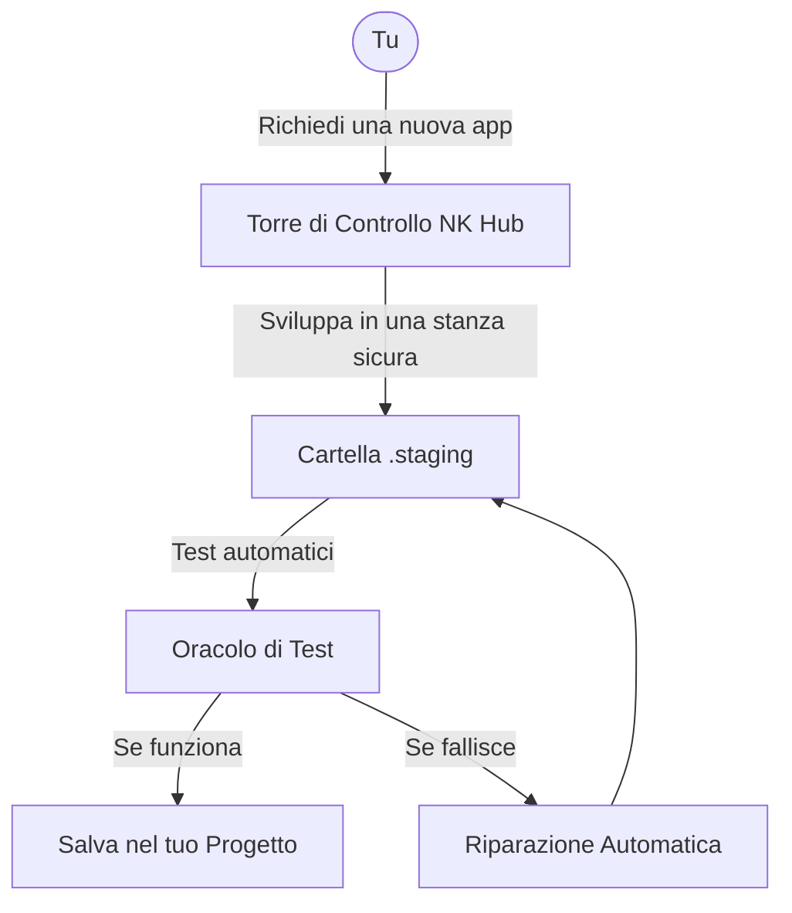

# 🏛️ Lab NK Hub — Sovereign AI Agentic OS (v2.4.0-ActiveSentinel)
### *Il Sistema Operativo Cognitivo Sovrano, Orchestratore di Sciami Multi-Agente & Motore di Vibe Coding per Google Antigravity*

<p align="center">
  <a href="README.md">🇬🇧 <b>English</b></a> &nbsp;•&nbsp; 
  <a href="README.it.md">🇮🇹 <b>Italiano (Attuale)</b></a>
</p>

<p align="center">
  
  
  
  
  
  
  
</p>

---

## 🟢 Parte 1: Per i Principianti (Sezione Non-Esperto)

### 🌟 Cos'è Nexus Keystone in 30 Secondi?
Immagina **Nexus Keystone (NK Hub)** come una **"Torre di Controllo per Agenti AI"**. 
Quando chiedi a un'AI (come Google Antigravity) di scrivere del codice, a volte può confondersi, cancellare file importanti o scrivere codice che si rompe su un vero computer. NK Hub agisce da supervisore: offre all'AI uno spazio sicuro dove lavorare, controlla tutto il codice automaticamente prima di salvarlo e si assicura che l'AI non rompa nulla. Tu devi solo dire cosa vuoi costruire, e la Torre di Controllo coordina in sicurezza gli agenti AI per portare a termine il lavoro!

### 🚀 Guida Rapida in 3 Comandi
Vuoi avviare un nuovo progetto in totale sicurezza? Esegui questi 3 comandi nel tuo terminale:

```powershell
# 1. Esegui il bootstrap della piattaforma (Avvia la Torre di Controllo)
& ".\.venv\Scripts\python.exe" scripts/nk_session_bootstrap.py

# 2. Controlla la salute del sistema (Verifica che sia tutto sicuro)
& ".\.venv\Scripts\python.exe" scripts/preflight_health_check.py

# 3. Inizializza un nuovo progetto vuoto all'esterno dell'Hub
& ".\.venv\Scripts\python.exe" scripts/external_project_scaffolder.py --name MioNuovoProgetto
```

### 🗺️ Architettura Visuale
Ecco una spiegazione ad alto livello di come funziona la Torre di Controllo:


### 📖 Glossario Amichevole
- **Agente:** Un lavoratore AI che scrive o controlla il codice.
- **Staging:** Un "recinto di sabbia" (sandbox) sicuro dove l'AI si esercita a scrivere codice senza rompere il tuo progetto reale.
- **Zero-Mock:** Test veri! Non facciamo finta che il codice funzioni; lo eseguiamo davvero.

---

## 🔴 Parte 2: Per Ingegneri Senior (Sezione Esperto)

### 🧮 Specifiche Matematiche & Algoritmi Core
Lab NK Hub è basato su fondamenta matematiche e deterministiche rigorose:

* **Localizzazione Guasti SBFL Ochiai:** 
  Per l'autoriparazione, usiamo la metrica di localizzazione fault spectrum-based di Ochiai per isolare le righe difettose con un budget di 80 token:
  $$Ochiai(s) = \frac{failed(s)}{\sqrt{total\_failed \times (failed(s) + passed(s))}}$$

* **Memoria Episodica 3-Tier & RRF:**
  La ricerca vettoriale nei domini `ARCH`, `SEC`, `OPS` e `DEVX` usa la Reciprocal Rank Fusion delle similarità BM25 e Dense Cosine:
  $$RRF\_Score(d) = \sum_{r \in R} \frac{1}{k + r(d)}$$ 
  *(con $k=60$)*.

* **Dipendenza Topologica (Kahn DAG):**
  Usa l'algoritmo di Kahn per Directed Acyclic Graphs (DAG) Topological Sorting e rilevamento cicli per l'instradamento delle modifiche architetturali.

* **Commit a Due Fasi Win32 (2PC):**
  I commit atomici sono gestiti tramite un oggetto kernel `Named Mutex`, controlli pre-flight hash CRC-32/SHA-256 e rigoroso rollback WAL (Write-Ahead Log) in caso di errore.

### 🛡️ Protocollo EGPWS Active Runtime Sentinel
L'Enhanced Ground Proximity Warning System per l'esecuzione degli sciami con latenza SLA $< 25$ ms.

| Stato | Condizione | Azione Intrapresa | SLA / Vincolo |
| :--- | :--- | :--- | :--- |
| **🟢 Verde** | Operazione nominale, CPU/RAM normali | Monitoraggio passivo | Overhead $< 25$ ms |
| **🟡 Attenzione** | Picco anomalo RAM o I/O wait | Log warning, limitazione task asincroni | $< 25$ ms |
| **🟠 Critico** | Rischio saturazione token o thread lock | Svuota memoria episodica, pausa non critici | $< 25$ ms |
| **🔴 Rosso** | Violazione regole o rottura sandbox | **VETO / Hard Terminate Subprocess** | Morte Istantanea |

### 🛰️ Swarm MTU & Zero-Amnesia Handoff
- **Swarm MTU Hard Gate:** La Maximum Transmission Unit per la comunicazione inter-agente `send_message` è rigidamente bloccata a **1.800 caratteri** (~450 token) per prevenire inondazioni di contesto.
- **Capsula Handoff Zero-Amnesia:** I trasferimenti di contesto tra agenti L3/L2 sono compressi via algoritmi Head-Tail sotto un tetto rigoroso di **800 token**.

### ⚡ Matrice SLA Latenza
Contratti di latenza rigida imposti nell'ecosistema:
- **Verifica Fast-stat:** $< 25$ ms
- **Session Bootstrap:** $< 120$ ms
- **Esecuzione Golden Suite:** 70 test Pytest in $< 25$ s

### 📈 Changelog Completo delle Versioni
- **v2.4.0-ActiveSentinel:** Integrazione del Sentinel EGPWS, Swarm MTU Hard Gate (1.800 car), e Matrice SLA. Ratchet elevato a 70 Golden Tests.
- **v2.3.0:** Introdotto Topological Sorting Kahn DAG ed estensioni Tier-3 Elastic Compactor.
- **v2.2.0:** Implementata Memoria Episodica 3-Tier con RRF (BM25 + Cosine, $k=60$).
- **v2.1.0:** Fast-Healing loop integrato con formula SBFL Ochiai.
- **v2.0.0:** Integrazione Win32 2PC Named Mutex e Hardened Zero-Mock compliance.

### 📊 Matrice Ufficiale di Certificazione
| Controllo Audit / Invariante | Metodo di Verifica | Esito Certificato |
| :--- | :--- | :---: |
| **Suite Test Permanente Piattaforma** | `pytest tests/ -q` (70 Golden Tests) | 🟢 **PASS (70/70 100.0%, 0 Errori)** |
| **Gating Swarm MTU** | Intercettore `send_message` | 🟢 **ATTIVO (Strict < 1.800 car)** |
| **Win32 Named Mutex 2PC** | Commit atomico livello kernel con WAL SHA-256 | 🟢 **VERIFICATO SU DISCO** |
| **EGPWS Latenza SLA** | Benchmark Sentinel Probe | 🟢 **PASS (< 25 ms)** |

---

<p align="center">
  <b>Lab NK Hub (Nexus Keystone v2.4.0-ActiveSentinel)</b> — <i>Sovereign Agentic Operating System.</i><br>
  Costruito per governare l'AI, collaudato sotto pressione, ottimizzato per il vero Vibe Coding.
</p>
