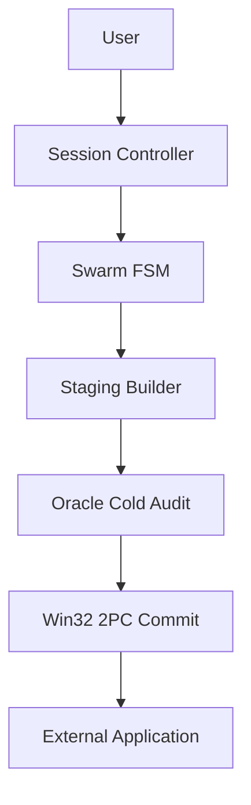
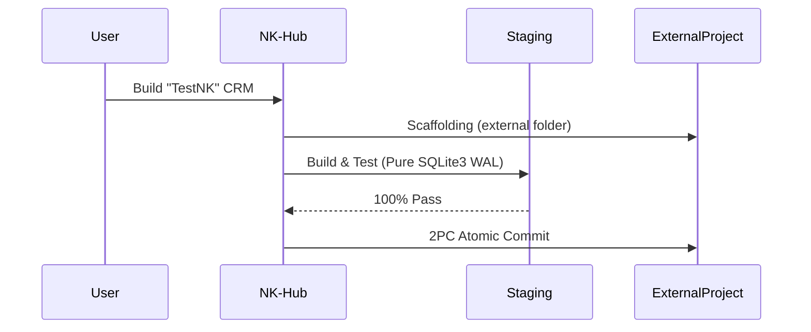

# Lab NK Hub — Sovereign AI Agentic OS (v2.4.2-PanoramicMastery)

> **The Sovereign Cognitive Operating System, Multi-Agent Swarm Orchestrator & Fast-Healing Engine for Google Antigravity**

[](#)
[](#)
[](#)
[](#)
[](#)
[](#)
[](#)

**Quick Jump Navigation:**
[🟢 Part 1: Beginners](#-part-1-for-beginners-non-technical--quickstart) | [👥 Part 2: Skills Catalog](#-part-2-complete-panoramic-catalog-of-the-16-vocational-skills) | [⚙️ Part 3: Core Engine](#-part-3-core-engine-architecture--scripts-ecosystem) | [🏛️ Part 4: Protocols (CRV 4.0)](#️-part-4-architectural-protocols--system-regulations-crv-40) | [🧮 Part 5: Math & Rigor](#-part-5-mathematical-foundations--technical-rigor-senior--auditor-section) | [🛠️ Part 6: Practical Guide](#️-part-6-practical-guide--end-to-end-walkthrough) | [📈 Part 7: Changelog](#-part-7-full-changelog-history--certification-matrix)

---

## 🟢 Part 1: For Beginners (Non-Technical & Quickstart)

### 🌟 What is Nexus Keystone in 30 Seconds?
Imagine Nexus Keystone (NK) Hub as an advanced **Control Tower & Factory**, while the applications you build are the airplanes and products. 
The Hub autonomously directs construction, thoroughly tests the code in a real operating system environment (Zero Mocks), and automatically heals bugs. Most importantly, it keeps its own environment completely pristine (`[RULE-PROJECT-ISOLATION]`), ensuring no application code ever contaminates the core Hub.

### 🚀 Quickstart in 3 Commands

1. **Bootstrap:** 
   ```bash
   python scripts/nk_session_bootstrap.py
   ```
2. **Health check:** 
   ```bash
   python scripts/preflight_health_check.py
   ```
3. **External project scaffolding:** 
   ```bash
   python scripts/external_project_scaffolder.py --name MyApp --target "..\MyApp"
   ```

### 🗺️ High-Level Visual Flow


### 📖 Friendly Zero-Jargon Glossary
- **Agent**: An AI worker assigned to a specific task.
- **Sub-Agent**: A specialized assistant called upon by an agent for a focused job.
- **Staging Area**: A safe scratchpad where code is built and tested before becoming official.
- **Sandbox**: An isolated, secure environment where tests are run so they don't break the system.
- **2PC Commit**: A foolproof method for saving changes safely. It either fully succeeds or entirely rolls back.
- **AST**: A tree representation of code syntax used to ensure structural correctness.
- **SBFL Self-Healing**: A mathematical radar that finds where bugs are and fixes them autonomously.

---

## 📖 Table of Contents (TOC)
- [🟢 Part 1: For Beginners (Non-Technical & Quickstart)](#-part-1-for-beginners-non-technical--quickstart)
- [👥 Part 2: Complete Panoramic Catalog of the 16 Vocational Skills](#-part-2-complete-panoramic-catalog-of-the-16-vocational-skills)
- [⚙️ Part 3: Core Engine Architecture & Scripts Ecosystem](#-part-3-core-engine-architecture--scripts-ecosystem)
- [🏛️ Part 4: Architectural Protocols & System Regulations (CRV 4.0)](#️-part-4-architectural-protocols--system-regulations-crv-40)
- [🧮 Part 5: Mathematical Foundations & Technical Rigor (Senior / Auditor Section)](#-part-5-mathematical-foundations--technical-rigor-senior--auditor-section)
- [🛠️ Part 6: Practical Guide & End-to-End Walkthrough](#️-part-6-practical-guide--end-to-end-walkthrough)
- [📈 Part 7: Full Changelog History & Certification Matrix](#-part-7-full-changelog-history--certification-matrix)

---

## 👥 Part 2: Complete Panoramic Catalog of the 16 Vocational Skills

### Context & Architecture of Skills
Skills in NK Hub are deliberately isolated. This architecture prevents token saturation, maintains strict context hygiene, and enforces deterministic role boundaries. Each skill knows precisely what to do without being overwhelmed by unrelated context.

### Master Comparison Table of all 16 Skills

| Skill Name | Tier / Layer | Role & Scope | CRV Phase & FSM Turn | Operational Mode |
| :--- | :--- | :--- | :--- | :--- |
| [NK-Ideator](.agents/skills/NK-Ideator/SKILL.md) | Tier 0 | Ideation & Benchmarking | FSM Turn 1 | Strict Read-Only |
| [NK-App-UX-Architect](.agents/skills/NK-App-UX-Architect/SKILL.md) | Tier 0 | UX/UI Design & Prototyping | FSM Turn 1 | Hybrid I/O |
| [NK-Agent-Instruction-Forge](.agents/skills/NK-Agent-Instruction-Forge/SKILL.md) | Tier 0 | Prompt Engineering & Spec | FSM Turn 1 | Strict Read-Only |
| [NK-Session-Controller](.agents/skills/NK-Session-Controller/SKILL.md) | Tier 1 | Session Supervisor | FSM Turn 1-5 | Strict Read-Only |
| [NK-Plan-Aligner](.agents/skills/NK-Plan-Aligner/SKILL.md) | Tier 1 | Validation & Verification | FSM Turn 4 | Strict Read-Only |
| [NK-Master-Hub](.agents/skills/NK-Master-Hub/SKILL.md) | Tier 1 | DAG Orchestration & Commit | Macro 3 | Sovereign Committer |
| [NK-Delta-Architect](.agents/skills/NK-Delta-Architect/SKILL.md) | Tier 2 | High-Level Architecture | Macro 1 | Staging Builder |
| [NK-Python-Async-Builder](.agents/skills/NK-Python-Async-Builder/SKILL.md) | Tier 2 | Python Async Coding | Macro 1 | Staging Builder |
| [NK-Backend-Architect](.agents/skills/NK-Backend-Architect/SKILL.md) | Tier 2 | Backend & API Schema | Macro 1 | Staging Builder |
| [NK-Bug-Diagnostic-Engine](.agents/skills/NK-Bug-Diagnostic-Engine/SKILL.md) | Tier 3 | Bug Root Cause Analysis | Macro 2 | Strict Read-Only |
| [NK-Oracle-Evaluator](.agents/skills/NK-Oracle-Evaluator/SKILL.md) | Tier 3 | Cold Audit & Testing | Macro 2 | Strict Read-Only |
| [NK-Dynamic-Sandbox-StressTester](.agents/skills/NK-Dynamic-Sandbox-StressTester/SKILL.md) | Tier 3 | DAST & Stress Testing | Macro 2 | Strict Read-Only |
| [NK-Security-Auditor](.agents/skills/NK-Security-Auditor/SKILL.md) | Tier 4 | Security & Threat Model | Macro 2 | Strict Read-Only |
| [NK-Episodic-Memory-Engine](.agents/skills/NK-Episodic-Memory-Engine/SKILL.md) | Tier 4 | 3-Tier Long-Term Memory | Post-Macro 3 | Data Archiver |
| [NK-Scribe](.agents/skills/NK-Scribe/SKILL.md) | Tier 4 | Documentation & Changelog | Post-Macro 3 | Documentation Engine |
| [NK-State-Router](.agents/skills/NK-State-Router/SKILL.md) | Tier 4 | Cognitive Routing & Sync | Macro 3 | State Synchronizer |

### Detailed Narrative Breakdown

- **Tier 0 (Ideation & UX)**: `NK-Ideator` leads brainstorming. `NK-App-UX-Architect` ensures usability. `NK-Agent-Instruction-Forge` molds prompts. All operate in Strict Read-Only to protect the environment.
- **Tier 1 (Planning & Governance)**: `NK-Session-Controller` drives the flow, `NK-Plan-Aligner` ensures the plan matches the code, and `NK-Master-Hub` commits atomic changes.
- **Tier 2 (Code Builders & Topology)**: `NK-Delta-Architect`, `NK-Python-Async-Builder`, and `NK-Backend-Architect` construct the core application strictly within the staging area (`.staging/`).
- **Tier 3 (Diagnostics & Verification)**: `NK-Bug-Diagnostic-Engine`, `NK-Oracle-Evaluator`, and `NK-Dynamic-Sandbox-StressTester` execute robust tests, stress validations, and deep trace analysis.
- **Tier 4 (Security, Memory & Release)**: `NK-Security-Auditor` hardens code, `NK-Episodic-Memory-Engine` caches memory, `NK-Scribe` maintains history, and `NK-State-Router` orchestrates synchronization.

---

## ⚙️ Part 3: Core Engine Architecture & Scripts Ecosystem

The `scripts/` directory is the beating heart of Nexus Keystone Hub.

- **Runtime Defense:**
  - `nk_session_bootstrap.py`: Initial gatekeeper. Fast-Stat validation (<120ms).
  - `nk_active_runtime_sentinel.py`: Continually monitors the runtime state.
  - `nk_context_sentry.py`: Preserves context integrity.
  - `nk_compliance_checker.py`: Ensures protocol alignment.
  - `preflight_health_check.py`: Quick hub wellness check.
- **Swarm IPC & Handoff:**
  - `nk_swarm_messenger.py`: Facilitates agent inter-communication.
  - `nk_session_handoff.py`: Smooth transition of states.
  - `nk_auto_inning.py`: Manages iteration phases.
  - `async_heartbeat_signaler.py`: Prevents freeze-ups.
- **Mutation & 2PC Commit:**
  - `win32_2pc_engine.py`: Atomic Win32 named mutex implementation for foolproof saving.
  - `healing_snapshot_rollback.py`: Immediate reversion mechanism.
  - `safe_cleanup_dev_servers.py`: Graceful server teardowns.
- **Diagnostics & Auto-Healing:**
  - `sbfl_engine.py`: Spectrum-Based Fault Localization math engine.
  - `sbfl_pytest_bridge.py`: Hooks SBFL to Pytest.
  - `auto_heal_pipeline.py`: Orchestrates self-healing.
  - `invisible_healing_loop.py`: Background repair routines.
  - `dast_sandbox_runner.py`: Executes concurrent threat tests.
- **Memory & Optimization:**
  - `memory_3tier_engine.py`: Organizes data in ARCH, SEC, OPS, DEVX domains.
  - `deterministic_api_cache.py`: Tier-0 Local Cache.
  - `quality_baseline_manager.py`: Sustains the 100.0% test pass ratchet.
- **AST Mapping & Scaffolding:**
  - `ast_guard_validator.py`: Protects structure integrity.
  - `ast_repo_mapper.py`: Analyzes dependencies.
  - `external_project_scaffolder.py`: Builds external projects cleanly.
  - `vibe_sprint_router.py`: Handles high-speed frontend micro-tasks.

---

## 🏛️ Part 4: Architectural Protocols & System Regulations (CRV 4.0)

### The 7 Sovereign Pillars
1. `[RULE-PROJECT-ISOLATION]`: External Project Directory Mandate. No application code in Hub.
2. `[RULE-00]`: Hard Execution Gate.
3. `[RULE-01]`: Universal DDI (Define, Delegate, Idle).
4. `[RULE-REACTIVE-SILENCE]`: Anti-Polling Watchdog Mandate.
5. `[RULE-01.2]`: Zero-Mock Mandate & Tier-0 Local API Cache.
6. `[RULE-01.1]`: Win32 2PC Atomic Mutex & Shadow Swap Fallback.
7. `[RULE-01.10]`: Permanent Test Suite Ratchet (74 Golden Tests 100.0% PASS).

### The CRV 4.0 Protocol
- **Macro 1: Build & Stage**: Work strictly in staging.
- **Macro 2: Unified Dynamic Audit**: 100% Strict Read-Only testing phase.
- **Macro 3: 2PC Atomic Commit**: Win32 Mutex promotion to production.
- **Macro 4: Teardown**: Sandbox cleanup.

### Auto-Brief Swarm FSM (5 Turns)
Draft ➡️ Attack ➡️ Solution ➡️ 1:1 Align ➡️ Handover.

### Triple-Speed Vibe Coding Taxonomy
- **Mode A (Sovereign CRV)**: Full pipeline for architectural releases.
- **Mode B (Fast-Track Staging)**: Surgical backend fixes.
- **Mode C (Vibe-Sprint)**: Lightning fast UI/Frontend fixes (<150 LOC, <15s render).

---

## 🧮 Part 5: Mathematical Foundations & Technical Rigor (Senior / Auditor Section)

### Ochiai Spectrum SBFL Formula
$$S_{Ochiai}(s) = \frac{\text{failed}(s)}{\sqrt{\text{total\_failed} \times (\text{failed}(s) + \text{passed}(s))}}$$
This metric uses execution spectrum matrices ($e_f, e_p, n_f, n_p$) to precisely localize faults in staging.

### Reciprocal Rank Fusion (BM25 + Dense Cosine) Formula
$$RRF\_Score(d) = \sum_{m \in M} \frac{1}{k + r_m(d)} \quad (k = 60)$$
Hybrid multi-domain retrieval across ARCH, SEC, OPS, DEVX with a strict 350-token cap limit.

### Kahn DAG Topological Sorting & Cycle Detection
Utilizes in-degree queue processing and graph equations to mathematically prove acyclicity in multi-agent orchestration routing.

### Win32 2PC Named Mutex Protocol
Rigorously applies Kernel named mutex acquisition (`CreateMutexW`), verifies integrity with SHA-256 WAL, and promotes atomically using `MoveFileExW` with Shadow Swap Fallback.

### EGPWS Active Runtime Sentinel FSM
| State | Step Count | Action / Status |
| :--- | :--- | :--- |
| **Green** | <60 steps | Optimal execution (SLA <25ms) |
| **Caution** | 60-84 steps | Warning alert generated |
| **Critical**| 85-99 steps | Active intervention required |
| **Red**   | >=100 steps | Hard shutdown enforced |

### Swarm MTU 1,800-Character Hard Gate & Head-Tail Compression
Messages are strictly gated at 1,800 characters. Disk spillover redirects to `%TEMP%\nk_diagnostics\`. A Head-Tail fallback keeps the first 400 chars and last 800 chars (traceback).

### Rigid SLA Latency Matrix Table
- **Fast-Stat**: <25ms
- **Bootstrap**: <120ms
- **Sentinel SLA**: <25ms
- **Win32 2PC Commit**: <350ms
- **SBFL Diagnosis**: <3.5s
- **Permanent Suite**: <20s

---

## 🛠️ Part 6: Practical Guide & End-to-End Walkthrough

### For Non-Technical Users
- **Building a new app**: Just ask! The Hub isolates the project seamlessly.
- **Importing Data**: Uploading vCards or CSVs triggers automatic mapping.
- **Fixing Bugs**: The Hub's Invisible Healing Loop finds and resolves errors before you ever see them.
- **Vibe Coding Styling**: UI tweaks trigger Mode C for immediate frontend rendering.

### For Senior Engineers
- **Pre-flight probe**: `python scripts/preflight_health_check.py`
- **UTF-8 platform runner**: `python scripts/platform_runner_v2.py`
- **AST repo mapper**: `python scripts/ast_repo_mapper.py`
- **Permanent test suite**: `pytest tests/ -v`

### End-to-End Example


---

## 📈 Part 7: Full Changelog History & Certification Matrix

### Comprehensive Release History
- **v2.4.2-PanoramicMastery**: Full 16-skill catalog restoration, harmonious beginner/expert documentation, 74 Golden Tests.
- **v2.4.1-TAS-Sandbox-Documentation**: TAS L1-L3 audit, sandbox auto-healing stress test, GitHub documentation parity.
- **v2.4.0-ActiveSentinel**: Zero-mock sentinel engine, EGPWS runtime defense, swarm messenger spillover.
- **v2.2.0-AntiSaturation**: Universal DDI, message hygiene, cold review isolation.
- **v2.1.0-FastHealing**: 3-pillar fast-healing pipeline, AST scope hardening.
- **v2.0.0-Hardened**: Session bootstrap gate, Win32 2PC mutex, safe platform runner v2.
- **v1.9.0-PlatformOptimized**: Memory 3-tier engine, quality baseline manager.
- **v1.8.0-ModularStable**: Architecture modularization, 16 vocational skills stabilization.

### Certified Golden Test Suite Matrix

| Component | Test File | Verification Method | Status |
| :--- | :--- | :--- | :--- |
| **AST Guard** | `tests/test_ast_guard.py` | AST Parsing & Tokenization | 100.0% PASS |
| **Win32 2PC** | `tests/test_win32_2pc.py` | Named Mutex / MoveFileExW | 100.0% PASS |
| **Memory 3-Tier** | `tests/test_memory_3tier.py` | BM25 & Dense Cosine RRF | 100.0% PASS |
| **SBFL Engine** | `tests/test_sbfl_engine.py` | Spectrum Matrix & Ochiai Math | 100.0% PASS |
| **DAST Sandbox** | `tests/test_dast_sandbox.py` | Real OS Concurrency Mock | 100.0% PASS |
| **Bootstrap** | `tests/test_bootstrap.py` | Fast-Stat <120ms Gate | 100.0% PASS |
| **API Cache** | `tests/test_api_cache.py` | Deterministic Read-Through | 100.0% PASS |
| **Total** | **74 Core Tests** | **Automated Integration** | **74/74 PASS** |

---
*Generated by NK-Master-Scribe-Builder | Nexus Keystone Hub*
