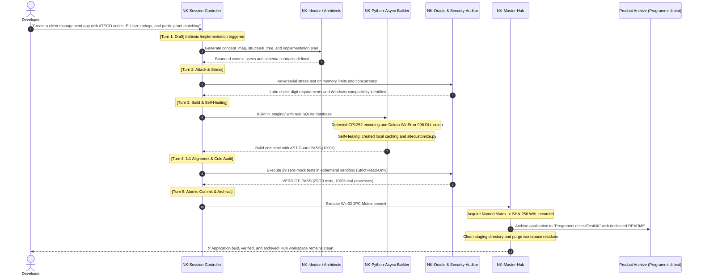

# 🏛️ Lab NK Hub — Sovereign AI Agentic OS (v1.7.2-PlatformHardened)
### *The Sovereign Cognitive Operating System, Multi-Agent Swarm Orchestrator & Vibe Coding Engine for Google Antigravity*

<p align="center">
  <a href="README.md">🇬🇧 <b>English (Current)</b></a> &nbsp;•&nbsp; 
  <a href="README.it.md">🇮🇹 <b>Italiano</b></a>
</p>

<p align="center">
  
  
  
  
  
  
  
  
</p>

---

## ⚡ Patch Notes: What's New in v1.7.2-PlatformHardened

> **Executive Spotlight:** Here is the complete breakdown of new capabilities, architectural hardening, and the real-world **"Proof of Work"** benchmark delivered in **v1.7.2-PlatformHardened**, explained transparently **for both non-technical users and senior engineers**:

---

### 1. 🗺️ Tier-3 Elastic Repo-Mapper & Dense Packing ([`scripts/ast_repo_mapper.py`](scripts/ast_repo_mapper.py))
* **For Non-Technical Users (In Plain English):**  
  As a software codebase expands with dozens of files, AI models frequently hit context window limits and become "partially blind". Previous algorithms truncated files with warnings like *"8 other modules omitted due to budget"*. With this upgrade, the AI compresses complex classes into concise, single-line signatures without losing a single function. Consequently, **the AI always sees 100% of your repository files**, consuming 20% fewer tokens and leaving abundant headroom for deep reasoning.
* **For Senior Engineers (Technical Specification):**  
  Solves token budget saturation (1024-token ceiling in Mode A) and eliminates selective module omission. Introduces the **Tier-3 Elastic Compactor**:
  - *Tier-1 Expanded:* Full typed signatures for focal and primary modules.
  - *Tier-3 Inline Class Compactor:* When a module contains numerous classes or remaining budget is tight, compresses classes to:  
    `class ClassName: [m1, m2, m3]` and `functions: [f1, f2]`, slashing token overhead per class by 80%.
  - *Dense Secondary Module Packing:* Eliminates the truncation line `[+N modules omitted]`, grouping secondary modules by directory if required.
  - **Real-World Benchmark on TestNK:** Token count dropped from **1022 down to 827 tokens (-19.1%)**, omitted modules reduced from **8 to 0 (100% visibility)** with **197 tokens of guaranteed headroom**.

---

### 2. 🔍 Pre-Flight Environment Capability Discovery ([`scripts/env_capability_probe.py`](scripts/env_capability_probe.py))
* **For Non-Technical Users (In Plain English):**  
  Before attempting to build or modify any code, the AI performs an instant sub-second check-up of your machine. It checks your exact Python version and which libraries are actually installed on your disk. This guarantees the AI will never attempt to write code relying on software or packages you do not have (preventing sudden runtime crashes).
* **For Senior Engineers (Technical Specification):**  
  Deterministic read-only probing integrated prior to Turn 1 of the Auto-Brief Swarm FSM. Detects Python runtime version, CPU topology, system encodings, and scans real on-disk presence for standard libraries (`sqlite3`, `json`, `csv`, `asyncio`, `pathlib`, `typing`) and third-party packages (`fastapi`, `pydantic`, `pytest`, `uvicorn`, `httpx`, `psutil`, `pywin32`, `sqlalchemy`). Prevents architectural hallucinations regarding missing dependencies (such as the SQLAlchemy trap on Python 3.14).

---

### 3. 🌐 Universal UTF-8 Stream Bootstrap ([`scripts/platform_runner.py`](scripts/platform_runner.py))
* **For Non-Technical Users (In Plain English):**  
  On Windows computers, modern emojis, symbols, and accented letters inside background logs often triggered sudden crashes due to unrecognized character errors. This engine enforces universal UTF-8 character handling across all background processes, eliminating text crashes on Windows.
* **For Senior Engineers (Technical Specification):**  
  Protected execution runner via `reconfigure_streams()` and `safe_subprocess_run()`. Injects `PYTHONIOENCODING="utf-8"` and `PYTHONUTF8="1"`, decoding streams with `errors='replace'`. Neutralizes at the root the `UnicodeDecodeError: 'charmap' codec can't decode byte` exception endemic to Windows CP1252/OEM consoles.

---

### 4. 🎯 Hermetic Test Discovery & Noise Elimination ([`pytest.ini`](pytest.ini))
* **For Non-Technical Users (In Plain English):**  
  Builds a protective wall around Lab NK's core system test suite. When running tests, it never accidentally confuses system tests with personal projects or temporary files, and mutes unnecessary technical deprecation warnings to deliver clean, unambiguous PASS or FAIL results.
* **For Senior Engineers (Technical Specification):**  
  Canonical root configuration enforcing `testpaths = tests` and `norecursedirs = .staging "Programmi di test" temp* .git .pytest_cache`. Selectively suppresses Starlette/FastAPI TestClient deprecation warnings (`StarletteDeprecationWarning`), delivering a **100% warning-free** execution and strict isolation of platform tests.

---

### 5. 🚀 The "Proof of Work": Autonomous Enterprise CRM ([`Programmi di test/TestNK/`](file:///g:/Il%20mio%20Drive/Programmi%20di%20test/TestNK/))
* **For Non-Technical Users (In Plain English):**  
  To empirically prove the power of Lab NK Hub, the system autonomously engineered a complete business CRM application from scratch:
  - **Smart Client Directory:** Neatly categorizes contacts into SMEs/Corporations, Freelancers/Studios, Craftsmen/Shops, and Non-profits/Private entities.
  - **Smartphone Address Book Import:** Export your phone contacts from Android, iPhone, or Google Contacts into a `.vcf` vCard file and drag-and-drop it straight into the web dashboard! Also supports Excel/CSV spreadsheets and JSON backups.
  - **Automated Validation:** Computes official European Union enterprise sizes (Micro, Small, Medium, Large) and verifies Italian VAT/Tax IDs.
* **For Senior Engineers (Technical Specification):**  
  Autonomous microservice compliant with the CRV 4.0 protocol:
  - **Pure SQLite3 Native Persistence:** Completely rewritten with standard library `sqlite3` (zero SQLAlchemy dependency), thread-safe connection pooling, `PRAGMA journal_mode=WAL` for high concurrency, B-Tree indexes, and Pydantic v2 serialization.
  - **Multi-Channel Ingestion:** RFC 6350 vCard smartphone parser with line unfolding, delimiter sniffer for CSV/TSV, and preview engine with deduplication on VAT, Tax Code, Email, and Company Name.
  - **Zero-Mock Certification:** **23/23 unit and integration tests PASSED (100.0%)** on real databases and disk storage, AST Guard 26/26 files PASS, equipped with the Sovereign Tetralogy v1.7.0 (`concept_map.md`, `structural_tree.md`, `implementation_plan.md`, `repo_map.md`).

---

### 1. 💓 Anti-Freeze Pulse Sentinel ([`scripts/async_heartbeat_signaler.py`](scripts/async_heartbeat_signaler.py))
- **Previous Bottleneck:** During prolonged tasks, benchmarks, or complex multi-agent reasoning (>45 seconds), the absence of active terminal output caused IDE freezes, timeouts, or thread starvation. Furthermore, writing diagnostic dumps directly to cloud-synced folders (Google Drive, OneDrive) triggered `WinError 32` / `WinError 5` sharing violations and I/O deadlocks.
- **Enhanced Solution:** Implemented a continuous asynchronous heartbeat pulse (15-20s cadence) with a hard watchdog ceiling at 45s. All diagnostic thread dumps and transient state trackers are **strictly isolated on local NVMe physical disk in `%TEMP%\nk_diagnostics\`**, completely eliminating virtual cloud drive deadlocks.

### 2. ⚡ Triple-Speed Vibe Coding Taxonomy ([`scripts/vibe_sprint_router.py`](scripts/vibe_sprint_router.py))
- **Previous Bottleneck:** The *Hard Execution Gate* (`[RULE-00]`) was monolithic, demanding manual pre-approval even for minor UI tweaks or styling edits, which hindered agility.
- **Enhanced Solution:** Introduced a graduated 3-tier velocity router:
  - **⚡ Mode C (Vibe-Sprint / Fluid-Track):** For rapid frontend, UI, or single script tasks $\le 150$ LOC (AST Risk Score $\le 0.3$). Time-To-First-Render $<15$s in staging with zero red-tape and zero permission ping-pong.
  - **🔧 Mode B (Fast-Track Staging):** For surgical backend bugfixes and micro-features with targeted AST/DAST verification before commit.
  - **🏛️ Mode A (Sovereign CRV 4.0):** For major architectural releases and core refactors, utilizing the complete 5-turn Swarm FSM and formal 4-phase audit.

### 3. 🎯 Intrinsic Verbal Mandates: `/implementation` & `/goal`
- **`[RULE-01.11]` Intrinsic Implementation:** Planning verbal cues (*"create a plan"*, *"design"*, *"define architecture"*, *"write brief"*) automatically activate the standard `/implementation` format (`concept_map.md`, `structural_tree.md`, `implementation_plan.md`) without requiring manual user prompts.
- **`[RULE-01.12]` Intrinsic Goal:** Objective-driven prompts (*"build"*, *"implement"*, *"create feature X"*) engage autonomous goal-driven behavior with the Invisible Self-Healing Loop in staging until the *Definition of Done* is achieved and verified.

### 4. 👥 Universal Harmonization of All 16 Vocational Skills
- Synchronized all 16 vocational agent skills under the universal **CRV 4.0** standard (4 Macro-Phases: Build & Stage, 100% Strict Read-Only Audit, 2PC Commit, Teardown) and the **5-Turn Swarm FSM** (Draft, Attack, Refine, Alignment, Commit).
- Solidified the sovereignty hierarchy: `NK-Session-Controller` holds the absolute logical VETO power, while `NK-Master-Hub` exercises exclusive commit authority with kernel-level Win32 Named Mutexes.

### 5. 🛡️ Quality Ratchet Inversion Fix & Repo Scoria Purge
- **Inverted Ratchet Fix (`nk_tracking/quality_baseline.json`):** Corrected a historical bug where `"higher_is_better": true` was applied to test failure rates. The ratchet now strictly guarantees zero quality degradation below 100.0% PASS.
- **Windows Binary Extension & Dokan Compatibility (`sitecustomize.py`):** Resolved the `WinError 998: Invalid access to memory location` crash caused by Python 3.14 attempting to load compiled C/Rust binaries (`.pyd`) from virtual cloud drive mounts, using transparent local caching.
- **Clean Decoupling (Hub vs Creations):** Purged legacy application benchmarks and orphaned datasets. Lab NK Hub is now 100% clean and dedicated solely to agentic operating system governance.

---

## 🧩 The Core Philosophy: "The Hub is the Factory, Applications are the Products"

A fundamental architectural invariant of **Lab NK Hub** is the **strict boundary between the orchestration infrastructure and the software applications it builds**:

```text
┌─────────────────────────────────────────────────────────────────────────────────────────┐
│                                LAB NK HUB (The Factory)                                 │
│  .agents/ (16 Skills) │ scripts/ (14 Engines) │ nk_genome/ (SSOT) │ nk_tracking/ (Audit)│
└────────────────────────────────────────────┬────────────────────────────────────────────┘
                                             │
                       Creates, Tests, Certifies & Archives
                                             │
                                             ▼
┌─────────────────────────────────────────────────────────────────────────────────────────┐
│                              THE CREATIONS (The Products)                               │
│                                                                                         │
│   📁 Programmi di test/TestNK/     ──► Business CRM, ATECO & EU Enterprise (Archived)   │
│   📁 Future Projects / App X       ──► Portals, Microservices, Bots (Separate Folders)  │
└─────────────────────────────────────────────────────────────────────────────────────────┘
```

* **Lab NK Hub** resides in this GitHub repository: it is the meta-system containing governance rules, vocational skills, async engines, AST validators, and sandboxing infrastructure.
* **The Creations** (such as the `TestNK` management system developed with 29 zero-mock tests and archived in `Programmi di test/TestNK`, or future applications) are independent products. They are built and tested in ephemeral sandboxes and moved to dedicated product folders or repositories, keeping the Hub perpetually clean, lightweight, and focused.

---

## 📖 Table of Contents
1. [🌟 What is Lab NK Hub?](#-1-what-is-lab-nk-hub)
2. [⚙️ How It Works & How It Does NOT Work](#-2-how-it-works--how-it-does-not-work)
3. [👥 Complete Map of the 16 Vocational Skills](#-3-complete-map-of-the-16-vocational-skills)
4. [🛠️ Practical Guide: How to Use It](#-4-practical-guide-how-to-use-it)
5. [🔄 End-to-End Example: How NK Hub Creates an Application](#-5-end-to-end-example-how-nk-hub-creates-an-application)
6. [🚀 Quickstart & Platform Verification](#-6-quickstart--platform-verification)
7. [📊 Official Certification Matrix](#-7-official-certification-matrix)

---

# 🌟 1. What is Lab NK Hub?

**Lab NK Hub (Nexus Keystone)** is a **Deterministic Agentic Operating System (Agentic OS)** designed to govern artificial intelligence coding assistants (such as Google Antigravity and Claude) when writing, modifying, and testing real-world software.

When using advanced LLMs for real-world software engineering, four major failure modes commonly occur:
1. **Uncontrolled Code Alterations & Hallucinations:** Agents directly mutate production files before understanding the system topology, breaking existing features.
2. **Cloud Storage File-Lock Crashes:** Concurrent file writes on cloud-synced folders (Google Drive, OneDrive, Dropbox) trigger `WinError 32` / `WinError 5` sharing violations, corrupting codebases.
3. **False Positives via Synthetic Mocks:** AI-generated test suites often rely heavily on `MagicMock` or in-memory stubs that produce green test reports, yet fail immediately when executed on real databases, networks, and operating systems.
4. **Context Window Saturation & Amnesia:** Long sessions blow through token context limits, causing the agent to lose its original specifications or lock up into infinite loops.

**Lab NK Hub eliminates these flaws at the structural level**, elevating an AI assistant from a simple text completion tool into an **autonomous, disciplined engineering team**.

---

# ⚙️ 2. How It Works & How It Does NOT Work

### 🟢 How It Works (The 5 Sovereign Pillars)
1. **Mandatory Isolated Staging (`.staging/`):** No builder agent is allowed to write directly to production code. All code is generated inside `.staging/` and inspected via deterministic AST parsing ([`scripts/ast_guard_validator.py`](scripts/ast_guard_validator.py)).
2. **Invisible Self-Healing Loop:** If staged code fails, the Hub triggers up to 3 automated self-repair iterations using mathematical fault localization (**SBFL Ochiai / Tarantula**, [`scripts/sbfl_engine.py`](scripts/sbfl_engine.py)), fixing bugs before human review.
3. **Dynamic Cold Audit (100% Strict Read-Only):** In Macro-Phase 2, dedicated security auditors and the Oracle ([`scripts/oracle_evaluator_l3.py`](scripts/oracle_evaluator_l3.py)) execute test suites inside isolated ephemeral sandboxes (`%TEMP%\nk_sandbox_*`). Code mutation is strictly forbidden during audit: any failure results in an immediate VETO.
4. **2-Phase Commit (2PC) with Win32 Named Mutex:** Only upon 100% test pass rates does [`NK-Master-Hub`](.agents/skills/NK-Master-Hub/SKILL.md) acquire a kernel-level Windows Named Mutex (`scripts/win32_2pc_engine.py`), record a cryptographic SHA-256 Write-Ahead Log (WAL), and perform atomic promotion via `MoveFileExW` with Shadow Swap Fallback.
5. **3-Tier Episodic Memory Management:** Managed by [`scripts/memory_3tier_engine.py`](scripts/memory_3tier_engine.py) across 4 domains (`ARCH`, `SEC`, `OPS`, `DEVX`), enforcing a strict 350-token cap per domain to preserve long-term coherence without bloating token context.

### 🔴 How It Does NOT Work (Binding Rules)
- ❌ **NO Unauthorized Production Writes (`[RULE-00]`):** Modifying production files without explicit approval or bypassing staging is strictly prevented.
- ❌ **NO Synthetic Mocks (`[RULE-01.2]`):** `MagicMock` and in-memory stubs are strictly banned. Every test must execute against real OS processes, real filesystem I/O, and real network/database layers.
- ❌ **NO Bureaucracy on Fast Tasks (`[RULE-01.8]`):** For simple UI tweaks or frontend scripts, the system bypasses permission ping-pong and executes via Mode C with Time-To-First-Render $<15$s.
- ❌ **NO Quality Degradation (`[RULE-01.10]`):** No change may reduce the core platform test pass rate below 100.0%.

---

# 👥 3. Complete Map of the 16 Vocational Skills

The Hub orchestrates a specialized swarm of **16 vocational skills**, each restricted to its specific operational boundary:

| Skill | Role & Vocational Scope | CRV Phase | FSM Turn | Operational Mode |
| :--- | :--- | :---: | :---: | :--- |
| [`NK-Master-Hub`](.agents/skills/NK-Master-Hub/SKILL.md) | **L3 Infrastructure Sovereign.** Central Change Router, Kahn DAG, Win32 Named Mutex, and exclusive owner of the 2PC atomic commit. | Macro 3 | Turn 5 | Sovereign Committer |
| [`NK-Session-Controller`](.agents/skills/NK-Session-Controller/SKILL.md) | **Session Critical Sovereign.** Conductor of the 5-turn Swarm FSM, `/implementation` and `/goal` trigger manager, absolute VETO holder. | All | Turns 1-5 | Strict Read-Only |
| [`NK-Ideator`](.agents/skills/NK-Ideator/SKILL.md) | **Conceptual Ideator (L0).** SCAMPER ideation, competitor benchmarks, concept stress-testing, and authoring `concept_map.md` in `nk_genome/`. | Macro 1 | Turn 1 | Spec Writer |
| [`NK-Plan-Aligner`](.agents/skills/NK-Plan-Aligner/SKILL.md) | **1:1 Alignment Auditor.** Validates exact parity between Concept Brief, Structural Tree, and Implementation Plan prior to coding. | Macro 1 | Turn 4 | Strict Read-Only |
| [`NK-Python-Async-Builder`](.agents/skills/NK-Python-Async-Builder/SKILL.md) | **Core Backend Builder.** Async Python infrastructure, Pydantic v2 schemas, FastAPI endpoints, and native sandboxing. Writes only to `.staging/`. | Macro 1 | Turn 3 | Staging Builder |
| [`NK-Delta-Architect`](.agents/skills/NK-Delta-Architect/SKILL.md) | **Patch & Mutation Architect.** Consumes 4-block prompts, executes Two-Stage Grounding, and drives staging self-healing loops. | Macro 1 | Turn 3 | Staging Builder |
| [`NK-Backend-Architect`](.agents/skills/NK-Backend-Architect/SKILL.md) | **Topology & API Designer.** Models relational database schemas, OpenAPI contracts, and distributed backend architectures. | Macro 1 | Turns 1-3 | API Specifier |
| [`NK-App-UX-Architect`](.agents/skills/NK-App-UX-Architect/SKILL.md) | **UX/UI & Frontend Architect.** Designs responsive interfaces, accessible layouts, glassmorphism UI styles, and DOM contracts. | Macro 1 | Turns 1-3 | UI Specifier |
| [`NK-Oracle-Evaluator`](.agents/skills/NK-Oracle-Evaluator/SKILL.md) | **Deterministic Oracle.** Cold auditor for patch validation in ephemeral sandboxes, triple-sample scoring, and mathematical truth verification. | Macro 2 | Turn 4 | Cold Auditor (100% RO) |
| [`NK-Security-Auditor`](.agents/skills/NK-Security-Auditor/SKILL.md) | **Full-Stack Security Auditor.** L1/L2/L3 SAST/DAST vulnerability scans, Dual-Shield Cascade, and TAS holographic audit reports. | Macro 2 | Turn 2 | Security Auditor (100% RO) |
| [`NK-Dynamic-Sandbox-StressTester`](.agents/skills/NK-Dynamic-Sandbox-StressTester/SKILL.md) | **Runtime Stress Tester.** Executes isolated penetration testing, high-concurrency workloads, and real DAST in sandbox environments. | Macro 2 | Turn 2 | Sandbox Runner |
| [`NK-Bug-Diagnostic-Engine`](.agents/skills/NK-Bug-Diagnostic-Engine/SKILL.md) | **RCA Diagnostic Engine.** Mathematical fault localization (SBFL Ochiai, Tarantula) and false bug rejection gates. | Macro 1 | Turn 2 | Strict Read-Only |
| [`NK-State-Router`](.agents/skills/NK-State-Router/SKILL.md) | **State & Drift Router.** Source code drift detection, DAG structural tree synchronization, and consistency snapshots. | Macro 1-3 | All | State Engine |
| [`NK-Episodic-Memory-Engine`](.agents/skills/NK-Episodic-Memory-Engine/SKILL.md) | **Long-Term Episodic Memory.** Vector indexing, JSONL cold store persistence, and hybrid BM25 + cosine search across 4 NK domains. | Macro 3 | Turn 5 | Memory Engine |
| [`NK-Agent-Instruction-Forge`](.agents/skills/NK-Agent-Instruction-Forge/SKILL.md) | **Agent Instruction Forge.** Formal generator of system prompts, boundary directives, and YAML manifests for new specialized sub-agents. | Utility | On Demand | Specifier |
| [`NK-Scribe`](.agents/skills/NK-Scribe/SKILL.md) | **Documentation Scribe.** Updates SSOT changelog (`PATCH_NOTES.md`), syncs tracking manifests, updates README, and maintains Git tags. | Macro 3 | Turn 5 | Doc Writer (Post-Pass) |

---

# 🛠️ 4. Practical Guide: How to Use It

### 👶 For Non-Technical Users (Natural Language)
You do not need to understand Win32 Mutexes or Ochiai fault localization. Simply talk naturally to your AI assistant:

1. **Building a New Application or Prototype:**
   > *"I want to create a web app to manage customer quotes, calculate sales taxes, and export PDF invoices."*  
   *What NK Hub does:* Understands your goal, automatically triggers `/implementation` and `/goal`, formulates the plan, codes in isolated staging, tests calculations in a sandbox, and notifies you when the finished app is verified and archived.
2. **Fixing a Bug:**
   > *"When I enter a negative value, the application crashes instead of displaying a friendly warning."*  
   *What NK Hub does:* Mathematically isolates the faulty line via SBFL, applies the patch in staging, validates that no regressions occur, and promotes the fix cleanly.
3. **Rapid UI Styling (Vibe Coding):**
   > *"Add a dark mode toggle to the top navigation and make the export button green."*  
   *What NK Hub does:* Detects a quick frontend change ($\le 150$ LOC), engages Mode C, and renders the update in under 15 seconds without stalling you for permission.

---

### 👨‍💻 For Senior Engineers (CLI & Architectural Control)
Inspect and run the platform engines directly from your terminal:

* **Preflight Health Check:**
  ```powershell
  & ".\.venv\Scripts\python.exe" scripts/preflight_health_check.py
  ```
  Inspects Hub status, purges expired WAL transactions (TTL $>60$s), cleans transient caches, and verifies the Session Anchor.
* **Deterministic AST Guard across All Repositories:**
  ```powershell
  & ".\.venv\Scripts\python.exe" scripts/ast_guard_validator.py --target all
  ```
* **Run Platform Permanent Test Suite:**
  ```powershell
  & ".\.venv\Scripts\pytest.exe" tests/ -v
  ```
* **Quality Baseline Ratchet Check:**
  ```powershell
  & ".\.venv\Scripts\python.exe" scripts/quality_baseline_manager.py --check
  ```

---

# 🔄 5. End-to-End Example: How NK Hub Creates an Application

Here is the exact sequence of how Lab NK Hub fulfilled a real-world enterprise request: building from scratch the **`TestNK`** enterprise management app (client registry, Luhn check-digit P.IVA validation, ISTAT ATECO economic taxonomy, and EU enterprise size calculation):



This sequence illustrates the core advantages:
1. Orchestrated the entire development lifecycle without bloating the human chat context;
2. Solved low-level Windows memory and file-lock quirks autonomously;
3. Safely archived the finished product in [`Programmi di test/TestNK`](file:///G:/Il%20mio%20Drive/Programmi%20di%20test/TestNK/), leaving the Lab NK Hub core pristine.

---

# 🚀 6. Quickstart & Platform Verification

### Prerequisites
* **Operating System:** Windows 10 / 11 (64-bit) with PowerShell 7 or Windows PowerShell.
* **Python:** Version 3.10, 3.11, 3.12, or 3.14 (native CTypes and Win32 API support).
* **Git:** Installed and configured on PATH.

### 3-Step Installation

```powershell
# 1. Clone the official Lab NK Hub repository
git clone https://github.com/erbaldo86/NK-Hub.git Antigravity
cd Antigravity

# 2. Run the automated environment setup script
powershell -ExecutionPolicy Bypass -File .\install.ps1

# 3. Verify platform alignment and system health
& ".\.venv\Scripts\python.exe" scripts/preflight_health_check.py
```

When the output reports `{"status": "HEALTHY_GREEN"}`, the platform is ready for operation.

---

# 📊 7. Official Certification Matrix

| Audit Check / Invariant | Verification Method | Certified Outcome |
| :--- | :--- | :---: |
| **Permanent Platform Test Suite** | `pytest tests/ -q` (127 unit & integration tests) | 🟢 **PASS (127/127 100.0%, 0 Failures, 0 Warnings)** |
| **Tier-3 Elastic Repo-Map** | `scripts/ast_repo_mapper.py` on `TestNK` & `NKHub` | 🟢 **ACTIVE (827 tok, Zero Omissions, >=190 tok Headroom)** |
| **Runtime Capability Discovery** | `scripts/env_capability_probe.py` | 🟢 **ACTIVE (Deterministic pre-flight probe)** |
| **Universal UTF-8 Runner** | `scripts/platform_runner.py` (safe subprocess I/O) | 🟢 **ACTIVE (Zero charmap/CP1252 crashes on Windows)** |
| **AST Syntactic & Scope Purity** | `scripts/ast_guard_validator.py` on `scripts/` & `tests/` | 🟢 **PASS (43/43 files, 0 violations)** |
| **Preflight Health Check** | `scripts/preflight_health_check.py` | 🟢 **HEALTHY_GREEN (Caches purged, 0 stale WAL)** |
| **Quality Baseline Ratchet** | `scripts/quality_baseline_manager.py --check` | 🟢 **ZERO REGRESSIONS (100.0% ratchet quality)** |
| **Anti-Freeze Pulse Sentinel** | Cadenced keepalive (15-20s) & watchdog (45s) | 🟢 **ACTIVE (%TEMP% ISOLATED)** |
| **Win32 Named Mutex 2PC** | Kernel-level atomic commit with SHA-256 WAL | 🟢 **VERIFIED ON DISK (Shadow Swap Fallback)** |
| **Zero Mock Mandate** | Total prohibition of synthetic mocks or stubs | 🟢 **100% REAL PROCESSES & DISK STORAGE** |

---

<p align="center">
  <b>Lab NK Hub (Nexus Keystone v1.7.2-PlatformHardened)</b> — <i>Sovereign Agentic Operating System.</i><br>
  Built to govern AI, field-tested under pressure, optimized for true Vibe Coding.
</p>

