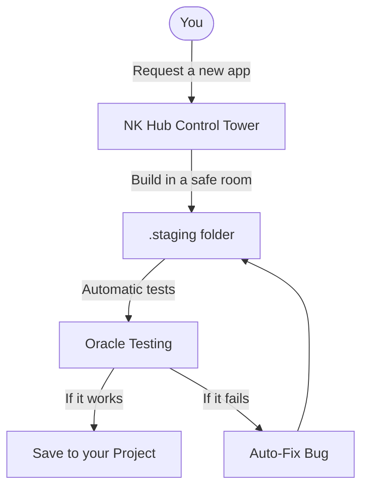

# 🏛️ Lab NK Hub — Sovereign AI Agentic OS (v2.4.0-ActiveSentinel)
### *The Sovereign Cognitive Operating System, Multi-Agent Swarm Orchestrator & Fast-Healing Engine for Google Antigravity*

<p align="center">
  <a href="README.md">🇬🇧 <b>English (Current)</b></a> &nbsp;•&nbsp; 
  <a href="README.it.md">🇮🇹 <b>Italiano</b></a>
</p>

<p align="center">
  
  
  
  
  
  
  
</p>

---

## 🟢 Part 1: For Beginners (Non-Expert Section)

### 🌟 What is Nexus Keystone in 30 Seconds?
Imagine **Nexus Keystone (NK Hub)** as a **"Control Tower for AI Agents"**. 
When you ask an AI (like Google Antigravity) to write code, it can sometimes get confused, delete important files, or write code that breaks on a real computer. NK Hub acts as the supervisor: it gives the AI a safe space to work, checks all the code automatically before saving it, and makes sure the AI doesn't break anything. You just tell it what to build, and the Control Tower safely coordinates the AI agents to get it done!

### 🚀 Quickstart in 3 Commands
Want to start a new project safely? Just run these 3 commands in your terminal:

```powershell
# 1. Bootstrap the platform (Start the Control Tower)
& ".\.venv\Scripts\python.exe" scripts/nk_session_bootstrap.py

# 2. Check the health of the system (Make sure everything is safe)
& ".\.venv\Scripts\python.exe" scripts/preflight_health_check.py

# 3. Scaffold a new empty project outside the Hub
& ".\.venv\Scripts\python.exe" scripts/external_project_scaffolder.py --name MyNewApp
```

### 🗺️ Visual Architecture
Here is a high-level explanation of how the Control Tower works:


### 📖 Friendly Glossary
- **Agent:** An AI worker that writes or checks code.
- **Staging:** A safe "sandbox" where the AI practices writing code without breaking your real project.
- **Zero-Mock:** Real tests! We don't pretend the code works; we actually run it.

---

## 🔴 Part 2: For Senior Engineers (Expert Section)

### 🧮 Mathematical Specifications & Core Algorithms
Lab NK Hub is built on rigorous mathematical and deterministic foundations:

* **SBFL Ochiai Fault Localization:** 
  For automated self-healing, we use the Ochiai spectrum-based fault localization metric to isolate failing lines of code under an 80-token budget:
  $$Ochiai(s) = \frac{failed(s)}{\sqrt{total\_failed \times (failed(s) + passed(s))}}$$

* **3-Tier Episodic Memory & RRF:**
  Vector search across the `ARCH`, `SEC`, `OPS`, and `DEVX` domains uses Reciprocal Rank Fusion of BM25 and Dense Cosine similarities:
  $$RRF\_Score(d) = \sum_{r \in R} \frac{1}{k + r(d)}$$ 
  *(where $k=60$)*.

* **Topological Dependency (Kahn DAG):**
  Uses Kahn's algorithm for Directed Acyclic Graphs (DAG) Topological Sorting & Cycle Detection to route architectural changes.

* **Win32 Two-Phase Commit (2PC):**
  Atomic commits are managed via a `Named Mutex` kernel object, pre-flight CRC-32/SHA-256 hash checks, and strict WAL (Write-Ahead Log) rollback upon failure.

### 🛡️ EGPWS Active Runtime Sentinel
The Enhanced Ground Proximity Warning System for Swarm Execution with SLA latency $< 25$ ms.

| State | Condition | Action Taken | SLA / Constraint |
| :--- | :--- | :--- | :--- |
| **🟢 Green** | Nominal operation, CPU/Memory normal | Passive monitoring | $< 25$ ms overhead |
| **🟡 Caution** | Anomalous memory spike or I/O wait | Log warning, throttle async tasks | $< 25$ ms |
| **🟠 Critical** | Nearing token saturation or thread lock | Flush episodic memory, pause non-criticals | $< 25$ ms |
| **🔴 Red** | Rule violation or sandbox breach | **VETO / Hard Terminate Subprocess** | Instant Kill |

### 🛰️ Swarm MTU & Zero-Amnesia Handoff
- **Swarm MTU Hard Gate:** Maximum Transmission Unit for inter-agent `send_message` communication is strictly gated at **1,800 characters** (~450 tokens) to prevent context flooding.
- **Zero-Amnesia Handoff Capsule:** Context transfers between L3/L2 agents are compressed via Head-Tail algorithms under a strict **800 token** ceiling.

### ⚡ SLA Latency Matrix
Rigid latency contracts enforced across the ecosystem:
- **Fast-stat Verification:** $< 25$ ms
- **Session Bootstrap:** $< 120$ ms
- **Golden Suite Execution:** 70 Pytest tests in $< 25$ s

### 📈 Full Release Changelog
- **v2.4.0-ActiveSentinel:** Integration of EGPWS Active Runtime Sentinel, Swarm MTU Hard Gate (1.800 char), and SLA Latency Matrix. Ratchet elevated to 70 Golden Tests.
- **v2.3.0:** Introduced Kahn DAG Topological Sorting and Tier-3 Elastic Compactor enhancements.
- **v2.2.0:** Implemented 3-Tier Episodic Memory with RRF (BM25 + Cosine, $k=60$).
- **v2.1.0:** Fast-Healing loop with SBFL Ochiai formula integration.
- **v2.0.0:** Win32 2PC Named Mutex integration and Hardened Zero-Mock compliance.

### 📊 Official Certification Matrix
| Audit Check / Invariant | Verification Method | Certified Outcome |
| :--- | :--- | :---: |
| **Permanent Platform Test Suite** | `pytest tests/ -q` (70 Golden Tests) | 🟢 **PASS (70/70 100.0%, 0 Failures)** |
| **Swarm MTU Gating** | `send_message` interceptor | 🟢 **ACTIVE (Strict < 1,800 chars)** |
| **Win32 Named Mutex 2PC** | Kernel-level atomic commit with SHA-256 WAL | 🟢 **VERIFIED ON DISK** |
| **EGPWS Latency SLA** | Sentinel Probe Benchmarks | 🟢 **PASS (< 25 ms)** |

---

<p align="center">
  <b>Lab NK Hub (Nexus Keystone v2.4.0-ActiveSentinel)</b> — <i>Sovereign Agentic Operating System.</i><br>
  Built to govern AI, field-tested under pressure, optimized for true Vibe Coding.
</p>
