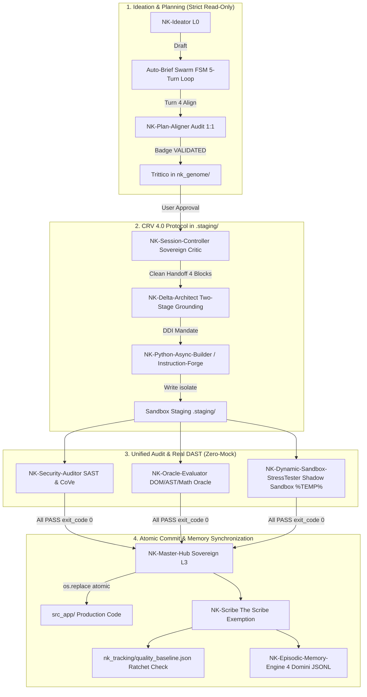

# 🏛️ NK-Hub Official Release v1.0: Antigravity Ecosystem

> **"Un'intera squadra di ingegneri, architetti, sviluppatori e guardiani della sicurezza virtuali al tuo fianco: trasforma idee complesse in software affidabile e certificato, senza allucinazioni o perdite di contesto."**

---

## 🌟 1. Cos'è NK-Hub? (Per Tutti)

**NK-Hub** (Nexus Keystone) è un **framework di orchestrazione multi-agente** per Antigravity. È stato progettato per risolvere il limite principale dei tradizionali assistenti AI: **il sovraccarico cognitivo**.

Quando chiedi a un singolo modello AI di ideare, progettare l'architettura, scrivere il codice, testarlo e documentarlo tutto insieme nella stessa chat, il contesto si satura rapidamente, emergono allucinazioni, il codice si rompe e il sistema dimentica le decisioni prese all'inizio.

### 🎭 La Metafora: La tua Squadra di Ingegneri Virtuali
NK-Hub supera questo problema introducendo la **specializzazione e la separazione dei ruoli**:
* 🧠 **L'Ideatore (`NK-Ideator`):** Esplora il mercato, analizza i requisiti e fa brainstorming strutturato.
* 🎨 **L'Architetto UX/UI (`NK-App-UX-Architect`):** Disegna l'esperienza utente, i flussi e i contratti visivi.
* 📐 **L'Allineatore di Piani (`NK-Plan-Aligner`):** Verifica che l'idea, la struttura e il piano esecutivo siano perfettamente coerenti prima di scrivere una sola riga di codice.
* 🛡️ **Il Supervisore Critico (`NK-Session-Controller`):** Assegna i compiti ai programmatori in modo chiaro e controlla a freddo ogni risultato.
* ⚡ **I Builder Specializzati (`NK-Python-Async-Builder`, `NK-Backend-Architect`):** Scrivono codice modulare, tipizzato e isolato in un'area di staging protetta (`.staging/`).
* 🧪 **Gli Auditor & l'Oracolo (`NK-Security-Auditor`, `NK-Oracle-Evaluator`, `NK-Dynamic-Sandbox-StressTester`):** Eseguono test empirici reali (senza finti mock) in sandbox effimere per garantire che tutto funzioni davvero.
* 🏛️ **Il Sovrano Infrastrutturale (`NK-Master-Hub`):** Gestisce i lock di sistema e promuove il codice collaudato in produzione.
* ✍️ **Il Documentatore (`NK-Scribe`):** Aggiorna changelog, note di rilascio e la memoria a lungo termine.

---

## 🚀 2. Come si Usa NK-Hub: Quickstart in 3 Passaggi

### Passo 1: Installazione (1-Click)
- 🪟 **Su Windows**: Esegui `.\install.ps1` (o tasto destro ➔ *Esegui con PowerShell*).
- 🏎️ **Su macOS / Linux**: Esegui `chmod +x install.sh && ./install.sh`.

### Passo 2: Avvio dell'Hub in Chat
Apri Antigravity e scrivi in chat:
```text
Avvia l'NK-Master-Hub
```
L'Hub presenterà la **Master Dashboard Markdown** in stato `[WAIT_INIT 🟡]` con i nodi operativi numerati `[0]-[13]`.

### Passo 3: Sviluppo Guidato in Totale Sicurezza
1. **Ideazione e Briefing:** Esprimi liberamente cosa vuoi creare. Il sistema opera in **Strict Read-Only** (`[RULE-00]`): non tocca alcun file di codice senza il tuo consenso.
2. **Generazione del Trittico:** Il sistema genera in `nk_genome/` i 3 documenti concettuali (`concept_map.md`, `structural_tree.md`, `implementation_plan.md`).
3. **Approvazione Umana (Human-in-the-Loop):** Quando il piano è pronto e validato da `NK-Plan-Aligner`, ti viene richiesta l'approvazione esplicita (*"Procedi"* o *"Autopilot"*).
4. **Costruzione e Verifica Atomica (CRV 4.0):** Il codice viene scritto in `.staging/`, testato contro oracoli indipendenti e promosso in produzione solo con verdetto `PASS`.

---

## 🧬 3. Deep-Dive Tecnico & Architettura (Per Esperti & Sviluppatori)



### 🔑 Pilastri Architetturali Fondamentali:

1. **`[RULE-00] HARD EXECUTION GATE`:** Divieto assoluto di scrittura I/O pre-approvazione. Richieste generiche, diagnostiche o di studio sono vincolate in *Strict Read-Only*.
2. **Actor-Critic Asimmetrico Disaccoppiato (`[RULE-02.7]`):**
   - **Critico (`NK-Session-Controller`):** Ha piena visibilità su Trittico, transcript, test e log; formula handoff chirurgici a 4 Blocchi e valida il lavoro con la **Cold Review a 5 Gate** (Scope, Code Grounding, Brief Grounding Forensic, Preservation, Truth/DAST).
   - **Lavoratore (`NK-Delta-Architect`):** Riceve solo il perimetro d'azione e i vincoli operativi, ignorando i criteri del critico per prevenire auto-assoluzioni.
3. **Protocollo CRV 4.0 a 4 Macro-Fasi (`[RULE-01.1]`):**
   - *Macro-Fase 1 (Build & Stage in Swarm):* Builder delegati scrivono unicamente in `.staging/`.
   - *Macro-Fase 2 (Unified Audit):* Esecuzione parallela di SAST, Cold Oracle e Real DAST in Sandbox OS effimera (`%TEMP%\sandbox_[UUID]\`).
   - *Macro-Fase 3 (Commit & Memorize):* Commit atomico (`os.replace`) con Win32 Exponential Backoff e aggiornamento documentale automatico (**The Scribe Exemption `[RULE-00.2]`**).
   - *Macro-Fase 4 (Teardown & Garbage Collection):* Bonifica immediata di staging e sandbox temporanee.
4. **Zero-Mock & Deterministic Oracle Mandate (`[RULE-01.2]` / `[RULE-01.8]`):** Divieto categorico di `unittest.mock.MagicMock`, `jest.fn()` o fuzzer simulati. Ogni verifica deve riprodurre flussi empirici reali con `exit_code: 0`.
5. **Memoria Episodica Semantica (`NK-Episodic-Memory-Engine`):** Indicizzazione vettoriale su 4 domini JSONL (`01_Bug_Diagnostics`, `02_Development_Patterns`, `03_Ideation_and_Decisions`, `04_Governance_and_Rules`) con rigido **hard cap di 350 token per recall**, azzerando la saturazione contestuale.
6. **Pre-Flight Health Check Deterministico (`scripts/preflight_health_check.py`):** Autodiagnosi all'avvio che sanifica file orfani, verifica la SSOT unica (`session_anchor.jsonl`) e valida l'allineamento con la baseline di qualità (`quality_baseline.json`).

---

## 🛠️ 4. Il Catalogo Completo delle 16 Skill Canoniche

| Livello / Vocazione | Skill Ufficiale | Ruolo Principale | Permessi I/O | Trigger & Utilizzo |
| :--- | :--- | :--- | :--- | :--- |
| **Supervisor / Critic** | `NK-Session-Controller` | Sovrano Critico, Handoff 4 Blocchi v2.0, Auto-Brief Swarm FSM e Cold Review 5 Gate | Read-Only codice; Scrittura `nk_tracking/` | Attivo all'avvio sessioni, gestione task complessi e review. |
| **Orchestrator L3** | `NK-Master-Hub` | Sovrano Infrastrutturale, Kahn DAG, Lock PID, Commit Atomico (`os.replace`) | Read-Only codice; Commit da `.staging/` | Trigger: *"Avvia NK-Master-Hub"*, dashboard centrale. |
| **Worker / Delta** | `NK-Delta-Architect` | Grounded Worker post-rilascio, Two-Stage Grounding & Triage | Read-Only codice; Delega builder in `.staging/` | Assegnazione task operativi da parte del Critico. |
| **Ideazione L0** | `NK-Ideator` | SCAMPER, benchmark competitor, STORM personas interview e Turn 1 FSM | Strict Read-Only | Progettazione nuovi moduli, brainstorming e requisiti. |
| **UX/UI Concept L3** | `NK-App-UX-Architect` | Bounded Context, User Journey, design system HSL & contratti UI JSON | Strict Read-Only | Definizione layout, prototipi visivi e specifiche UI. |
| **Backend & API L2** | `NK-Backend-Architect` | Topologie multi-agente, rotte OpenAPI 3.0 & Pydantic v2 | Strict Read-Only | Architettura server, schemi DB e contratti IPC. |
| **Prompt Forge L1** | `NK-Agent-Instruction-Forge` | Generatore unificato di System Instructions per agenti & YAML metadata | Scrittura in `.staging/` | Creazione o aggiornamento di istruzioni per sub-agenti. |
| **Async Builder L2** | `NK-Python-Async-Builder` | Sviluppo backend asincrono, FastAPI, Pydantic v2 & IPC | Scrittura in `.staging/` | Implementazione codice Python e microservizi. |
| **Security TAS L1/2/3** | `NK-Security-Auditor` | Threat & Audit System unificato, SAST statico & CoVe selettiva | Strict Read-Only | Macro-Fase 2 CRV 4.0 per vulnerabilità e conformità. |
| **Cold Auditor** | `NK-Oracle-Evaluator` | Oracoli deterministici (DOM, AST semantico, Math Ground Truth) | Sandbox effimera `%TEMP%` | Macro-Fase 2 CRV 4.0 per validazione funzionale. |
| **Dynamic DAST** | `NK-Dynamic-Sandbox-StressTester` | Real DAST stress testing, concorrenza asincrona e race condition | Sandbox effimera `%TEMP%` | Macro-Fase 2 CRV 4.0 per stress test dinamici. |
| **RCA Engine** | `NK-Bug-Diagnostic-Engine` | Root Cause Analysis a doppio livello & False Bug Rejection | Strict Read-Only | Diagnosi anomalie, ticket di bug e riproduzione guasti. |
| **Plan Aligner** | `NK-Plan-Aligner` | Audit di allineamento 1:1 del Trittico 3/3 (Turn 4 FSM) | Strict Read-Only | Turno 4 FSM prima dell'approvazione del piano. |
| **State Router** | `NK-State-Router` | Sincronizzazione stato, Kahn DAG & Backup Circolare v5.0 | Lock Backup Circolare | Rilevamento drift e consistenza topologica. |
| **Documentation** | `NK-Scribe` | Manutenzione changelog, PATCH_NOTES.md, README.md & Git | Scrittura documentale | Macro-Fase 3 CRV 4.0 post-approvazione audit. |
| **Episodic Memory** | `NK-Episodic-Memory-Engine` | Memoria a lungo termine su 4 domini JSONL (350 token cap) | `System_Documentation/NK_Episodic_Memory/` | Recall semantico pattern, RCA e decisioni pregresse. |

---

## 📁 5. Topologia Tripartita del Workspace (`[RULE-05]`)

```
G:/Il mio Drive/Antigravity/
├── .agents/
│   ├── AGENTS.md                                 # Regolamento Master di Sistema v1.0 (SSOT)
│   └── skills/                                   # Le 16 Skill Canoniche dei Nodi Agentici
├── nk_genome/                                    # Single Source of Truth Concettuale (Trittico)
│   ├── concept_map.md                            # Visione & Architettura Funzionale (Release v1.0)
│   ├── structural_tree.md                        # Topologia Moduli, Vocazioni & Checksum
│   └── implementation_plan.md                    # Piano Esecutivo Dettagliato & Milestone Anchor IDs
├── nk_tracking/                                  # Tracciamento, Log, Baseline & Database
│   ├── anchor/
│   │   └── session_anchor.jsonl                  # SSOT Activity Anchor deterministico
│   ├── reports_and_briefs/                       # Report di Audit e Manifest di Sessione
│   ├── quality_baseline.json                     # Metriche di qualità e non-regressione
│   └── nk_tas_roi.db                             # Database SQLite WAL (audit logs)
├── System_Documentation/                         # Documentazione Portale & Memoria Cognitiva
│   ├── Documentation/                            # Guide Tecniche e Manuali Operativi (00, 01, 02, 03)
│   └── NK_Episodic_Memory/                       # 4 Domini di Memoria a Lungo Termine (JSONL)
├── scripts/                                      # Motori Deterministici Python (Health, SAST, AST, Baseline)
├── .staging/                                     # Area di Staging Fisica Isolata per CRV 4.0
└── src_app/                                      # Codice Sorgente Applicativo Reale di Produzione
```

---

## 💡 6. Scenario Prompt Cards (Esempi Pratici)

### 🟢 Scenario A: Creazione di una Nuova Applicazione
```text
Ciao! Voglio sviluppare una nuova applicazione web per la gestione dei flussi finanziari aziendali. Avvia l'NK-Master-Hub e guidami dall'ideazione L0 alla stesura del Trittico concettuale.
```

### 🟡 Scenario B: Segnalazione e Risoluzione di un Bug
```text
Ho riscontrato un'anomalia nel calcolo delle imposte differite nel modulo contabile. Attiva NK-Bug-Diagnostic-Engine per eseguire la Root Cause Analysis (RCA) e verificare se si tratta di un bug reale o di una shadow feature.
```

### 🔵 Scenario C: Refactoring Architetturale Backend
```text
Dobbiamo refactorizzare i modelli dati del backend per adottare Pydantic v2 e contratti OpenAPI 3.0. Attiva NK-Delta-Architect per eseguire il Two-Stage Grounding e preparare la pipeline CRV 4.0.
```

---

## 📜 Licenza & Governance
NK-Hub è governato dal **Regolamento di Sistema v1.0** contenuto in [.agents/AGENTS.md](.agents/AGENTS.md).  
Tutti i nodi agentici, gli orchestratori e i builder operano sotto il vincolo imperativo delle regole **DDI**, **CRV 4.0**, **Two-Stage Grounding** e **Zero-Mock Verification**.
