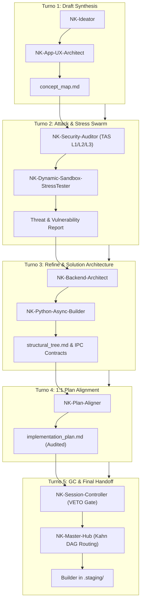

# 🏛️ Nexus Keystone Hub (v1.1.0-Universal)
### *The Sovereign Cognitive Operating System & Swarm Orchestration Engine for Google Antigravity*

<p align="center">
  
  
  
  
  
  
</p>

---

## 📖 Indice dei Contenuti
1. [🌟 Livello Introduttivo: Che cos'è Nexus Keystone Hub?](#-1-livello-introduttivo-che-cosè-nexus-keystone-hub)
   - [Il Problema Risolto](#-il-problema-risolto)
   - [I 6 Super-Poteri di NK-Hub](#-i-6-super-poteri-aggiunti-ad-antigravity)
2. [🚀 Tutorial di Installazione & Setup Rapido](#-2-tutorial-di-installazione-su-antigravity)
   - [Prerequisiti di Sistema](#prerequisiti-di-sistema)
   - [Guida Passo-Passo](#guida-passo-passo)
   - [Comandi di Verifica e Collaudo](#comandi-di-verifica-e-collaudo)
3. [🔬 Sezione Tecnica Avanzata (Deep Dive Architetturale)](#-3-sezione-tecnica-avanzata-per-esperti-e-sviluppatori)
   - [La FSM ad Auto-Brief a 5 Turni](#la-fsm-ad-auto-brief-a-5-turni-swarm-orchestration)
   - [Il Protocollo di Verifica Continua CRV 4.0](#il-protocollo-di-verifica-continua-crv-40)
   - [Catalogo Completo delle 16 Vocational Skills](#catalogo-completo-delle-16-vocational-skills)
   - [I 10 Motori Python Asincroni (`scripts/`)](#i-10-motori-python-asincroni-scripts)
   - [La Trinità del Genome (`nk_genome/`)](#la-trinità-del-genome-nk_genome)
   - [Memoria Episodica a 3 Livelli](#architettura-della-memoria-episodica-a-3-livelli)
   - [Suite Permanente di 49 Unit Test Zero-Mock](#suite-permanente-di-49-unit-test-zero-mock-tests)
4. [🔒 Progetti Esterni Isolati](#-4-progetti-esterni-isolati)
5. [📜 Note di Rilascio & Versioning](#-5-note-di-rilascio--versioning)

---

# 🌟 1. Livello Introduttivo: Che cos'è Nexus Keystone Hub?

**Nexus Keystone Hub (NK-Hub)** è il **sistema operativo cognitivo e infrastrutturale** progettato specificamente per trasformare l'ambiente di sviluppo agentico **Google Antigravity** in una fabbrica autonoma di software ingegneristico di livello Enterprise.

Mentre i normali agenti AI operano come "programmatori solitari" che tentano di scrivere o modificare codice direttamente sul disco (spesso allucinando modifiche, introducendo bug silenti o corrompendo i file), **Nexus Keystone Hub introduce una rigida separazione dei poteri, una memoria episodica strutturata e garanzie fisiche transazionali di livello kernel**.

```
┌─────────────────────────────────────────────────────────────────────────────┐
│                          GOOGLE ANTIGRAVITY IDE                             │
│                                                                             │
│   ┌─────────────────────────────────────────────────────────────────────┐   │
│   │                      NEXUS KEYSTONE HUB v1.1.0                      │   │
│   │                                                                     │   │
│   │   🧠 16 Esperti Vocazionali  ─► 🔄 FSM ad Auto-Brief (5 Turni)      │   │
│   │   🛡️ Hard Execution Gate    ─► 📦 Staging Area Isolata              │   │
│   │   🔬 Real DAST Sandbox       ─► 🎯 Diagnosi SBFL Ochiai (<80 tok)   │   │
│   │   🔒 Win32 2PC Mutex ACID    ─► 💾 3-Tier Episodic Memory           │   │
│   └─────────────────────────────────────────────────────────────────────┘   │
└─────────────────────────────────────────────────────────────────────────────┘
```

---

### 🛑 Il Problema Risolto
Nello sviluppo assistito da agenti AI moderno si verificano quattro criticità critiche:
1. **Scritture Selvaggie & Allucinazioni:** Agenti che modificano file sorgente in produzione prima ancora di aver compreso il problema o senza aver ottenuto l'approvazione dell'utente.
2. **Crash da Lock su Cloud Storage:** Modifiche concorrenti su cartelle sincronizzate (Google Drive, OneDrive, Dropbox) causano errori `WinError 32` / `WinError 5` (Sharing Violation) corrompendo i sorgenti.
3. **Falsi Positivi da "Mock":** Test sintetici che usano `Mock` e `MagicMock` simulando che tutto funzioni, mentre il codice reale fallisce miseramente a runtime.
4. **Perdita della Memoria Storica:** Agenti che saturano il context window dimenticando le decisioni architetturali prese nelle sessioni precedenti.

---

### ⚡ I 6 Super-Poteri Aggiunti ad Antigravity

| Super-Potere | Come Funziona | Beneficio Diretto |
| :--- | :--- | :--- |
| 🛡️ **Zero Allucinazioni di Scrittura** | Hard Execution Gate (`[RULE-00]`): Nessun agente può toccare i file in `src_app/`. Il codice viene generato e testato **esclusivamente in `.staging/`**. | Totale sicurezza: nessun codice rotto finisce mai nei sorgenti di produzione. |
| 🔒 **Blindatura Fisica Anti-Corruzione** | Commit atomico a due fasi (**Win32 2PC Mutex**) con Named Mutex kernel, Write-Ahead Logging crittografico SHA-256 e Shadow Swap Fallback per dischi cloud. | Zero file corrotti o collisioni anche durante la sincronizzazione attiva di Google Drive. |
| 🔬 **Collaudo Dinamico Reale a Zero-Mock** | Sandbox effimera in `%TEMP%` con esecuzione reale e tracciamento istruzione per istruzione tramite `trace.Trace` nativo. | I bug reali vengono scovati prima del rilascio, eliminando ogni finto test simulato. |
| 🎯 **Diagnosi Chirurgica dei Bug (SBFL)** | Motore matematico **Spectrum-Based Fault Localization** (Ochiai, Tarantula, DStar) con calibrazione Def-Use. | Individua la riga esatta responsabile dell'errore restituendo un report compatto $<80$ token. |
| 🧠 **Memoria Episodica a 3 Livelli** | Architettura a 3 strati: Core Memory ($\le 350$ token su 4 domini), Scratchpad rolling a 200 eventi e Archival Store ibrido (BM25 + Dense Cosine con RRF). | L'agente ricorda tutte le decisioni passate senza appesantire la finestra di contesto. |
| 👥 **Sciame di 16 Esperti Vocazionali** | Orchestrazione asimmetrica Actor-Critic su 5 turni formalizzati (dall'ideazione all'audit di sicurezza, fino al commit). | Specializzazione estrema: ogni agente fa una sola cosa con la massima eccellenza. |

---

# 🚀 2. Tutorial di Installazione su Antigravity

Questa guida illustra passo dopo passo come integrare **Nexus Keystone Hub** nel proprio workspace Antigravity su sistema operativo Windows.

### Prerequisiti di Sistema
- **Sistema Operativo:** Windows 10 / Windows 11 (64-bit).
- **Python:** Versione 3.11, 3.12 o 3.14 (con supporto standard CTypes e Win32).
- **Ambiente:** Google Antigravity IDE o CLI.
- **Git:** Installato e configurato su PATH.

---

### Guida Passo-Passo

#### Passo 1: Clonare il Repository
Apri il terminale PowerShell nel percorso desiderato (ad esempio all'interno della cartella sincronizzata di Google Drive o su disco locale):
```powershell
# Clona il repository ufficiale di Nexus Keystone Hub
git clone https://github.com/erbaldo86/NK-Hub.git Antigravity

# Entra nella directory del progetto
cd Antigravity
```

#### Passo 2: Installare le Dipendenze Core
NK-Hub adotta una filosofia a **zero dipendenze superflue**, basandosi sulla libreria standard Python e pacchetti industriali rigorosamente versionati in `requirements.txt`:
```powershell
pip install -r requirements.txt
```
*I pacchetti includono: `pydantic>=2.7.0,<3.0.0` (contratti a tipizzazione rigida), `psutil>=5.9.8,<6.0.0` (gestione watchdog e processi Windows), `pytest>=8.2.0` e `pytest-asyncio`.*

#### Passo 3: Integrazione Automatica in Antigravity
All'apertura del workspace in Antigravity, l'ambiente rileverà automaticamente la directory `.agents/`:
- **`.agents/AGENTS.md`**: Costituzione di sistema, regole di governance e protocollo vincolante CRV 4.0.
- **`.agents/skills/`**: Il pool delle **16 Vocational Skills** caricate nativamente per l'invocazione degli agenti.
- **`.agents/rules/anti_crash_rules.md`**: Norme di protezione attiva da lock e crash I/O Windows.

#### Passo 4: Eseguire il Preflight Health Check
Prima di avviare qualsiasi attività operativa, esegui il controllo di integrità dell'Hub per validare lo stato dei file WAL, la pulizia della cache e la conformità delle skill:
```powershell
python scripts/preflight_health_check.py
```
> **Output Atteso:** `{"status": "HEALTHY_GREEN", "baseline_alignment": {"version": "1.1.0-Universal", "skills_audited": 16, ...}}`

#### Passo 5: Eseguire la Test Suite Permanente
Verifica l'intero set di 49 unit test Zero-Mock:
```powershell
# Tramite Python unittest nativo:
python -m unittest discover tests -v

# Oppure tramite pytest:
pytest tests/ -v
```
> **Risultato:** `49 passed in ~13s (100% OK, 0 failures, 0 errors)`.

---

# 🔬 3. Sezione Tecnica Avanzata (Per Esperti e Sviluppatori)

### La FSM ad Auto-Brief a 5 Turni (Swarm Orchestration)

L'interazione tra i nodi agentici è governata da una **Finite State Machine a 5 Turni concatenati**, implementando il pattern architetturale **Decoupled Asymmetric Actor-Critic**.



1. **Turno 1 (Draft Synthesis):** `NK-Ideator` e `NK-App-UX-Architect` scompongono la richiesta utente, effettuano analisi di mercato/benchmark ed emettono la `concept_map.md` iniziale.
2. **Turno 2 (Attack & Stress Swarm):** `NK-Security-Auditor` e `NK-Dynamic-Sandbox-StressTester` conducono threat modeling avversariale (L1 Prompt Injection, L2 API/Data Flow, L3 Full-Stack DAST) per individuare vulnerabilità prima di qualsiasi riga di codice.
3. **Turno 3 (Refine & Solution Architecture):** `NK-Backend-Architect` e `NK-Python-Async-Builder` progettano la topologia a grafo Kahn DAG, i contratti Pydantic v2 in modalità strict (`extra='forbid'`) e l'albero strutturale (`structural_tree.md`).
4. **Turno 4 (1:1 Plan Alignment):** `NK-Plan-Aligner` esegue una cold review di aderenza biunivoca (1:1) tra Concept Map, Structural Tree e Piano di Implementazione, verificando conformità ai vincoli token e policy.
5. **Turno 5 (GC & Final Handoff):** `NK-Session-Controller` applica i 5 Rejection Gate deterministici, purga i metadati effimeri e consegna il mandato esecutivo a `NK-Master-Hub`.

---

### Il Protocollo di Verifica Continua CRV 4.0

Il ciclo di rilascio del codice adotta 4 Macro-Fase impermeabili:

```
  ┌───────────────────────┐
  │     MACRO-FASE 1      │  Builder scrive SOLO in .staging/
  │     Build & Stage     │  Invisible Self-Healing Loop (Max 3 iterazioni AST/DAST/SBFL)
  └──────────┬────────────┘
             │
             ▼
  ┌───────────────────────┐
  │     MACRO-FASE 2      │  100% STRICT READ-ONLY & ZERO-MOCK
  │ Unified Dynamic Audit │  Cold Auditor: NK-Oracle-Evaluator + NK-Security-Auditor
  └──────────┬────────────┘  Sandbox in %TEMP%\nk_sandbox_<uuid>\ (Veto immediato se FAIL)
             │ (Esito: PASS 0)
             ▼
  ┌───────────────────────┐
  │     MACRO-FASE 3      │  Commit Atomico a Due Fasi (scripts/win32_2pc_engine.py)
  │  2PC Commit & Memory  │  Win32 Named Mutex + SHA-256 WAL + Shadow Swap Fallback
  └──────────┬────────────┘  Aggiornamento Memoria Episodica & Baseline Ratchet
             │
             ▼
  ┌───────────────────────┐
  │     MACRO-FASE 4      │  Bonifica deterministica directory temporanee effimere
  │ Deterministic Teardown│  tests/ e suite permanente rimangono INVIOLABILI
  └───────────────────────┘
```

---

### Catalogo Completo delle 16 Vocational Skills

Tutte le skill risiedono in `.agents/skills/` e seguono interfacce deterministiche:

| # | Vocational Skill | Ruolo Operativo & Responsabilità | Turno FSM / Macro-Fase | Input / Output Contract |
| :---: | :--- | :--- | :---: | :--- |
| **1** | `NK-Session-Controller` | Sovrano Critico di Sessione, gestione FSM a 5 Turni, potere di VETO assoluto e Handoff Mode A/Mode B. | FSM Turn 5 / Governance | Input: Proposte swarm<br>Output: Decisione VETO / Handoff |
| **2** | `NK-Master-Hub` | Sovrano Infrastrutturale L3, routing modifiche su Kahn DAG, acquisizione Named Mutex e Master 2PC. | Macro-Fase 3 / Routing | Input: Execution DAG<br>Output: 2PC Atomic Commit |
| **3** | `NK-Ideator` | Nodo L0 per ideazione creativa, metodo SCAMPER, benchmark competitivi e concept drafting. | FSM Turn 1 | Input: User Request<br>Output: `concept_map.md` iniziale |
| **4** | `NK-App-UX-Architect` | Architetto dell'esperienza utente, interaction design, flow architetturale e gerarchia UI. | FSM Turn 1 | Input: Concept Map<br>Output: Design Spec & Layout Contract |
| **5** | `NK-Backend-Architect` | Architetto di backend, modellazione schemi dati, contratti OpenAPI 3.0 e topologia asincrona. | FSM Turn 3 | Input: Threat Report<br>Output: Data Models & API Specs |
| **6** | `NK-Security-Auditor` | Threat & Audit System L1/L2/L3, SAST multi-layer, Dual-Shield Cascade e report olografici TAS. | FSM Turn 2 & Macro-Fase 2 | Input: AST & API Specs<br>Output: TAS Audit Report JSON |
| **7** | `NK-Dynamic-Sandbox-StressTester` | Stress tester dinamico, pen-testing runtime isolato in Shadow Sandbox `%TEMP%\nk_sandbox_*`. | FSM Turn 2 & Macro-Fase 2 | Input: Target sandbox<br>Output: Dynamic Security Vector |
| **8** | `NK-Plan-Aligner` | Nodo di Audit e Allineamento 1:1 tra Brief, Albero Strutturale e Piano di Implementazione. | FSM Turn 4 | Input: Genome Triptych<br>Output: `PlanAlignmentReport` |
| **9** | `NK-Python-Async-Builder` | Generatore specializzato di codice Python asincrono, Pydantic v2 Strict Mode e IPC contracts. | Macro-Fase 1 (Staging) | Input: Implementation Plan<br>Output: Async Code in `.staging/` |
| **10** | `NK-Delta-Architect` | Worker di manutenzione post-rilascio, Two-Stage Grounding e gestione delta-patch su codice esistente. | Macro-Fase 1 (Delta) | Input: Delta Prompt<br>Output: Staged Patchset |
| **11** | `NK-Oracle-Evaluator` | Oracolo Deterministico e Cold Auditor, validazione E2E, ground truth e scoring statistico triplo. | Macro-Fase 2 (Cold Audit) | Input: Staged Code<br>Output: PASS / FAIL Verdict (`exit_code`) |
| **12** | `NK-Bug-Diagnostic-Engine` | Root Cause Analysis (RCA) deterministica, isolamento difetti e Rejection Gate per falsi bug. | Diagnostica Bug | Input: Bug Report<br>Output: RCA & False Bug Rejection |
| **13** | `NK-Agent-Instruction-Forge` | Fucina di System Instructions per nuovi nodi agentici (YAML frontmatter, strict boundaries). | Metaprompting | Input: Vocational Specs<br>Output: `SKILL.md` compliant |
| **14** | `NK-State-Router` | Gestore del drift di stato, sincronizzazione del Genome e backup circolare dell'Hub. | Gestione Stato | Input: State Signals<br>Output: State Sync Manifest |
| **15** | `NK-Episodic-Memory-Engine` | Indicizzazione vettoriale, archiviazione JSONL e recupero semantico per i 4 domini di memoria. | Memoria a 3 Livelli | Input: Session Artifacts<br>Output: Dense/Sparse Context Vector |
| **16** | `NK-Scribe` | Skill isolata per aggiornamento automatico changelog (`PATCH_NOTES.md`), documentazione e Git. | Post-Commit / Scribe | Input: `session_anchor.jsonl`<br>Output: Changelog & Git Push |

---

### I 10 Motori Python Asincroni (`scripts/`)

Il cuore computazionale di NK-Hub è composto da 10 motori asincroni ad alte prestazioni:

1. **`scripts/win32_2pc_engine.py` (Win32 Two-Phase Commit Engine):**
   - Gestione `Win32NamedMutex` con semantica RAII e binding all'ID del thread proprietario (`GetCurrentThreadId()`) per prevenire violazioni OS `ERROR_NOT_OWNER` (Codice 288).
   - Write-Ahead Logging (WAL) crittografico atomico con SHA-256 e CRC-32 per recovery da crash improvvisi.
   - Sostituzione atomica file tramite `MoveFileExW` con CTypes espliciti Win64 (`argtypes=[LPCWSTR, LPCWSTR, DWORD]`, `restype=BOOL`), algoritmo a 8 tentativi di exponential backoff con full jitter (10-80ms) e fallback su procedura **Shadow Swap** (file `.shadow` e `.old`) per tollerare sharing violation cloud (`WinError 32`/`WinError 5`).
2. **`scripts/dast_sandbox_runner.py` (Real DAST Sandbox Runner):**
   - Esecuzione di codice e test dinamici in directory sandbox isolate `%TEMP%\nk_sandbox_<uuid>\`.
   - Tracciamento deterministico delle linee di esecuzione tramite `trace.Trace(count=1, trace=0)` nativo.
   - Watchdog asincrono con **Watchdog Pre-Kill Inversion**: esecuzione prioritaria di `taskkill /F /T /PID <pid>` prima della chiusura handle, eliminando atomicamente interi alberi di sottoprocessi su Windows.
3. **`scripts/sbfl_engine.py` (Spectrum-Based Fault Localization):**
   - Calcolo statistico della densità di errore per ciascuna riga di codice con formule matematiche:
     $$\text{Ochiai} = \frac{n_{ef}}{\sqrt{n_f \cdot (n_{ef} + n_{ep})}}, \quad \text{Tarantula} = \frac{\frac{n_{ef}}{n_f}}{\frac{n_{ef}}{n_f} + \frac{n_{ep}}{n_p}}, \quad \text{DStar} = \frac{n_{ef}^\alpha}{n_{ep} + (n_f - n_{ef})}$$
   - Calibrazione anti-coincidental correctness basata su catene Def-Use con fattore di sconto $\gamma=0.7$.
   - Tri-Pass Voting Filter per eliminare la flakiness dai trace di esecuzione.
   - Generazione di `OchiaiDiagnosticPayload` strutturato con footprint inferiore a 80 token.
4. **`scripts/ast_guard_validator.py` (Static AST Guard Validator):**
   - Validazione dell'albero sintattico astratto pre/post-modifica con pieno supporto a Python moderno (PEP 634 Match/Case `ast.Match`, PEP 695 `type_params`, `TypeAlias`, walrus operator `:=` e isolamento degli scope di list comprehension).
   - Preservazione rigorosa delle firme di funzione e decoratori.
5. **`scripts/ast_repo_mapper.py` (AST Topology Mapper & PageRank):**
   - Parsing ricorsivo dell'intero repository, mappatura delle dipendenze cross-modulo ed esportazione in grafo Kahn DAG.
   - Algoritmo di **Personalized PageRank** ($\alpha=0.85$, $\epsilon=10^{-6}$) per il calcolo del blast radius d'impatto e Karpathy Token Slicing per la compattazione dei moduli.
6. **`scripts/memory_3tier_engine.py` (3-Tier Episodic Memory Engine):**
   - Gestore della memoria episodica a lungo termine (descritta in dettaglio di seguito).
7. **`scripts/invisible_healing_loop.py` (Invisible Autonomous Self-Healing):**
   - Ciclo di autoriparazione rapida fino a 3 iterazioni (Triage L1 Sintassi AST $\rightarrow$ Triage L2 Runtime DAST $\rightarrow$ Triage L3 Localizzazione SBFL) confinato **rigorosamente alla sola Macro-Fase 1** in `.staging/`.
8. **`scripts/preflight_health_check.py` (Boot Sanitizer & Health Check):**
   - Sanificazione all'avvio dell'Hub: auto-purge dei file `.wal` orfani con TTL $> 60$ secondi, verifica dell'Activity Anchor e pulizia cache (`__pycache__`, `.pytest_cache`).
9. **`scripts/safe_cleanup_dev_servers.py` (Windows Anti-Lock Watchdog):**
   - Rilevamento e terminazione forzata di processi demone e server orfani che mantengono file lock aperti sui sorgenti.
10. **`scripts/quality_baseline_manager.py` (Quality Baseline Ratchet):**
    - Monitoraggio della baseline di qualità in `nk_tracking/quality_baseline.json` con meccanismo di ratchet unidirezionale (la qualità può solo aumentare o rimanere costante, mai degradare).

---

### La Trinità del Genome (`nk_genome/`)

Il Genome rappresenta la **Single Source of Truth (SSOT)** dell'intero ecosistema:
- **`nk_genome/concept_map.md`:** Specifica concettuale ad alto livello, mappatura funzionale e requisiti di dominio.
- **`nk_genome/structural_tree.md`:** Albero topologico dei moduli, dipendenze Kahn DAG e contratti IPC.
- **`nk_genome/implementation_plan.md`:** Piano operativo formale con checklist di verifica e criteri di accettazione.
- **`nk_genome/business_financial_domain_spec.md`:** Specifiche e invarianti matematiche di dominio preservate.
- **`nk_genome/PATCH_NOTES.md`:** Changelog canonico SSOT di tutte le release e milestone raggiunte.

---

### Architettura della Memoria Episodica a 3 Livelli

```
┌─────────────────────────────────────────────────────────────────────────────┐
│                       3-TIER EPISODIC MEMORY ENGINE                         │
│                                                                             │
│   ┌─────────────────────────────────────────────────────────────────────┐   │
│   │ TIER 1: CORE MEMORY (Persistente in session_anchor.jsonl)           │   │
│   │ Hard Cap: <= 350 Token per Dominio (ARCH | SEC | OPS | DEVX)        │   │
│   └──────────────────────────────────┬──────────────────────────────────┘   │
│                                      │                                      │
│                                      ▼                                      │
│   ┌─────────────────────────────────────────────────────────────────────┐   │
│   │ TIER 2: LOCAL SCRATCHPAD (Sliding Window a 200 Eventi)              │   │
│   │ Rotazione Backup Circolare (.bak_1, .bak_2) via Streaming Copy      │   │
│   │ Compattazione deterministica a 10 Snapshot                          │   │
│   └──────────────────────────────────┬──────────────────────────────────┘   │
│                                      │ (Surplus Overflow)                   │
│                                      ▼                                      │
│   ┌─────────────────────────────────────────────────────────────────────┐   │
│   │ TIER 3: ARCHIVAL COLD STORE (Recupero Semantico Ibrido)             │   │
│   │ Ricerca Ibrida: Pure Python BM25 (Sparse) + Dense Cosine (Dense)    │   │
│   │ Fusione di Rango: Reciprocal Rank Fusion (RRF k=60)                 │   │
│   └─────────────────────────────────────────────────────────────────────┘   │
│                                                                             │
│   ⚡ Shadow Read Cache: Lettura sub-millisecondo con validazione mtime/SHA   │
└─────────────────────────────────────────────────────────────────────────────┘
```

---

### Suite Permanente di 49 Unit Test Zero-Mock (`tests/`)

In conformità al **Permanent Test Suite Mandate (`[RULE-01.10]`)**, i 49 test di sistema non possono mai essere alterati o cancellati. Ogni test valida codice reale su processi e filesystem reali:

| Modulo di Test | N° Test | Componenti e Garanzie Validate |
| :--- | :---: | :--- |
| `test_win32_2pc.py` | 8 | RAII Named Mutex, Thread-affinity binding, recovery `WAIT_ABANDONED`, commit 2PC completo, abort su hash mismatch, retry MoveFileExW su Google Drive e **stress test con 50 scrittori concorrenti**. |
| `test_dast_sandbox.py` | 6 | Isolamento sandbox `%TEMP%`, line tracer nativo, watchdog timeout per loop infiniti, isolamento env e **Watchdog pre-kill `taskkill /F /T`**. |
| `test_sbfl_engine.py` | 7 | Formule Ochiai, Tarantula e DStar ($\alpha=2.0$), calibrazione Def-Use ($\gamma=0.7$), Tri-Pass voting filter e payload $<80$ token. |
| `test_ast_guard_validator.py` | 8 | Pattern matching PEP 634, Type params PEP 695, scope comprehensions, walrus operator e preservazione firme. |
| `test_ast_repo_mapper.py` | 6 | Topologia grafo Kahn DAG, PageRank ($\alpha=0.85$), rilevamento cicli e Karpathy Token Slicing. |
| `test_memory_3tier.py` | 6 | Hard cap $\le 350$ token Tier 1, sliding window 200 eventi Tier 2, ricerca ibrida BM25+Dense RRF ($k=60$) Tier 3, Shadow Read Cache e rotazione streaming `.bak_1`/`.bak_2`. |
| `test_invisible_healing_loop.py` | 4 | Triage L1 AST, Triage L2 DAST, Triage L3 SBFL e interruzione a 3 tentativi (Circuit Breaker con rollback). |
| `test_schemas_and_contracts.py` | 4 | Modalità Strict Pydantic (`extra='forbid'`), supporto metadata `JsonValue`, hash chaining DAG SHA-256 e token limit IPCPointerReturn ($<80$ token). |

---

# 🔒 4. Progetti Esterni Isolati

I seguenti moduli sono formalizzati come entità isolate e autonome, esenti dal core di NK-Hub:
- **`Antigravity model/`**: Repository di modelli e artefatti di business.
- **`Output Business Keystone/`**: Repository deliverable per progetti esterni dedicati.
- **`google-docs-mcp/`**: Server MCP attivo per la sincronizzazione cloud con Google Docs.

---

# 📜 5. Note di Rilascio & Versioning

- **Versione Corrente:** `v1.1.0-Universal` (Milestone: `NK-MS-20260822-UNIVERSAL-STABILIZATION`).
- **Single Source of Truth (SSOT) del Changelog:** [`nk_genome/PATCH_NOTES.md`](nk_genome/PATCH_NOTES.md).
- **Protocollo di Conformità:** `CRV 4.0` (Continuous Rigorous Verification).

---

<p align="center">
  <b>Nexus Keystone Hub v1.1.0-Universal</b><br>
  <i>Ingegnerizzato per l'Affidabilità Assoluta su Windows, Filesystem Virtuali e Architetture Multi-Agente Enterprise.</i>
</p>
