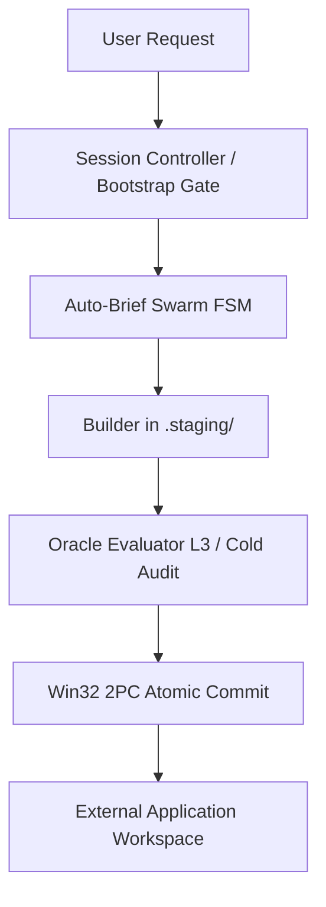
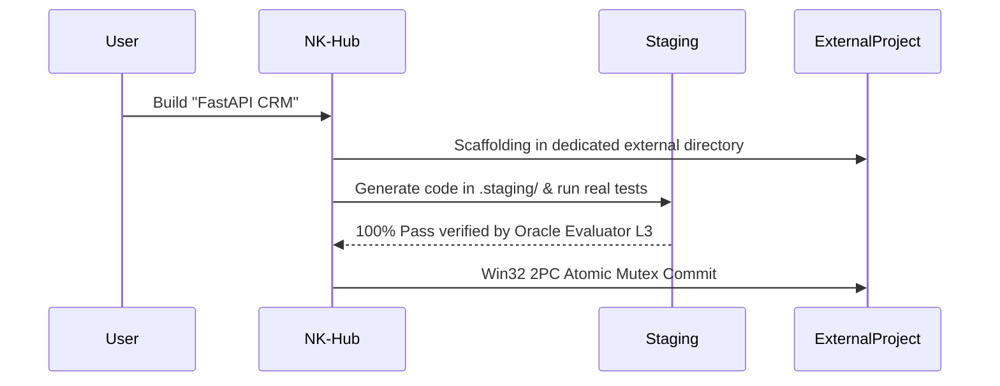

# Lab NK Hub — Sovereign AI Agentic OS (v2.6.0-DualEngine-Symbiosis)

> **The Sovereign Cognitive Operating System, Multi-Agent Swarm Orchestrator & Fast-Healing Engine for Google Antigravity**

[](#)
[](#)
[](#)
[](#)
[](#)
[](#)
[](#)

**Quick Jump Navigation:**
[🟢 Part 1: Beginners](#-part-1-for-beginners-non-technical--quickstart) | [👥 Part 2: Skills Catalog](#-part-2-complete-panoramic-catalog-of-the-16-vocational-skills) | [⚙️ Part 3: Core Engine](#-part-3-core-engine-architecture--scripts-ecosystem) | [🏛️ Part 4: Protocols (CRV 4.0)](#️-part-4-architectural-protocols--system-regulations-crv-40) | [🧮 Part 5: Math & Rigor](#-part-5-mathematical-foundations--technical-rigor-senior--auditor-section) | [🛠️ Part 6: Practical Guide](#️-part-6-practical-guide--end-to-end-walkthrough) | [📈 Part 7: Changelog](#-part-7-full-changelog-history--certification-matrix)

---

## 🟢 Part 1: For Beginners (Non-Technical & Quickstart)

### 🌟 What is Nexus Keystone in 30 Seconds?
Imagine Nexus Keystone (NK) Hub as an advanced **Control Tower & Autonomous Software Factory**, while the applications you build are the airplanes and products. 
The Hub autonomously directs construction, thoroughly tests the code in a real operating system environment (Zero Mocks), and automatically heals bugs via SBFL Ochiai algorithms. Most importantly, it keeps its own environment completely pristine (`[RULE-PROJECT-ISOLATION]`), ensuring no application code ever contaminates the core Hub.

### 🚀 Quickstart in 3 Commands

1. **Session Bootstrap (<120ms Fast-Stat):** 
   ```bash
   python scripts/nk_session_bootstrap.py
   ```
2. **Pre-flight Health Check:** 
   ```bash
   python scripts/preflight_health_check.py
   ```
3. **External Project Scaffolding:** 
   ```bash
   python scripts/external_project_scaffolder.py --name MyApp --target "..\MyApp"
   ```

### 🖥️ Unified Onboarding Dashboard & Verbal Triggers (`[RULE-00.5]`)
Under `[RULE-00.5] UNIFIED_ONBOARDING_DASHBOARD_MANDATE`, whenever the user utters an environment initiation trigger:
> **Verbal Triggers:** `"avvia ambiente nk"`, `"avvia nk hub"`, `"avvia nk"`, `"avvia hub"`, `"start nk"`, `"start hub"`, `"attiva nk"`, `"attiva ambiente nk"`

The system executes a deterministic 3-step sequence:
1. **Fast-Stat Session Bootstrap Gate:** Runs `scripts/nk_session_bootstrap.py` in $< 120$ ms (validating root isolation, purging stale WAL logs with TTL $> 60$s, and ensuring state invariants). Heavy diagnostic suites are strictly barred from session startups.
2. **Unified Master Dashboard Rendering:** Presents the canonical 15 vocational nodes (`[0]` - `[14]`):
   - **`[0] 💡 NK-Ideator`**: Conceptual Ideation, Competitor Benchmarking & SCAMPER (L0).
   - **`[1] 🏛️ NK-App-UX-Architect`**: Macro-Architecture, UX/UI Design System & Data Contracts (L3).
   - **`[2] 🏗️ NK-Backend-Architect`**: Multi-Agent Topologies & OpenAPI 3.0 REST/FastAPI Schemas (L2).
   - **`[3] ⚡ NK-Agent-Instruction-Forge`**: L1 Metaprompting & Agent System Instructions Forge.
   - **`[4] 🐍 NK-Python-Async-Builder`**: Async Python Engine, Pydantic v2 & IPC Engine (L2).
   - **`[5] 🔄 NK-Delta-Architect`**: Grounded Post-Release Worker & 4-Block Patch Execution.
   - **`[6] 🛡️ NK-Security-Auditor`**: Threat & Audit System L1/L2/L3 & Chain-of-Verification (CoVe).
   - **`[7] 🎯 NK-Oracle-Evaluator`**: Deterministic Oracle, Cold Evaluator & DOM Delta Inspector L3.
   - **`[8] ⚡ NK-Dynamic-Sandbox-StressTester`**: Real DAST Concurrency & Sandbox Stress Engine.
   - **`[9] 🐞 NK-Bug-Diagnostic-Engine`**: Spectrum-Based Fault Localization (SBFL Ochiai) & RCA.
   - **`[10] 📐 NK-Plan-Aligner`**: 1:1 Specification Alignment Gate (Turn 4 Auto-Brief Swarm FSM).
   - **`[11] 🧠 NK-State-Router`**: Kahn DAG Orchestration, SHA-256 Checksum & Circular Backup v5.0.
   - **`[12] ✍️ NK-Scribe`**: Documentation Engine, Changelog SSOT, Repo-Map & Git Mirroring.
   - **`[13] 🧠 NK-Episodic-Memory-Engine`**: 3-Tier Long-Term Episodic Memory & RRF Vector Retrieval.
   - **`[14] 👑 NK-Session-Controller`**: Session Supervisor, Sovereign Critic & Auto-Brief Swarm FSM.
3. **Two-Way Footer Guidance:**
   - **Direct Selection (Optional):** Enter **`[0]` - `[14]`** to consult or invoke a specialized node directly.
   - **Goal-Driven Mode (Recommended):** Simply describe your objective in natural language (e.g., *"Build a CRM backend"*, *"Fix authentication bug"*, *"Audit security"*). `NK-Session-Controller` and `NK-Master-Hub` automatically coordinate the appropriate subagents and skills in the background.

### 🗺️ High-Level Visual Flow


### 📖 Friendly Zero-Jargon Glossary
- **Agent**: An autonomous AI worker assigned to a specific domain or lifecycle phase.
- **Sub-Agent**: A specialized worker spawned concurrently for isolated tasks without cluttering parent context.
- **Staging Area (`.staging/`)**: A safe pre-production scratchpad where code is built and verified before promotion.
- **Shadow Sandbox (`%TEMP%\nk_sandbox_*`)**: An ephemeral runtime container where tests run against real OS processes.
- **2PC Commit**: Two-Phase Commit protocol with Named Mutex that guarantees atomic promotion or zero-damage rollback.
- **AST**: Abstract Syntax Tree validator ensuring pure syntax and scope integrity before code execution.
- **SBFL Self-Healing**: Mathematical fault radar using the Ochiai metric to pinpoint bugs and heal them automatically.

---

## 📖 Table of Contents (TOC)
- [🟢 Part 1: For Beginners (Non-Technical & Quickstart)](#-part-1-for-beginners-non-technical--quickstart)
- [👥 Part 2: Complete Panoramic Catalog of the 16 Vocational Skills](#-part-2-complete-panoramic-catalog-of-the-16-vocational-skills)
- [⚙️ Part 3: Core Engine Architecture & Scripts Ecosystem](#-part-3-core-engine-architecture--scripts-ecosystem)
- [🏛️ Part 4: Architectural Protocols & System Regulations (CRV 4.0)](#️-part-4-architectural-protocols--system-regulations-crv-40)
- [🧮 Part 5: Mathematical Foundations & Technical Rigor (Senior / Auditor Section)](#-part-5-mathematical-foundations--technical-rigor-senior--auditor-section)
- [🛠️ Part 6: Practical Guide & End-to-End Walkthrough](#️-part-6-practical-guide--end-to-end-walkthrough)
- [📈 Part 7: Full Changelog History & Certification Matrix](#-part-7-full-changelog-history--certification-matrix)

---

## 👥 Part 2: Complete Panoramic Catalog of the 16 Vocational Skills

### Context & Architecture of Skills
Skills in NK Hub are modular, isolated units of vocational competence. This architecture enforces Universal DDI (Define, Delegate, Idle), prevents token saturation, maintains pristine context hygiene, and guarantees deterministic boundaries.

### Master Comparison Table of all 16 Skills

| Skill Name | Tier / Layer | Role & Scope | CRV Phase & FSM Turn | Operational Mode |
| :--- | :--- | :--- | :--- | :--- |
| [NK-Ideator](.agents/skills/NK-Ideator/SKILL.md) | Tier 0 | Ideation & Benchmarking | FSM Turn 1 | Strict Read-Only |
| [NK-App-UX-Architect](.agents/skills/NK-App-UX-Architect/SKILL.md) | Tier 0 | UX/UI Design & Prototyping | FSM Turn 1 | Hybrid I/O |
| [NK-Agent-Instruction-Forge](.agents/skills/NK-Agent-Instruction-Forge/SKILL.md) | Tier 0 | Prompt Engineering & Spec | FSM Turn 1 | Strict Read-Only |
| [NK-Session-Controller](.agents/skills/NK-Session-Controller/SKILL.md) | Tier 1 | Session Supervisor | FSM Turn 1-5 | Strict Read-Only |
| [NK-Plan-Aligner](.agents/skills/NK-Plan-Aligner/SKILL.md) | Tier 1 | Validation & Verification | FSM Turn 4 | Strict Read-Only |
| [NK-Master-Hub](.agents/skills/NK-Master-Hub/SKILL.md) | Tier 1 | DAG Orchestration & Commit | Macro 3 | Sovereign Committer |
| [NK-Delta-Architect](.agents/skills/NK-Delta-Architect/SKILL.md) | Tier 2 | High-Level Architecture | Macro 1 | Staging Builder |
| [NK-Python-Async-Builder](.agents/skills/NK-Python-Async-Builder/SKILL.md) | Tier 2 | Python Async Coding | Macro 1 | Staging Builder |
| [NK-Backend-Architect](.agents/skills/NK-Backend-Architect/SKILL.md) | Tier 2 | Backend & API Schema | Macro 1 | Staging Builder |
| [NK-Bug-Diagnostic-Engine](.agents/skills/NK-Bug-Diagnostic-Engine/SKILL.md) | Tier 3 | Bug Root Cause Analysis | Macro 2 | Strict Read-Only |
| [NK-Oracle-Evaluator](.agents/skills/NK-Oracle-Evaluator/SKILL.md) | Tier 3 | Cold Audit & Testing | Macro 2 | Strict Read-Only |
| [NK-Dynamic-Sandbox-StressTester](.agents/skills/NK-Dynamic-Sandbox-StressTester/SKILL.md) | Tier 3 | DAST & Stress Testing | Macro 2 | Strict Read-Only |
| [NK-Security-Auditor](.agents/skills/NK-Security-Auditor/SKILL.md) | Tier 4 | Security & Threat Model | Macro 2 | Strict Read-Only |
| [NK-Episodic-Memory-Engine](.agents/skills/NK-Episodic-Memory-Engine/SKILL.md) | Tier 4 | 3-Tier Long-Term Memory | Post-Macro 3 | Data Archiver |
| [NK-Scribe](.agents/skills/NK-Scribe/SKILL.md) | Tier 4 | Documentation & Changelog | Post-Macro 3 | Documentation Engine |
| [NK-State-Router](.agents/skills/NK-State-Router/SKILL.md) | Tier 4 | Cognitive Routing & Sync | Macro 3 | State Synchronizer |

### Detailed Narrative Breakdown

- **Tier 0 (Ideation & UX)**: `NK-Ideator` leads brainstorming. `NK-App-UX-Architect` designs UI/UX journeys. `NK-Agent-Instruction-Forge` shapes agent instructions. Strict Read-Only to safeguard the Hub.
- **Tier 1 (Planning & Governance)**: `NK-Session-Controller` supervises the FSM lifecycle, `NK-Plan-Aligner` ensures 1:1 specification fidelity, and `NK-Master-Hub` orchestrates DAG execution and commits changes.
- **Tier 2 (Code Builders & Topology)**: `NK-Delta-Architect`, `NK-Python-Async-Builder`, and `NK-Backend-Architect` construct features exclusively in `.staging/`.
- **Tier 3 (Diagnostics & Verification)**: `NK-Bug-Diagnostic-Engine`, `NK-Oracle-Evaluator`, and `NK-Dynamic-Sandbox-StressTester` execute zero-mock tests, DOM delta verification, and dynamic stress profiling.
- **Tier 4 (Security, Memory & Release)**: `NK-Security-Auditor` hardens endpoints, `NK-Episodic-Memory-Engine` indexes episodic knowledge, `NK-Scribe` maintains documentation and Git changelogs, and `NK-State-Router` tracks genome drift.

---

## ⚙️ Part 3: Core Engine Architecture & Scripts Ecosystem

The `scripts/` directory is the resilient runtime core of Nexus Keystone Hub:

- **Runtime Defense & Session Governance:**
  - `nk_session_bootstrap.py`: Initial gatekeeper. Fast-Stat validation ($<120$ ms) and orphaned WAL cleanup.
  - `nk_active_runtime_sentinel.py`: Continually monitors runtime steps and enforces EGPWS defensive gates.
  - `nk_context_sentry.py`: Preserves context integrity and calculates token footprint traffic light.
  - `nk_compliance_checker.py`: Validates strict protocol adherence and anti-polling compliance.
  - `preflight_health_check.py`: Comprehensive hub wellness probe and cache hygiene.
  - `platform_runner.py`: Universal safe subprocess runner with unbuffered stream normalization and CP1252/UTF-8 resilience.
- **Swarm IPC & Handoff:**
  - `nk_swarm_messenger.py`: Inter-agent IPC with strict 1,800-char MTU and disk spillover.
  - `nk_session_handoff.py`: State capsule snapshot and session resumption engine.
  - `nk_auto_inning.py`: Manages iteration innings with monotonic quality ratchet.
  - `async_heartbeat_signaler.py`: Background liveness pulse preventing Google Drive FS lock freeze-ups.
- **Mutation & Win32 2PC Commit:**
  - `win32_2pc_engine.py`: Win32 Named Mutex atomic 2PC promotion engine with orphan `.wal/` directory cleanup, SHA-256 verification, and Shadow Swap fallback.
  - `healing_snapshot_rollback.py`: Transactional staging snapshot manager with automated rollback on regression.
  - `safe_cleanup_dev_servers.py`: Graceful background dev server termination before edits.
- **Diagnostics, Verification & Auto-Healing:**
  - `sbfl_engine.py`: Spectrum-Based Fault Localization math engine (Ochiai metric, $<80$ token diagnostic payload).
  - `sbfl_pytest_bridge.py`: Real-time Pytest trace collector and suspiciousness calculator.
  - `auto_heal_pipeline.py`: Orchestrated fast-loop auto-healer with automatic Windows pytest command normalization (`sys.executable -m pytest`) and fitness gate.
  - `invisible_healing_loop.py`: Background self-repair loop in `.staging/` (AST $\to$ DAST $\to$ SBFL).
  - `oracle_evaluator_l3.py`: L3 DOM Reader & E2E Oracle Evaluator for zero-mock HTML/DOM tree delta verification.
  - `micro_hud_renderer.py`: Real-Time Micro-HUD stream renderer with native CP1252 / pure ASCII fallback mode for legacy Windows consoles.
  - `dast_sandbox_runner.py`: Concurrency and memory watchdog stress runner in isolated `%TEMP%` sandboxes.
- **Memory & Optimization:**
  - `memory_3tier_engine.py`: 3-Tier episodic memory engine across ARCH, SEC, OPS, and DEVX domains (350 token cap).
  - `deterministic_api_cache.py`: Tier-0 deterministic local API cache (SQLite WAL) preventing network rate-limits.
  - `quality_baseline_manager.py`: Sustains the non-regressive 100.0% test pass ratchet.
- **AST Mapping & Scaffolding:**
  - `ast_guard_validator.py`: Pure AST static validator checking scope integrity (PEP 634 pattern matching, PEP 695 type parameters).
  - `ast_repo_mapper.py`: Dependency graph analyzer, Karpathy slicer, and high-density AST repo-map generator.
  - `external_project_scaffolder.py`: Deterministic scaffolder creating external project roots (`[RULE-PROJECT-ISOLATION]`).
  - `vibe_sprint_router.py`: Mode C router calculating AST Risk Score for rapid frontend iterations.

---

## 🏛️ Part 4: Architectural Protocols & System Regulations (CRV 4.0)

### The 8 Sovereign Pillars
1. `[RULE-PROJECT-ISOLATION]`: External Project Directory Mandate. Application code NEVER resides in the Hub.
2. `[RULE-00]`: Hard Execution Gate. Zero unauthorized file modification in production.
3. `[RULE-00.5]`: Unified Onboarding Dashboard Mandate. Fast-Stat bootstrap gate & 15-node canonical dashboard.
4. `[RULE-01]`: Universal DDI Mandate (Define, Delegate, Idle). Zero monolithic main-thread context bloat.
5. `[RULE-REACTIVE-SILENCE]`: Anti-Polling Watchdog Mandate. Zero busy polling on background tasks.
6. `[RULE-01.2]`: Zero-Mock Mandate & Tier-0 Local API Cache. Pure OS execution without fake mocks.
7. `[RULE-01.1]`: Win32 2PC Atomic Mutex & Shadow Swap Fallback.
8. `[RULE-01.10]`: Permanent Test Suite Ratchet (78 Golden Tests 100.0% PASS).

### The CRV 4.0 Protocol
- **Macro 1: Build & Stage**: Code written strictly in `.staging/`. AST verification & Invisible Healing Loop.
- **Macro 2: Unified Dynamic Audit**: 100% Strict Read-Only verification (SAST, Oracle Evaluator, Real DAST).
- **Macro 3: 2PC Atomic Commit**: Win32 Named Mutex promotion, WAL purge, 3-tier memory snapshot.
- **Macro 4: Deterministic Teardown**: Ephemeral sandbox cleanup and `.staging/` clearing.

### Auto-Brief Swarm FSM (5 Turns)
Draft Synthesis $\to$ Attack & Stress Swarm $\to$ Refine & Solution Architecture $\to$ 1:1 Plan Alignment $\to$ Garbage Collection & Handoff.

### Triple-Speed Vibe Coding Taxonomy
- **Mode A (Sovereign CRV)**: Full 5-turn FSM and formal 4-macro audit for architectural releases.
- **Mode B (Fast-Track Staging)**: Surgical backend bugfixes with AST + DAST in staging before commit.
- **Mode C (Vibe-Sprint)**: Fluid-track UI/Frontend iterations ($\le 150$ LOC, $<15$s render, zero-mock).

---

## 🧮 Part 5: Mathematical Foundations & Technical Rigor (Senior / Auditor Section)

### Ochiai Spectrum SBFL Formula
$$S_{Ochiai}(s) = \frac{\text{failed}(s)}{\sqrt{\text{total\_failed} \times (\text{failed}(s) + \text{passed}(s))}}$$
Localizes faults via execution spectrum matrices ($e_f, e_p, n_f, n_p$) in staging, emitting payloads in $<80$ tokens.

### Reciprocal Rank Fusion (BM25 + Dense Cosine) Formula
$$RRF\_Score(d) = \sum_{m \in M} \frac{1}{k + r_m(d)} \quad (k = 60)$$
Hybrid multi-domain retrieval across ARCH, SEC, OPS, and DEVX with a strict 350-token cap.

### Kahn DAG Topological Sorting & Cycle Detection
Applies in-degree queue processing and edge matrix verification to guarantee strict acyclicity in multi-agent routing.

### Win32 2PC Named Mutex Protocol
Acquires Win32 kernel named mutex (`CreateMutexW`), verifies SHA-256 and CRC32 WAL records, and promotes atomically using `MoveFileExW` with Shadow Swap Fallback. Cleans up empty `.wal/` directories to prevent file system clutter.

### EGPWS Active Runtime Sentinel FSM
| State | Step Count | Action / Status |
| :--- | :--- | :--- |
| **Green** | $<60$ steps | Optimal execution (SLA $<25$ ms) |
| **Caution** | 60-84 steps | Warning alert generated |
| **Critical**| 85-99 steps | Active intervention required |
| **Red** | $\ge 100$ steps | Hard shutdown enforced |

### Swarm MTU 1,800-Character Hard Gate & Head-Tail Compression
All inter-agent messages are strictly capped at 1,800 characters. Large outputs spill to `%TEMP%\nk_diagnostics\`. A Head-Tail fallback keeps the first 400 chars and last 800 chars of tracebacks.

### Rigid SLA Latency Matrix Table
- **Fast-Stat Bootstrap**: $<120$ ms
- **Active Sentinel Check**: $<25$ ms
- **Win32 2PC Atomic Commit**: $<350$ ms
- **SBFL Ochiai Diagnosis**: $<3.5$ s
- **Permanent Golden Test Suite**: $<20$ s

---

## 🛠️ Part 6: Practical Guide & End-to-End Walkthrough

### For Non-Technical Users
- **Building a new app**: Simply state your goal. The Hub scaffolds an external folder and builds the app.
- **Importing Data**: CSV or vCard uploads trigger automated schema extraction and validation.
- **Fixing Bugs**: The Invisible Healing Loop repairs failures in staging before production files are touched.
- **Fast UI Tweaks**: Request UI enhancements to trigger Mode C for real-time rendering.

### For Senior Engineers
- **Pre-flight health probe**: `python scripts/preflight_health_check.py`
- **Safe platform runner**: `python scripts/platform_runner.py`
- **AST repo mapper**: `python scripts/ast_repo_mapper.py`
- **Permanent test suite**: `python -m pytest tests/ -q`

### End-to-End Walkthrough Flow


---

## 📈 Part 7: Full Changelog History & Certification Matrix

### Comprehensive Release History
- **v2.6.0-DualEngine-Symbiosis**: Dual-Mirroring Artifact Bridge (`/plan`), Autonomous Goal Drive (`/goal`), 4 Adversarial Context Shields (C1 Target Resolution, C2 Context Sentry, C3 Unattended Failure Manifest, C4 2PC Safety Gate), 3 Zero-Mock Fast-Healing Pillars, Dead Code Cleansing on 28 files, Pre/Post-Cleansing Sandwich NAS/TAS Audit, 48/48 AST Guard, and permanent ratchet to 79 Golden Tests (100.0% PASS).
- **v2.5.2-Hardened**: Unified Onboarding Dashboard Mandate (`[RULE-00.5]`), 78 Permanent Golden Tests suite ratchet, automatic Windows pytest normalization in `auto_heal_pipeline.py`, L3 DOM Oracle Reader (`scripts/oracle_evaluator_l3.py`), Real-Time Micro-HUD renderer (`scripts/micro_hud_renderer.py`), Win32 2PC orphaned `.wal/` directory cleanup, and 100% documentation parity.
- **v2.5.1-Hardened**: Session Bootstrap Gate ($<120$ ms), Universal Safe Subprocess Runner v2, Reactive Silence Anti-Polling, Deterministic Scaffolder, Tier-0 Local API Cache Zero-Mock, Win32 2PC Mutex & 74 Golden Tests suite ratchet.
- **v2.4.2-PanoramicMastery**: Full 16-skill catalog restoration, beginner/expert documentation, 74 Golden Tests.
- **v2.4.1-TAS-Sandbox-Documentation**: TAS L1-L3 audit, sandbox auto-healing stress test, GitHub documentation parity.
- **v2.4.0-ActiveSentinel**: Zero-mock sentinel engine, EGPWS runtime defense, swarm messenger spillover.
- **v2.2.0-AntiSaturation**: Universal DDI, message hygiene, cold review isolation.
- **v2.1.0-FastHealing**: 3-pillar fast-healing pipeline, AST scope hardening.
- **v2.0.0-Hardened**: Session bootstrap gate, Win32 2PC mutex, safe platform runner v2.
- **v1.9.0-PlatformOptimized**: Memory 3-tier engine, quality baseline manager.
- **v1.8.0-ModularStable**: Architecture modularization, 16 vocational skills stabilization.

### Certified Golden Test Suite Matrix (79/79 PASS)

| Component | Test File | Tests | Verification Method | Status |
| :--- | :--- | :---: | :--- | :---: |
| **AST Guard Validator** | `tests/test_ast_guard_validator.py` | 6 | AST Scope Integrity, PEP 634/695 & Syntactic Purity | 100.0% PASS |
| **AST Repo Mapper** | `tests/test_ast_repo_mapper.py` | 10 | Cache Concurrency, Dependency Graph & PageRank | 100.0% PASS |
| **Auto-Heal Pipeline** | `tests/test_auto_heal_pipeline.py` | 6 | SBFL Bridge, Snapshot Rollback & Fitness Gate | 100.0% PASS |
| **Active Sentinel Suite** | `tests/test_active_sentinel_suite.py` | 4 | Runtime States, Swarm MTU Spillover & Inning Ratchet | 100.0% PASS |
| **Context Sentry** | `tests/test_context_sentry.py` | 5 | Token Estimation, Head-Tail & Traffic Light | 100.0% PASS |
| **DAST Sandbox** | `tests/test_dast_sandbox.py` | 5 | Line Tracer, Process Tree Kill & Watchdog Limits | 100.0% PASS |
| **Memory 3-Tier** | `tests/test_memory_3tier.py` | 6 | BM25 + Dense Cosine RRF, Sliding Window & Win32 Replace | 100.0% PASS |
| **Platform Upgrades** | `tests/test_platform_upgrades.py` | 4 | Env Capability Probe, Safe Runner & Pytest Config | 100.0% PASS |
| **SBFL Engine** | `tests/test_sbfl_engine.py` | 7 | Ochiai Precision, Def-Use Filter & Tri-Pass Flaky Removal | 100.0% PASS |
| **Schemas & Contracts** | `tests/test_schemas_and_contracts.py` | 5 | Pydantic v2 Strict Mode, SHA-256 DAG & IPC Footprint | 100.0% PASS |
| **Super Brief Upgrades** | `tests/test_super_brief_upgrades.py` | 6 | Fast-Stat Bootstrap, Scaffolder, Cache & Goal Failure Manifest | 100.0% PASS |
| **Unified Onboarding Mandate** | `tests/test_unified_onboarding_mandate.py` | 4 | [RULE-00.5], 15 Nodi Hub, Boundary 10 & Bootstrap | 100.0% PASS |
| **Win32 2PC Engine** | `tests/test_win32_2pc.py` | 7 | Named Mutex, Thread Affinity, 50 Concurrent Writers | 100.0% PASS |
| **Real Sandbox Stress** | `tests/stress/test_real_sandbox_stress.py` | 4 | Swarm Flooder, Monolithic Spammer & Traceback Bomb | 100.0% PASS |
| **Total** | **14 Permanent Test Files** | **79** | **Comprehensive Zero-Mock Automated Verification** | **79/79 PASS (100.0%)** |

---
*Generated by NK-Master-Scribe-Builder | Nexus Keystone Hub*
