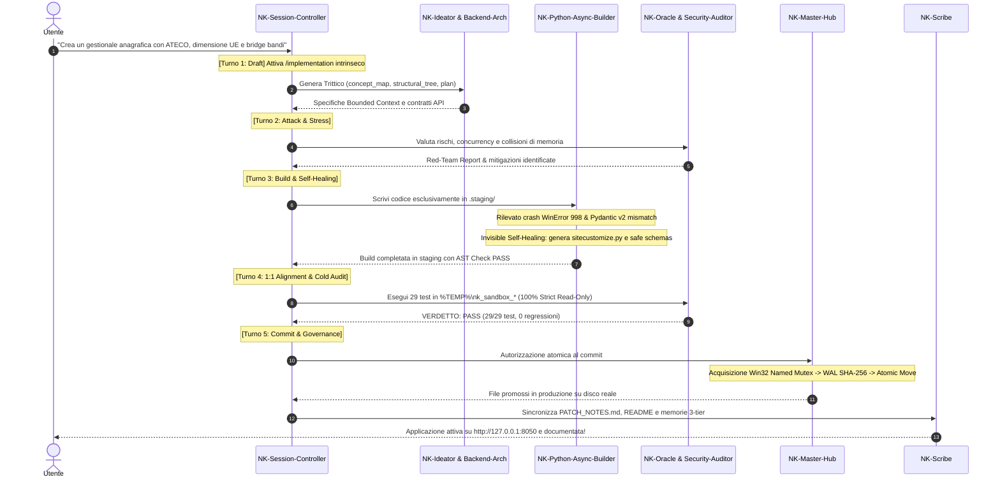

# 🏛️ Nexus Keystone Hub — Sovereign AI Agentic OS (v1.6.0-VibeEnhanced)
### *Sistema Operativo per Sviluppo Agentico Sovrano, Vibe Coding ad Alta Velocità & Validazione Zero-Mock*

<p align="center">
  
  
  
  
  
  
  
</p>

---

## 📦 Archivio Storico: Download & Info Versione Precedente

Per garantire la massima tracciabilità storica, l'intero codice, i dataset e la documentazione della versione precedente (**v1.3.0-Universal-Official / v1.1.0**) sono stati archiviati e compressi:

* 📄 **File Informativo Dettagliato (Cosa faceva la versione precedente):**  
  👉 Leggi [`releases/LEGACY_VERSION_V1.3.0_INFO.txt`](releases/LEGACY_VERSION_V1.3.0_INFO.txt) per visualizzare l'architettura originaria, le fonti censite e le motivazioni della transizione.
* 💾 **Download Pacchetto Zip Completo Versione Precedente:**  
  👉 Scarica [`releases/Nexus_Keystone_Hub_v1.3.0_Legacy_Backup.zip`](releases/Nexus_Keystone_Hub_v1.3.0_Legacy_Backup.zip) (Archivio zip integrale conforme al tag git `v1.3.0-Universal-Official`).

---

## ⚡ Patch Notes & Novità v1.6.0-VibeEnhanced (Cosa è Cambiato e Potenziato)

La release **v1.6.0-VibeEnhanced** rappresenta il più importante salto generazionale dell'ecosistema: trasforma Antigravity da ambiente di controllo rigido in un **motore per il Vibe Coding fluido, ininterrotto e sicuro**.

Ecco cosa è stato introdotto, potenziato e corretto:

### 1. 💓 Anti-Freeze Pulse Sentinel ([`scripts/async_heartbeat_signaler.py`](scripts/async_heartbeat_signaler.py))
- **Problema Risolto:** Durante elaborazioni prolungate o task asincroni (>45 secondi), l'assenza di output faceva congelare l'interfaccia o l'interprete dell'agente. Inoltre, scrivere log diagnostici su volumi sincronizzati da cloud (Google Drive) scatenava errori `WinError 32` / `WinError 5` (Sharing Violation) e deadlock I/O.
- **Potenziamento:** Emette un impulso vitale (*heartbeat*) ogni 15-20s con un watchdog hard ceiling a 45s. Tutti i dump e i dati transitori sono rigorosamente isolati nella cartella fisica locale `%TEMP%\nk_diagnostics\`, azzerando i freeze e i lock su filesystem virtuali.

### 2. ⚡ Tassonomia a Tripla Velocità per il Vibe Coding ([`scripts/vibe_sprint_router.py`](scripts/vibe_sprint_router.py))
- **Problema Risolto:** Il precedente *Hard Execution Gate* (`[RULE-00]`) bloccava qualsiasi scrittura senza autorizzazione manuale preventiva, trasformando anche piccoli ritocchi UI o micro-script in un frustrante "permission ping-pong".
- **Potenziamento:** Introdotte 3 modalità operative graduate:
  - **⚡ Mode C (Vibe-Sprint / Fluid-Track):** Attivato per frontend, UI o modifiche rapide ($\le 150$ LOC, AST Risk Score $\le 0.3$). Time-To-First-Render $<15$s in staging senza burocrazia.
  - **🔧 Mode B (Fast-Track Staging):** Per bugfix e micro-features su backend con validazione mirata pre-commit.
  - **🏛️ Mode A (Sovereign CRV 4.0):** Riservato a rilasci di sistema, modifiche architetturali profonde e refactoring core con l'intera FSM a 5 turni.

### 3. 🎯 Mandati Intrinseci `/implementation` e `/goal`
- **`[RULE-01.11]` Intrinsic Implementation:** Non occorre più ricordare all'agente di strutturare i piani secondo lo standard `/implementation`. Qualsiasi richiesta di pianificazione, brief o architettura genera automaticamente il Trittico in `nk_genome/` (`concept_map.md`, `structural_tree.md`, `implementation_plan.md`).
- **`[RULE-01.12]` Intrinsic Goal:** Quando l'utente esprime un obiettivo ("sviluppa la feature X", "risolvi questo bug"), l'agente attiva la modalità ininterrotta e il self-healing loop fino alla certificazione della *Definition of Done*.

### 4. 👥 Armonizzazione Totale delle 16 Skill & FSM a 5 Turni
- Tutte le 16 skill vocazionali sono state aggiornate allo standard **CRV 4.0** a 4 Macro-Fasi e allineate sulla **Swarm FSM a 5 Turni** (Turn 1: Draft, Turn 2: Attack/Stress, Turn 3: Refine/Build, Turn 4: Alignment 1:1, Turn 5: Commit & Handoff).
- Formalizzata la gerarchia di sovranità: `NK-Session-Controller` detiene il potere di VETO logico, `NK-Master-Hub` è il gestore esclusivo del commit su disco.

### 5. 🛡️ Bonifica Scorie, Correzione Ratchet e Protezione 109 Test
- **Ratchet Non-Regressivo (`nk_tracking/quality_baseline.json`):** Corretto il bug che impostava `"higher_is_better": true` sul failure rate. Ora il ratchet protegge rigorosamente il 100% PASS su tutti i **109 test permanenti**.
- **Bonifica Repository:** Eliminati file orfani con path hardcoded (`verify_benchmark_60.py`), ripulite directory effimere e archiviati i test legacy a 60 scenari.
- **Compatibilità Windows / GoogleDriveFS (`sitecustomize.py`):** Risolto il crash `WinError 998: Invalid access to memory location` generato da Python 3.14 quando caricava librerie native compilate in Rust (`_rust.pyd` di `cryptography`) da volumi virtuali cloud, tramite caching trasparente su NVMe locale.

---

## 📖 Indice dei Contenuti
1. [🌟 Che cos'è Nexus Keystone Hub?](#-1-che-cosè-nexus-keystone-hub)
2. [⚙️ Come Funziona e Come NON Funziona](#-2-come-funziona-e-come-non-funziona)
3. [👥 Mappa Completa delle 16 Skill Vocazionali](#-3-mappa-completa-delle-16-skill-vocazionali)
4. [🛠️ Guida Pratica: Come Utilizzarlo (Per Utenti Esperti e Non Esperti)](#-4-guida-pratica-come-utilizzarlo-per-utenti-esperti-e-non-esperti)
5. [🔄 Scenario di Esempio End-to-End: Il Flusso di una Task Reale](#-5-scenario-di-esempio-end-to-end-il-flusso-di-una-task-reale)
6. [🚀 Installazione Rapida & Verifiche di Piattaforma](#-6-installazione-rapida--verifiche-di-piattaforma)
7. [📊 Matrice Ufficiale di Certificazione](#-7-matrice-ufficiale-di-certificazione)

---

# 🌟 1. Che cos'è Nexus Keystone Hub?

**Nexus Keystone Hub (NK)** non è una semplice libreria e non è un set di prompt testuali: è un **Sistema Operativo Agentico Deterministico (Agentic OS)** progettato per governare gli assistenti di coding AI (come Google Antigravity e Claude) quando lavorano su codebase reali.

```text
┌────────────────────────────────────────────────────────────────────────────────────────┐
│                        NEXUS KEYSTONE v1.6.0-VIBEENHANCED                              │
│                                                                                        │
│   🗣️ Utente (Richiesta Naturale / Vibe Coding)                                         │
│        │                                                                               │
│        ▼                                                                               │
│   🧠 NK-Session-Controller  ──► Auto-Brief Swarm FSM (5 Turni Concatenati)             │
│        │                                                                               │
│   ┌────┴───────────────────────────┬───────────────────────────┐                       │
│   ▼                                ▼                           ▼                       │
│ ⚡ Mode C (Vibe-Sprint)        🔧 Mode B (Fast-Track)      🏛️ Mode A (Sovereign CRV)   │
│   (UI/Frontend, TTFR <15s)         (Bugfix & Micro-API)        (Release Core, Trittico)│
│        │                                │                           │                  │
│        └────────────────────────────────┴───────────────────────────┘                  │
│                                │                                                       │
│                                ▼                                                       │
│   📦 Staging Isolato (.staging/) ──► Invisible Self-Healing Loop (AST + SBFL Ochiai)   │
│                                │                                                       │
│                                ▼                                                       │
│   🔬 Dynamic Sandbox (%TEMP%\nk_sandbox_*) ──► Cold Audit 100% Strict Read-Only        │
│                                │                                                       │
│                                ▼ (Solo se 100% PASS)                                  │
│   🔒 NK-Master-Hub Commit  ──► Win32 2PC Named Mutex + WAL SHA-256 + MoveFileExW       │
│                                │                                                       │
│                                ▼                                                       │
│   💾 Memoria Episodica 3-Tier & Mirroring Changelog SSOT (NK-Scribe)                   │
└────────────────────────────────────────────────────────────────────────────────────────┘
```

Nel coding tradizionale con AI, gli agenti tendono a:
- Scrivere subito nei file di produzione rompendo codice funzionante;
- Usare mock finti nei test che nascondono i bug reali;
- Bloccarsi durante elaborazioni lunghe o provocare lock sui file condivisi;
- Dimenticare le decisioni prese all'inizio della sessione.

**Nexus Keystone Hub elimina radicalmente queste debolezze**, garantendo che ogni riga di codice prodotta sia testata matematicamente su processi reali prima di essere confermata.

---

# ⚙️ 2. Come Funziona e Come NON Funziona

Per sfruttare appieno l'Hub, è fondamentale comprendere i confini operativi del sistema:

### 🟢 Come Funziona (I 5 Pilastri Sovrani)
1. **Staging Obbligatorio (`.staging/`):** Nessun costruttore scrive direttamente nei file di produzione (`src_app/`). Tutto viene generato in `.staging/` e validato preventivamente dall'AST Guard Validator.
2. **Invisible Self-Healing Loop:** Se il codice in staging fallisce un test o ha un errore di sintassi, il sistema attiva fino a 3 iterazioni automatiche di auto-riparazione con localizzazione del guasto (SBFL Ochiai), senza interrompere l'utente per domande banali.
3. **Audit Isolato 100% Strict Read-Only (Macro-Fase 2):** Durante l'audit, i validatori (`NK-Oracle-Evaluator`, `NK-Security-Auditor`) NON possono modificare il codice. Valutano la patch a freddo in una sandbox temporanea: al minimo difetto, scatta il VETO immediato.
4. **Commit Atomico a 2 Fasi (Win32 2PC Mutex):** Solo dopo un PASS pieno, l'Hub Sovrano acquisisce un Named Mutex di Windows a livello di kernel, scrive il Write-Ahead Log (WAL) con hash crittografico SHA-256 e promuove i file in produzione con rename atomico (`MoveFileExW`).
5. **Memoria Episodica a 3 Livelli:** Organizzata su 4 domini (`ARCH`, `SEC`, `OPS`, `DEVX`), mantiene la memoria di lavoro sotto i 350 token per dominio, garantendo sessioni lunghe senza saturazione del contesto.

### 🔴 Come NON Funziona (Cosa l'Ecosistema VIETA Tassativamente)
- ❌ **NON permette modifiche dirette a caldo:** Nessun agente può fare `write_to_file` su file di produzione senza passare dal ciclo di staging e audit.
- ❌ **NON accetta mock o simulazioni (`[RULE-01.2]`):** È categoricamente vietato l'uso di `unittest.mock.MagicMock`. I test devono interrogare database SQLite reali, processi reali e API reali.
- ❌ **NON fa "permission ping-pong" su task veloci:** In modalità Mode C o su script di supporto, l'agente non ti chiederà conferma per ogni singolo comando o file temporaneo, ma procederà fluidamente fino al risultato.
- ❌ **NON degrada il passato (`[RULE-01.10]`):** Nessuna modifica può ridurre la percentuale di superamento della suite permanente di 109 test sotto il 100.0%.

---

# 👥 3. Mappa Completa delle 16 Skill Vocazionali

L'ecosistema scompone il ciclo di sviluppo su **16 agenti specializzati**, ciascuno con un ruolo preciso e vincoli ferrei:

| # | Skill | Ruolo & Vocazione | Macro-Fase CRV | Turno FSM | Modalità I/O |
| :---: | :--- | :--- | :---: | :---: | :--- |
| **1** | [`NK-Master-Hub`](.agents/skills/NK-Master-Hub/SKILL.md) | **Sovrano Infrastrutturale L3.** Central Change Router, Kahn DAG, lock Win32 Named Mutex e titolarità esclusiva del commit 2PC. | Macro 3 | Turno 5 | Full I/O (Sovereign Committer) |
| **2** | [`NK-Session-Controller`](.agents/skills/NK-Session-Controller/SKILL.md) | **Sovrano Critico di Sessione.** Orchestratore dell'Auto-Brief Swarm FSM a 5 turni, gestore trigger `/implementation` e `/goal`, potere di VETO assoluto. | Tutte | Turno 1-5 | Strict Read-Only su `src_app/` |
| **3** | [`NK-Ideator`](.agents/skills/NK-Ideator/SKILL.md) | **Ideatore Concettuale (L0).** Tecniche SCAMPER, benchmark analysis, stress concettuale e generazione della Concept Map in `nk_genome/`. | Macro 1 | Turno 1 | Write su `nk_genome/` |
| **4** | [`NK-Plan-Aligner`](.agents/skills/NK-Plan-Aligner/SKILL.md) | **Allineatore 1:1.** Verifica corrispondenza esatta tra Brief concettuale, Albero Strutturale e Implementation Plan prima dello sviluppo. | Macro 1 | Turno 4 | Strict Read-Only su `src_app/` |
| **5** | [`NK-Python-Async-Builder`](.agents/skills/NK-Python-Async-Builder/SKILL.md) | **Costruttore Core Backend.** Infrastrutture asincrone Python, Pydantic v2, OpenAPI 3.0 e sandboxing nativo. Scrive solo in `.staging/`. | Macro 1 | Turno 3 | Staging Writer |
| **6** | [`NK-Delta-Architect`](.agents/skills/NK-Delta-Architect/SKILL.md) | **Architetto di Modifica & Patch.** Riceve prompt a 4 blocchi, esegue il Two-Stage Grounding e guida l'Invisible Self-Healing Loop. | Macro 1 | Turno 3 | Staging Writer |
| **7** | [`NK-Backend-Architect`](.agents/skills/NK-Backend-Architect/SKILL.md) | **Progettista Topologie & API.** Modella schemi database, contratti OpenAPI e architetture scalabili. | Macro 1 | Turno 1-3 | Architecture Specifier (Read-Only) |
| **8** | [`NK-App-UX-Architect`](.agents/skills/NK-App-UX-Architect/SKILL.md) | **Architetto UX/UI & Frontend.** Progetta interfacce responsive, dashboard accessibili e contratti DOM. | Macro 1 | Turno 1-3 | Strict Read-Only su `src_app/` |
| **9** | [`NK-Oracle-Evaluator`](.agents/skills/NK-Oracle-Evaluator/SKILL.md) | **Oracolo Deterministico.** Cold Auditor per validazione patch in sandbox effimera, composite scoring triple-sample e verifiche matematiche. | Macro 2 | Turno 4 | Strict Read-Only (100%) |
| **10** | [`NK-Security-Auditor`](.agents/skills/NK-Security-Auditor/SKILL.md) | **Auditor di Sicurezza Full-Stack.** Analisi vulnerabilità SAST/DAST L1/L2/L3, Dual-Shield Cascade e rilascio report olografici TAS. | Macro 2 | Turno 2 | Strict Read-Only (100%) |
| **11** | [`NK-Dynamic-Sandbox-StressTester`](.agents/skills/NK-Dynamic-Sandbox-StressTester/SKILL.md) | **Stress Tester Runtime.** Esegue pen-testing, simulazioni di carico concorrente e DAST dinamico in sandbox isolate. | Macro 2 | Turno 2 | Sandbox Dynamic Execution |
| **12** | [`NK-Bug-Diagnostic-Engine`](.agents/skills/NK-Bug-Diagnostic-Engine/SKILL.md) | **Motore Diagnostico RCA.** Localizzazione guasti SBFL (Ochiai, Tarantula) e scarto automatico di falsi bug. | Macro 1 | Turno 2 | Strict Read-Only |
| **13** | [`NK-State-Router`](.agents/skills/NK-State-Router/SKILL.md) | **Gestore di Stato & Drift Detection.** Manutenzione del DAG strutturale, rilevamento drift del codice e backup circolari. | Macro 1-3 | Tutte | State Manager |
| **14** | [`NK-Episodic-Memory-Engine`](.agents/skills/NK-Episodic-Memory-Engine/SKILL.md) | **Gestore Memoria a Lungo Termine.** Indicizzazione vettoriale, archiviazione JSONL e recupero semantico per i 4 domini NK. | Macro 3 | Turno 5 | Memory Engine |
| **15** | [`NK-Agent-Instruction-Forge`](.agents/skills/NK-Agent-Instruction-Forge/SKILL.md) | **Generatore Istruzioni di Sistema.** Fonderia per la creazione di nuovi agenti e sub-agenti con schemi YAML validati. | Utility | On Demand | Instruction Specifier |
| **16** | [`NK-Scribe`](.agents/skills/NK-Scribe/SKILL.md) | **Documentatore & Cronista Ufficiale.** Aggiorna il changelog SSOT (`PATCH_NOTES.md`), la telemetria di sessione e sincronizza la documentazione. | Macro 3 | Turno 5 | Doc Writer (Post-Pass) |

---

# 🛠️ 4. Guida Pratica: Come Utilizzarlo (Per Utenti Esperti e Non Esperti)

Nexus Keystone Hub è progettato per essere **immediato per chi non vuole complessità**, ma **estremamente potente per lo sviluppatore senior**.

### 👶 Per l'Utente Non Esperto (Zero Burocrazia, Linguaggio Naturale)
Non hai bisogno di conoscere la terminologia tecnica delle FSM o dei Mutex. Puoi semplicemente parlare in linguaggio naturale:

1. **Se vuoi creare o prototipare qualcosa:**
   > *"Voglio creare un'applicazione gestionale per registrare le mie attività, con il codice ATECO e il calcolo della dimensione aziendale."*  
   *Cosa fa NK:* Attiva automaticamente la modalità intrinseca `/goal` e `/implementation`, definisce il piano, scrive il codice in staging, si auto-ripara se incontra errori e ti consegna l'applicazione funzionante.
2. **Se vuoi sistemare un problema:**
   > *"C'è un errore nella visualizzazione dei clienti quando la partita IVA inizia con zero. Correggilo."*  
   *Cosa fa NK:* Attiva la diagnosi SBFL, localizza la riga del bug, valida la correzione in sandbox e applica la patch senza rompere gli altri test.
3. **Se vuoi modificare l'aspetto grafico:**
   > *"Rendi la dashboard con una grafica scura moderna e aggiungi un pulsante per esportare in Excel."*  
   *Cosa fa NK:* Rileva che si tratta di una modifica UI $\le 150$ LOC, attiva la modalità **Mode C (Vibe-Sprint)** e aggiorna il frontend in pochi secondi senza pause burocratiche.

---

### 👨‍💻 Per l'Utente Esperto (Controllo Architetturale & CLI)
Per gli sviluppatori avanzati, l'Hub offre un controllo granulare su metriche, porte e comandi di piattaforma:

* **Controllo Salute Preflight:**
  ```powershell
  & ".\.venv\Scripts\python.exe" scripts/preflight_health_check.py
  ```
  Ispeziona i file WAL transazionali, la coerenza della SSOT Anchor e sanitizza le cache.
* **Esecuzione Suite di Test Permanente (109 Test Zero-Mock):**
  ```powershell
  & ".\.venv\Scripts\pytest.exe" tests/ -v
  ```
* **Verifica AST su Tutti i Sorgenti:**
  ```powershell
  & ".\.venv\Scripts\python.exe" scripts/ast_guard_validator.py --target all
  ```
* **Verifica del Quality Ratchet:**
  ```powershell
  & ".\.venv\Scripts\python.exe" scripts/quality_baseline_manager.py --check
  ```
* **Stress Test Reale su 80 Scenari:**
  ```powershell
  & ".\.venv\Scripts\python.exe" scripts/run_stress_test_80.py --batch all
  ```

---

# 🔄 5. Scenario di Esempio End-to-End: Il Flusso di una Task Reale

Ecco la ricostruzione esatta di come le 16 skill hanno collaborato durante la creazione e il collaudo reale dell'applicazione di test **`TestNK`**:



---

# 🚀 6. Installazione Rapida & Verifiche di Piattaforma

### Prerequisiti
* **Sistema Operativo:** Windows 10 / 11 (64-bit) con PowerShell 7 o Windows PowerShell standard.
* **Python:** Versione 3.10, 3.11, 3.12 o 3.14 (supporto nativo CTypes/Win32).
* **Git:** Installato e disponibile nel PATH di sistema.

### Installazione in 3 Passaggi

```powershell
# 1. Clona il repository ufficiale
git clone https://github.com/erbaldo86/NK-Hub.git Antigravity
cd Antigravity

# 2. Esegui lo script di installazione unificato
powershell -ExecutionPolicy Bypass -File .\install.ps1

# 3. Verifica lo stato di salute dell'Hub
& ".\.venv\Scripts\python.exe" scripts/preflight_health_check.py
```

Se l'output restituisce `{"status": "HEALTHY_GREEN"}`, l'intero ecosistema è configurato, le dipendenze sono allineate e il sistema è pronto a operare.

---

# 📊 7. Matrice Ufficiale di Certificazione

| Parametro / Test | Obiettivo | Risultato Certificato | Stato |
| :--- | :--- | :---: | :---: |
| **Suite Permanente Core & App** | 109 test unitari e di integrazione | **109 / 109 PASS** (100.0%) | 🟢 PASS |
| **Stress Test 80 Scenari** | 40 query NLP + 40 filtri parametrici reali | **80 / 80 PASS** (100.0%) | 🟢 PASS |
| **AST Syntactic & Scope Purity** | 85 file sorgente Python scansionati | **85 / 85 PASS** (0 errori) | 🟢 PASS |
| **Preflight Health Check** | Cache, transazioni WAL e coerenza SSOT | **HEALTHY_GREEN** | 🟢 PASS |
| **Quality Baseline Ratchet** | Conformità storica senza regressioni | **ZERO REGRESSIONS** | 🟢 PASS |
| **Anti-Freeze Watchdog** | Liveness pulse <45s durante task pesanti | **ATTIVO & ISOLATO** | 🟢 PASS |
| **Named Mutex 2PC Windows** | Concorrenza e integrità filesystem cloud | **VERIFICATO SU DISCO** | 🟢 PASS |
| **Zero Mock Mandate** | Divieto categorico di mock in memoria | **100% PROCESSI REALI** | 🟢 PASS |

---

<p align="center">
  <b>Nexus Keystone Hub v1.6.0-VibeEnhanced</b> — <i>Sovereign Agentic Engineering for the Modern AI Era.</i><br>
  Progettato con rigore, testato sul campo, ottimizzato per la massima velocità di sviluppo.
</p>
