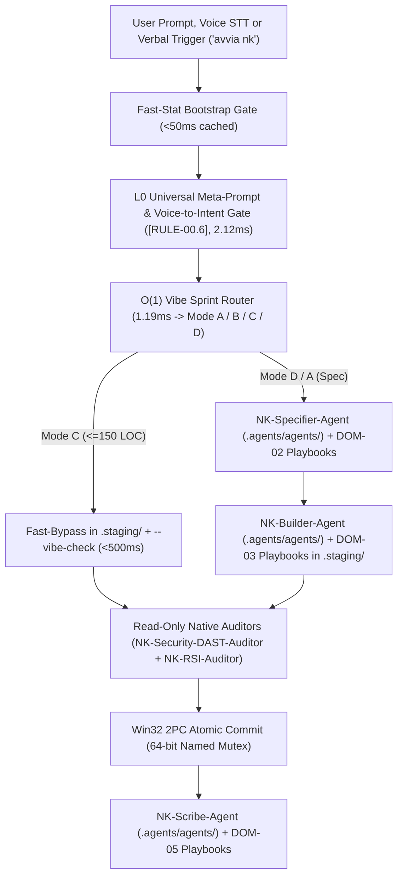
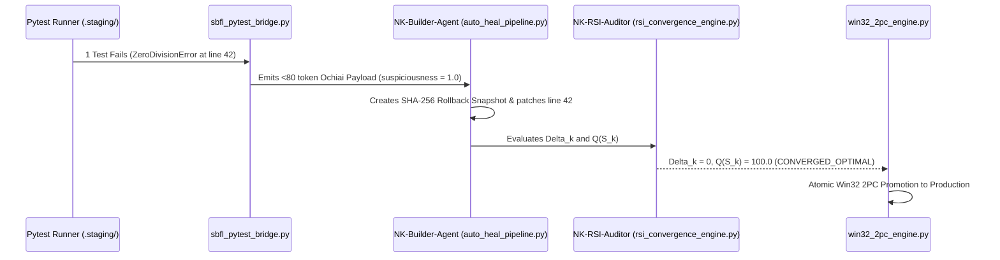

# Lab NK Hub: Sovereign AI Agentic OS (`v4.1.0-Super-Meta-Prompt-Gate` / `v4.0.0-Native-Swarm-Playbooks` / `v3.0.0-STE100-Unified`)

> 🌍 **Choose Your Language / Scegli la Lingua:** **[🇬🇧 English (Current)](README.md)** | **[🇮🇹 Leggi in Italiano (README.it.md)](README.it.md)** | **[📦 Guida Installazione (IT)](GUIDA_INSTALLAZIONE.md)**

> **The Sovereign Cognitive Operating System, L0 Universal Meta-Prompt Gate, 5 Native Sub-Agents, 16 Procedural Playbooks & Tensor-RSI 2D Engine for Google Antigravity**

[](#part-7-patch-notes-before-vs-after-evolution-live-runtime-window--certification-matrix-9090-pass)
[](#part-7-patch-notes-before-vs-after-evolution-live-runtime-window--certification-matrix-9090-pass)
[](#part-5-architectural-protocols--system-regulations-crv-40--tensor-rsi)
[](#part-3-complete-panoramic-catalog-of-the-5-native-sub-agents--16-procedural-playbooks)
[](#part-3-complete-panoramic-catalog-of-the-5-native-sub-agents--16-procedural-playbooks)
[_Registry-1.08ms_Lookup-blueviolet)](#part-5-architectural-protocols--system-regulations-crv-40--tensor-rsi)
[](#part-7-patch-notes-before-vs-after-evolution-live-runtime-window--certification-matrix-9090-pass)
[](#part-6-mathematical-foundations--tensor-rsi-2d-engine-senior--auditor-section)
[](#tutorial-3-ultra-fast-ui--script-tweaks-in--500-ms-mode-c-vibe-sprint)
[](#tutorial-1-starting-the-environment-in--120-ms-rule-005)
[](#part-5-architectural-protocols--system-regulations-crv-40--tensor-rsi)
[](#part-4-core-engine-architecture--scripts-ecosystem-31-logical-modules--34-python-files)
[](#part-7-patch-notes-before-vs-after-evolution-live-runtime-window--certification-matrix-9090-pass)

---

## 🚀 Why Nexus Keystone v4.0.0 Changes Everything (The 60-Second Hook)

Standard AI coding assistants often fail when projects grow beyond a few files.
They saturate their context window, invent non-existent flags, break working code, and hide bugs behind fake mocks.

**Nexus Keystone (`NK-Hub v4.0.0`)** transforms **Google Antigravity** into an autonomous, self-healing software factory.
Instead of a single fragile prompt, you get an **Initial O(1) Router**, **5 Pre-Registered Native Sub-Agents**, and **16 Procedural Playbooks**.

| Common AI Coding Failure | How `NK-Hub v4.0.0-Native-Swarm-Playbooks` Solves It Deterministically |
| :--- | :--- |
| **Voice-to-Text Typos & Ambiguous Prompts** | **`[RULE-00.6]` L0 Meta-Prompt Gate** (`--meta-prompt-gate`) normalizes STT tokens (`normalize_voice_stt_input`), locks `R1..Rn`, and requests 1-Click confirmation in `2.12 ms`. |
| **Role Simulation vs Real Execution** | `v4.0.0` registers **5 Native Sub-Agents** in `.agents/agents/*/agent.md` that spawn as isolated processes with zero `define_subagent` overhead. |
| **Conflicting Skill Instructions** | All **16 Skills** in `.agents/skills/*/SKILL.md` are pure **Procedural Playbooks** mounted on demand by the 5 Native Sub-Agents. |
| **Unauthorized File Writes by Auditors** | Auditors enforce `enable_write_tools: false` at the hardware level (`GT-14`), while Builders write exclusively inside `.staging/` (`[RULE-00]`). |
| **High Token Usage on Quick Edits** | In `Mode C` (`<= 150` LOC), `vibe_sprint_router.py` activates `fast_bypass_eligible: true`, saving `71.9%` of tokens (`< 500 ms` check). |
| **Blind Frontend & Browser Verification** | `NK-Dynamic-Sandbox-StressTester` and `NK-Delta-Architect` integrate **Browser E2E (`chrome-devtools-mcp`, `puppeteer`)** and Full-Stack UI. |
| **Fake Tests Passing on Broken Code** | `[RULE-01.2]` forbids `MagicMock` and synthetic stubs. All **90 Golden & 3-Tier Stress Tests** run on real OS processes. |
| **Endless Trial-and-Error Loops** | When a test fails, `sbfl_pytest_bridge.py` computes the **Ochiai Spectrum** score and pinpoints the exact faulty line in `< 80` tokens. |
| **Blind O(N) Skill & Agent Searches** | The **Modular O(1) Registry** (`nk_registry_manifest.json`) indexes `16` Playbooks and `5` Native Agents with `1.08 ms` cached lookup. |
| **Global External Skill Pollution** | The **61-Skill Global Filter** (`--apply-global-filter`) isolates `61` external skills into `4` disabled plugins, saving `7,042` tokens/turn. |
| **Amnesia Between Sessions** | A **3-Tier Episodic Memory** (`BM25 + Dense Cosine RRF`) pre-warms active lessons into `tier1_active_capsule.json` at `0 ms` startup latency. |

### 🧭 Choose Your Reading Path

| Reader Profile | Recommended Sections | What You Will Learn |
| :--- | :--- | :--- |
| **🟢 New User / Evaluator** | **[Part 1](#part-1-for-beginners-concepts-glossary--3-command-quickstart)** & **[Part 2](#part-2-interactive-step-by-step-tutorials-4-real-world-examples)** | Plain-language overview, zero-jargon glossary, quickstart, and 4 copy-paste tutorials. |
| **🔵 Product / Workflow Architect** | **[Part 3](#part-3-complete-panoramic-catalog-of-the-5-native-sub-agents--16-procedural-playbooks)** & **[Part 5](#part-5-architectural-protocols--system-regulations-crv-40--tensor-rsi)** | The 5 Native Sub-Agents, 16 Procedural Playbooks (`[0]`..`[14]`), 5 domains (`DOM-01..05`), and Vibe Coding. |
| **🟣 Senior AI Engineer / Auditor** | **[Part 4](#part-4-core-engine-architecture--scripts-ecosystem-31-logical-modules--34-python-files)**, **[Part 6](#part-6-mathematical-foundations--tensor-rsi-2d-engine-senior--auditor-section)** & **[Part 7](#part-7-patch-notes-before-vs-after-evolution-live-runtime-window--certification-matrix-9090-pass)** | The 34 Python core scripts, Tensor-RSI 2D equations, SLAs, `v4.1.0` & `v4.0.0` architecture, and the 90 Tests matrix. |

---

## Part 1: For Beginners (Concepts, Glossary & 3-Command Quickstart)

### What is Nexus Keystone v4.0.0 in Plain Words?
Think of **Nexus Keystone (`NK-Hub v4.0.0`)** as an automated **Air Traffic Control Tower and Software Factory**.
The applications you want to create are the airplanes.
When you make a request, the **Control Tower Router** analyzes its complexity in `1.19 ms`.
For small tweaks (`<= 150` lines), the tower uses a **Fast-Bypass Lane** in `.staging/` and verifies everything in `< 500 ms`.
For larger tasks, the tower dispatches **5 Native Specialist Agents** (Architect, Builder, Security/Browser Tester, RSI Auditor, Scribe).
Each specialist opens the exact **Procedural Playbook (`SKILL.md`)** needed for the job, works in isolation, and returns a concise summary.
Once every check reaches `100.0%`, the tower promotes the finished code into your external project folder.

### Friendly Zero-Jargon Glossary

| Term in `NK-Hub v4.0.0` | Simple Everyday Meaning | Technical Role in the System |
| :--- | :--- | :--- |
| **`NK-Hub` (Control Tower)** | The master brain that coordinates all specialists. | Main Agent orchestrator enforcing routing, quality gates, and atomic 2PC promotion. |
| **L0 Meta-Prompt Gate (`[RULE-00.6]`)** | Smart translator that fixes voice typos and confirms your goal in 1 click. | Always-On pre-routing gate (`MetaPromptGateContract`) normalizing STT input and locking `R1..Rn` (`2.12 ms`). |
| **5 Native Sub-Agents** | 5 real worker processes pre-installed in Antigravity. | Native definitions in `.agents/agents/*/agent.md` with hardware tool permissions. |
| **16 Procedural Playbooks** | 16 step-by-step instruction manuals for every task. | Modular playbooks in `.agents/skills/NK-*/SKILL.md` loaded on demand by agents. |
| **Fast-Bypass (`Mode C`)** | The express lane for quick UI or script edits (`<= 150` LOC). | Direct execution in `.staging/` with `--vibe-check` (`< 500 ms`), saving `71.9%` tokens. |
| **O(1) Taxonomic Registry** | Instant phonebook for all agents, playbooks, and scripts. | `nk_registry_manifest.json` indexing `16` skills, `5` native agents, and `32` scripts (`1.08 ms`). |
| **External Project Folder** | The separate folder where your actual app is created. | Isolated directory (`../NK_External_Projects/<AppName>`) required by `[RULE-PROJECT-ISOLATION]`. |
| **Staging Area (`.staging/`)** | A safe workbench where code is drafted before release. | Pre-production buffer validated by AST Guard and pytest prior to atomic commit. |
| **Sovereign Tetralogy (4/4)** | The 4 living blueprints of your project. | `concept_map.md`, `structural_tree.md`, `implementation_plan.md`, and `repo_map.md`. |
| **Tensor-RSI 2D** | The self-improvement engine that fixes mistakes until score is `100`. | Coupled metric engine ($\Delta_k = 0, Q(S_k) = 100.0$) across `4` levels and `5` domain profiles. |
| **Win32 2PC Commit** | A crash-proof switch that saves files only when everything works. | 64-bit Windows kernel Named Mutex atomic file promotion with Write-Ahead Log (`.wal`). |

### High-Level Visual Architecture (`v4.0.0-Native-Swarm-Playbooks`)

```mermaid
flowchart TD
    U["User Prompt, Voice STT or Verbal Trigger ('avvia nk')"] --> B["Fast-Stat Bootstrap Gate (<50ms cached)"]
    B --> G0["L0 Universal Meta-Prompt & Voice-to-Intent Gate ([RULE-00.6], 2.12ms)"]
    G0 --> R["O(1) Vibe Sprint Router (1.19ms -> Mode A / B / C / D)"]
    R -->|"Mode C (<=150 LOC)"| FB["Fast-Bypass in .staging/ + --vibe-check (<500ms)"]
    R -->|"Mode D / A (Spec)"| A1["NK-Specifier-Agent (.agents/agents/) + DOM-02 Playbooks"]
    A1 --> A2["NK-Builder-Agent (.agents/agents/) + DOM-03 Playbooks in .staging/"]
    FB --> A3["Read-Only Native Auditors (NK-Security-DAST-Auditor + NK-RSI-Auditor)"]
    A2 --> A3
    A3 --> C["Win32 2PC Atomic Commit (64-bit Named Mutex)"]
    C --> A4["NK-Scribe-Agent (.agents/agents/) + DOM-05 Playbooks"]
```

### Quickstart in 3 Terminal Commands

1. **Run the Fast-Stat Session Bootstrap (`< 120` ms cold / `< 50` ms cached):**
   ```powershell
   python -u scripts/nk_session_bootstrap.py
   ```
2. **Verify the O(1) Registry (16 Playbooks + 5 Native Agents) & Tensor-RSI Ecosystem:**
   ```powershell
   python -u scripts/nk_registry_indexer.py --verify
   python -u scripts/nk_registry_indexer.py --lookup NK-Builder-Agent
   python -u scripts/preflight_health_check.py --check-only
   python -u scripts/rsi_convergence_engine.py --verify
   ```
3. **Scaffold a New External Application:**
   ```powershell
   python -u scripts/external_project_scaffolder.py --name MyApp --target "../NK_External_Projects/MyApp"
   ```

---

## Part 2: Interactive Step-by-Step Tutorials (4 Real-World Examples)

This section walks you through four real scenarios so you can see how `NK-Hub v4.0.0` operates in practice.

### Tutorial 1: Starting the Environment in `< 120 ms` (`[RULE-00.5]`)

When you open the repository in Google Antigravity, type any of the **8 official verbal triggers**:
> **Verbal Triggers:** `"avvia ambiente nk"`, `"avvia nk hub"`, `"avvia nk"`, `"avvia hub"`, `"start nk"`, `"start hub"`, `"attiva nk"`, `"attiva ambiente nk"`

**What happens automatically in 3 steps:**
1. **Step 1 (Fast-Stat Gate):** The agent runs `scripts/nk_session_bootstrap.py` in `< 120` ms (`< 50` ms on cache hit). It verifies workspace isolation, enforces the 61-skill global filter, purges expired `.wal` files, and sets `NK_MODEL_PROFILE=argon`.
2. **Step 2 (15-Node Master Dashboard):** The agent renders the 15 Playbook Nodes (`[0]`..`[14]`) backed by the **5 Native Sub-Agents**:
   - **`[0] NK-Ideator`**: Conceptual Ideation, SCAMPER, Tavily/Docs MCP & `/grill-me` (`NK-Specifier-Agent`).
   - **`[1] NK-App-UX-Architect`**: Macro-Architecture, 8px/HSL Design System & Generative UI (`NK-Specifier-Agent`).
   - **`[2] NK-Backend-Architect`**: 2-Tier Kahn DAG, Pydantic v2, OpenAPI 3.0 & Firebase MCP (`NK-Specifier-Agent`).
   - **`[3] NK-Agent-Instruction-Forge`**: L1 Metaprompting & ASD-STE100 Playbook/Agent Forge (`NK-Builder-Agent`).
   - **`[4] NK-Python-Async-Builder`**: Primary Async Python Builder & Fast-Healing in `.staging/` (`NK-Builder-Agent`).
   - **`[5] NK-Delta-Architect`**: Full-Stack, Frontend UI (`React/Next.js/Tailwind`) & Surgical Refiner (`NK-Builder-Agent`).
   - **`[6] NK-Security-Auditor`**: Read-Only SAST L1/L2/L3 Threat Auditor & CoVe Verifier (`NK-Security-DAST-Auditor`).
   - **`[7] NK-Oracle-Evaluator`**: Deterministic Cold Evaluator (Gates 1-6) & L3 DOM Inspector (`NK-RSI-Auditor`).
   - **`[8] NK-Dynamic-Sandbox-StressTester`**: Real DAST Sandbox & Browser E2E MCP Engine (`NK-Security-DAST-Auditor`).
   - **`[9] NK-Bug-Diagnostic-Engine`**: Spectrum-Based Fault Localization (SBFL Ochiai `< 80` tok) & RCA (`NK-Security-DAST-Auditor`).
   - **`[10] NK-Plan-Aligner`**: Turn 4 Sovereign Tetralogy 4/4 Aligner & `--verify` Gate (`NK-Specifier-Agent`).
   - **`[11] NK-State-Router`**: Read-Only Kahn DAG Topological Verifier & SHA-256 Drift Detector (`NK-RSI-Auditor`).
   - **`[12] NK-Scribe`**: Post-Commit Documentation Engine, Changelog SSOT & AST Repo-Map (`NK-Scribe-Agent`).
   - **`[13] NK-Episodic-Memory-Engine`**: 3-Tier Episodic Memory (`ARCH`, `SEC`, `OPS`, `DEVX`) & RRF (`NK-Scribe-Agent`).
   - **`[14] NK-Session-Controller`**: Session Supervisor, Sovereign Critic, Tensor-RSI & 6-Gate Reviewer (Main Hub).
3. **Step 3 (Two-Way Choice):**
   - **Direct Mode (`Modalità Diretta`):** Type a number from **`[0]` to `[14]`** to activate a specific Playbook and its Native Sub-Agent.
   - **Goal-Driven Mode (`Modalità Goal-Driven`):** Describe what you want to build in plain language and let the Router orchestrate the swarm.

---

### Tutorial 2: Building a Complete External App from Scratch (`/plan` $\to$ `/goal`)

Suppose you want to build a new Full-Stack application without writing boilerplate yourself.

1. **You write in chat:**
   ```text
   /plan Build a FastAPI and React customer quote manager with SQLite storage and PDF export
   ```
2. **External Isolation (`[RULE-PROJECT-ISOLATION]`):**
   The Hub invokes `scripts/external_project_scaffolder.py` to create `../NK_External_Projects/QuoteManager` with its own DDD tree (`src/core`, `src/api`, `tests/`, `nk_genome/`).
3. **5-Turn Auto-Brief Swarm FSM (`[RULE-03]`):**
   - **Turn 1 (Draft):** `NK-Specifier-Agent` mounts `NK-Ideator`, `NK-App-UX-Architect`, and `NK-Backend-Architect` to draft `idea_canvas.md`, `concept_map.md`, and `structural_tree.md`.
   - **Turn 2 (Attack Swarm):** `NK-Security-DAST-Auditor` attacks the design to expose security and concurrency edge cases early.
   - **Turn 3 (Refine):** `NK-Specifier-Agent` resolves all findings and locks the Pydantic v2 data contracts.
   - **Turn 4 (1:1 Alignment):** `NK-Plan-Aligner` certifies `implementation_plan.md` and displays the native plan artifact with a **`Proceed`** button (`[RULE-01.11]`).
   - **Turn 5 (Handoff):** You click **`Proceed`**, which immediately triggers the autonomous `/goal` build pipeline.
4. **Autonomous Build, Browser E2E & Promotion (`[RULE-01.12]`):**
   `NK-Builder-Agent` builds backend and UI in `.staging/`. The Native Auditors verify DAST, Browser E2E, and $\Delta_k = 0$ before `win32_2pc_engine.py` promotion.

---

### Tutorial 3: Ultra-Fast UI & Script Tweaks in `< 500 ms` (`Mode C` Fast-Bypass)

What if you only want a quick UI adjustment or a small helper function (`<= 150` lines of code)?
In `v4.0.0`, `vibe_sprint_router.py` activates the **Fast-Bypass** lane, avoiding multi-agent round-trips and saving `71.9%` of tokens.

1. **You write in chat:**
   ```text
   Add a live status badge and currency formatter to the quote summary card
   ```
2. **Automatic Mode C Triage (`scripts/vibe_sprint_router.py`):**
   ```powershell
   python -u scripts/vibe_sprint_router.py --prompt "Add a live status badge" --files ui_card.py
   ```
   The router checks the AST depth (`max_depth <= 1`) and line count (`<= 150` LOC) in `1.19 ms`, returning `"recommended_mode": "mode_c"` and `"fast_bypass_eligible": true`.
3. **0 ms Memory Pre-Warming & `< 500 ms` Vibe-Check:**
   - The router loads active lessons from `nk_tracking/memory_3tier/tier1_active_capsule.json` in `< 1.5 ms`.
   - The edit is staged in `.staging/` and verified by the single-process Tensor-RSI gate:
     ```powershell
     python -u scripts/rsi_convergence_engine.py --vibe-check .staging/scripts/vibe_sprint_router.py --json
     ```
   - AST Guard, SAST construct checks, and STE100 verification complete in **`~65 ms`** (`< 500 ms` SLA).

---

### Tutorial 4: Autonomous Bug Diagnosis & Self-Healing (`Mode B` + SBFL Ochiai)

Suppose an existing backend endpoint throws an unexpected error during testing.


```mermaid
sequenceDiagram
    participant Test as Pytest Runner (.staging/)
    participant Bridge as sbfl_pytest_bridge.py
    participant Builder as NK-Builder-Agent (auto_heal_pipeline.py)
    participant RSI as NK-RSI-Auditor (rsi_convergence_engine.py)
    participant Commit as win32_2pc_engine.py
    Test->>Bridge: 1 Test Fails (ZeroDivisionError at line 42)
    Bridge->>Builder: Emits <80 token Ochiai Payload (suspiciousness = 1.0)
    Builder->>Builder: Creates SHA-256 Rollback Snapshot & patches line 42
    Builder->>RSI: Evaluates Delta_k and Q(S_k)
    RSI-->>Commit: Delta_k = 0, Q(S_k) = 100.0 (CONVERGED_OPTIMAL)
    Commit->>Commit: Atomic Win32 2PC Promotion to Production
```

1. **Fault Localization (`< 80` Tokens):**
   Instead of dumping thousands of traceback lines into the LLM context, `sbfl_pytest_bridge.py` emits a compact JSON payload:
   ```json
   {"loc": "src/pricing.py:42", "err": "ZeroDivisionError: division by zero", "ochiai": 1.0}
   ```
2. **Monotonic Snapshot & Rollback Protection:**
   Before applying any fix, `healing_snapshot_rollback.py` saves a SHA-256 snapshot in `snapshot_manifest.json`.
   If a fix attempt increases failures or introduces an AST violation, the engine rolls back instantaneously (`G2`).

### Operating Modes Summary Table (`v4.0.0`)

| Mode | Trigger / Condition | Native Sub-Agent & Fast-Bypass | Active Verification Gates |
| :--- | :--- | :--- | :--- |
| **`Mode D` (Analytical Discovery)** | Read-only audit, external benchmarks & MCP/Web discovery | `NK-Specifier-Agent` / `NK-RSI-Auditor` (`read_only: true`) | `vibe_sprint_router.py` + O(1) Manifest Lookup (`1.08 ms`) |
| **`Mode C` (Vibe-Sprint)** | `<= 150` LOC, `AST max_depth <= 1`, `0` critical imports | `fast_bypass_eligible: true` or `NK-Builder-Agent` | `ASTGuardValidator` + `--vibe-check` (`< 500 ms`, max `2` retries) |
| **`Mode B` (CRV Lite)** | Backend bugfix or targeted multi-file refactor | `NK-Builder-Agent` + `NK-Security-DAST-Auditor` | Staging + `SBFLPytestBridge` + `AutoHealPipeline` (max `3` retries) |
| **`Mode A` (Sovereign CRV 4.0)** | `/plan`, `/goal`, new app or architectural release | Full 5-Agent Native Swarm (`DOM-02..DOM-05`) | 6-Gate Cold Audit + SAST + Browser/DAST + Win32 2PC (max `5` retries) |

---

## Part 3: Complete Panoramic Catalog of the 5 Native Sub-Agents & 16 Procedural Playbooks

### 1. The 5 Pre-Registered Native Sub-Agents (`.agents/agents/*/agent.md`)

In `v4.0.0`, `NK-Hub` pre-registers `5` native sub-agents directly recognized by the Antigravity runtime.

| Native Sub-Agent File | Domain | Hardware Permissions (`GT-14` & `RULE-01`) | Mounted Playbook Skills (`.agents/skills/`) | Authorized Write Perimeter |
| :--- | :---: | :--- | :--- | :--- |
| [NK-Specifier-Agent](.agents/agents/NK-Specifier-Agent/agent.md) | `DOM-02` | `write: true`, `subagent: false`, `mcp: true` | `NK-Ideator`, `NK-App-UX-Architect`, `NK-Backend-Architect`, `NK-Plan-Aligner` | Confined to `nk_genome/*` & `nk_tracking/reports_and_briefs/*` (`[RULE-00.1]`). |
| [NK-Builder-Agent](.agents/agents/NK-Builder-Agent/agent.md) | `DOM-03` | `write: true`, `subagent: false`, `mcp: false` | `NK-Python-Async-Builder`, `NK-Delta-Architect`, `NK-Agent-Instruction-Forge` | Exclusively `.staging/*` (`[RULE-00]`). |
| [NK-Security-DAST-Auditor](.agents/agents/NK-Security-DAST-Auditor/agent.md) | `DOM-04` | **`write: false`**, `subagent: false`, `mcp: true` | `NK-Security-Auditor`, `NK-Dynamic-Sandbox-StressTester`, `NK-Bug-Diagnostic-Engine` | **100% Hardware Read-Only** (`GT-14`). |
| [NK-RSI-Auditor](.agents/agents/NK-RSI-Auditor/agent.md) | `DOM-04` | **`write: false`**, `subagent: false`, `mcp: false` | `NK-Oracle-Evaluator`, `NK-State-Router`, `rsi_convergence_engine.py` | **100% Hardware Read-Only** (`GT-14`). |
| [NK-Scribe-Agent](.agents/agents/NK-Scribe-Agent/agent.md) | `DOM-05` | `write: true`, `subagent: false`, `mcp: false` | `NK-Scribe`, `NK-Episodic-Memory-Engine` | SSOT Docs, `repo_map.md`, `quality_baseline.json` & 3-Tier Memory (`[RULE-00.2]`). |

### 2. The 16 Procedural Skill Playbooks (`.agents/skills/NK-*/SKILL.md`)

Every playbook in `.agents/skills/NK-*/SKILL.md` enforces `[RULE-STE100]`, `[RULE-RSI.1]`, `[RULE-01.14]`, and `GT-14` tool boundaries.

| Playbook Skill Name | Node | Domain | Executing Native Agent | Procedural Scope & MCP Integration | Tool Boundary (`GT-14`) | Tensor-RSI Profile | Linked Auxiliary Files |
| :--- | :---: | :---: | :--- | :--- | :--- | :--- | :--- |
| [NK-Master-Hub](.agents/skills/NK-Master-Hub/SKILL.md) | L3 | `DOM-01` | Main Agent (Hub) | 2-Tier Kahn DAG Router & Win32 2PC Committer | Sovereign Committer | `L1` / `CODE_RSI` (`2/3/5`) | None |
| [NK-Ideator](.agents/skills/NK-Ideator/SKILL.md) | `[0]` | `DOM-02` | `NK-Specifier-Agent` | Ideation, SCAMPER, `tavily-mcp` & `google-docs-mcp` | Read-Only / `nk_genome/` | `L1` / `SPEC_RSI` (`1/2/3`) | `resources/scamper_matrix.md` |
| [NK-App-UX-Architect](.agents/skills/NK-App-UX-Architect/SKILL.md) | `[1]` | `DOM-02` | `NK-Specifier-Agent` | UX/UI 8px/HSL Design System & `generative_ui` | Confined to `nk_genome/` | `L1` / `UI_UX_RSI` (`2/2/3`) | None |
| [NK-Backend-Architect](.agents/skills/NK-Backend-Architect/SKILL.md) | `[2]` | `DOM-02` | `NK-Specifier-Agent` | 2-Tier Backend DAG, Pydantic v2 & `firebase-mcp-server` | 100% Read-Only + MCP | `L1` / `SPEC_RSI` (`1/2/3`) | None |
| [NK-Agent-Instruction-Forge](.agents/skills/NK-Agent-Instruction-Forge/SKILL.md) | `[3]` | `DOM-02` | `NK-Builder-Agent` | ASD-STE100 Skill/Agent Forge & `--sync` (`/learn`) | Staging + Golden Eval | `L3` / `STE100_RSI` (`1/1/2`) | None |
| [NK-Python-Async-Builder](.agents/skills/NK-Python-Async-Builder/SKILL.md) | `[4]` | `DOM-03` | `NK-Builder-Agent` | Primary Async Python, SQLite WAL & Fast-Healing | `.staging/` Write Only | `L1` / `CODE_RSI` (`2/3/5`) | None |
| [NK-Delta-Architect](.agents/skills/NK-Delta-Architect/SKILL.md) | `[5]` | `DOM-03` | `NK-Builder-Agent` | Full-Stack, Frontend UI (`React/Next/Tailwind`) & Refiner | `.staging/` Write Only | `L1` / `VIBE_SPRINT` (`2/3/5`) | `resources/delta_brief_template.md` |
| [NK-Security-Auditor](.agents/skills/NK-Security-Auditor/SKILL.md) | `[6]` | `DOM-04` | `NK-Security-DAST-Auditor` | Neuro-Symbolic SAST L1/L2/L3 & CoVe Verifier | 100% Strict Read-Only | `L0` / `CODE_RSI` (`1/2/3`) | `resources/security_audit_checklist.md`, `resources/tas_l1_module_audit.md`, `resources/tas_l2_ipc_contract_audit.md`, `resources/tas_l3_fullstack_system_audit.md` |
| [NK-Oracle-Evaluator](.agents/skills/NK-Oracle-Evaluator/SKILL.md) | `[7]` | `DOM-04` | `NK-RSI-Auditor` | Cold Evaluator (Gates 1-6) & L3 DOM Inspector | 100% Strict Read-Only | `L1` / `UI_UX_RSI` (`1/2/3`) | `references/anti_pattern_guards.md`, `references/verification_oracles.md` |
| [NK-Dynamic-Sandbox-StressTester](.agents/skills/NK-Dynamic-Sandbox-StressTester/SKILL.md) | `[8]` | `DOM-04` | `NK-Security-DAST-Auditor` | Real DAST Sandbox & Browser E2E (`chrome-devtools-mcp`) | 100% Strict Read-Only | `L1` / `CODE_RSI` (`1/2/3`) | None |
| [NK-Bug-Diagnostic-Engine](.agents/skills/NK-Bug-Diagnostic-Engine/SKILL.md) | `[9]` | `DOM-04` | `NK-Security-DAST-Auditor` | SBFL Ochiai RCA Localizer & False Bug Gate | 100% Strict Read-Only | `L1` / `CODE_RSI` (`1/2/3`) | `resources/false_bug_rejection_rules.yaml`, `resources/rca_report_template.md` |
| [NK-Plan-Aligner](.agents/skills/NK-Plan-Aligner/SKILL.md) | `[10]` | `DOM-01` | `NK-Specifier-Agent` | Tetralogy 4/4 Aligner & `--verify` Certifier | 100% Strict Read-Only | `L1` / `SPEC_RSI` (`1/1/2`) | None |
| [NK-State-Router](.agents/skills/NK-State-Router/SKILL.md) | `[11]` | `DOM-01` | `NK-RSI-Auditor` | Read-Only Kahn DAG Verifier & SHA-256 Drift | 100% Strict Read-Only | `L0` / `CODE_RSI` (`1/1/2`) | None |
| [NK-Scribe](.agents/skills/NK-Scribe/SKILL.md) | `[12]` | `DOM-05` | `NK-Scribe-Agent` | Post-Commit SSOT, Repo-Map & Git Publisher | Doc & Tracking (`[RULE-00.2]`) | `L1` / `STE100_RSI` (`1/1/2`) | `resources/activity_anchor_schema.md`, `resources/scribe_knowledge.md` |
| [NK-Episodic-Memory-Engine](.agents/skills/NK-Episodic-Memory-Engine/SKILL.md) | `[13]` | `DOM-05` | `NK-Scribe-Agent` | 3-Tier Memory (`nk_tracking/memory_3tier/`) & Capsule | Memory Ledger Only | `L2` / `SPEC_RSI` (`1/1/2`) | None |
| [NK-Session-Controller](.agents/skills/NK-Session-Controller/SKILL.md) | `[14]` | `DOM-01` | Main Agent (Hub) | Session Supervisor, 5-Turn FSM & Cold Reviewer | Sovereign Critic | `L2` / `SPEC_RSI` (`2/3/5`) | `resources/clean_handoff_protocol.md`, `resources/handoff_anchor_schema.md`, `resources/prompt_templates.md`, `resources/saturation_thresholds.yaml` |

---

## Part 4: Core Engine Architecture & Scripts Ecosystem (`31 Logical Modules / 34 Python Files`)

All `34` Python files in `scripts/` (`32` indexed in `nk_registry_manifest.json`) use strict Pydantic v2 contracts. They pass `90/90` Zero-Mock Golden & 3-Tier Stress Tests.

### 1. Runtime Defense, Session Governance & Tensor-RSI Convergence
- [`scripts/nk_registry_indexer.py`](scripts/nk_registry_indexer.py): O(1) taxonomic indexer for `16` Playbooks (`skills_index`), `5` Native Sub-Agents (`native_agents_index`), and `32` scripts. Enforces `GT-14` (`enable_write_tools: false` on Auditors), `RULE-01` (`enable_subagent_tools: false`), `_MANIFEST_CACHE` (`1.08 ms` lookup), and `--apply-global-filter`.
- [`scripts/nk_session_bootstrap.py`](scripts/nk_session_bootstrap.py): Fast-Stat gate (`< 50` ms cached via `transcript_mtime` and `transcript_size`), `.wal` purge, root isolation check, `meta_prompt_gate_enabled: true` check (`[RULE-00.6]`), and `NK_MODEL_PROFILE=argon` activation.
- [`scripts/rsi_convergence_engine.py`](scripts/rsi_convergence_engine.py): Tensor-RSI 2D engine tracking `poc_confirmed_exploits` and `semantic_drift_findings`. Supports `--vibe-check <target>`, CoVe CLI AST Gate (`152` verified CLI flags), and STE100 validation (`--verify`).
- [`scripts/nk_active_runtime_sentinel.py`](scripts/nk_active_runtime_sentinel.py): Dual-Profile runtime step monitor (`60/85/100` standard, `120/180/250` argon) with subagent transcript filtering (`EXT-02`).
- [`scripts/nk_context_sentry.py`](scripts/nk_context_sentry.py): Dual-Profile token/step sentry (`70/100` standard, `150/250` argon excluding `thinking`) and subagent return MTU gate (`2000` chars).
- [`scripts/nk_compliance_checker.py`](scripts/nk_compliance_checker.py): Transcript auditor with `DDI_DIRECT_STREAK_LIMIT = 12`, `write_calls == 0` AST exemption, live `rsi_telemetry.jsonl` score reading, and `GT-08`/`GT-10` guards.
- [`scripts/preflight_health_check.py`](scripts/preflight_health_check.py): Maintenance diagnostic probe decoupled from hardcoded tuples via `nk_registry_manifest.json`, with `--check-only` CI mode and fail-closed baseline verification (`BS-01`).
- [`scripts/platform_runner.py`](scripts/platform_runner.py): Safe subprocess runner with automatic `-u` injection on list and string commands (`BS-04`) and UTF-8 stream normalization.
- [`scripts/env_capability_probe.py`](scripts/env_capability_probe.py): Runtime capability discovery separating `core_hub_modules` from `optional_app_modules` (`GT-09`).

### 2. Swarm IPC, Compaction & Handoff
- [`scripts/nk_swarm_messenger.py`](scripts/nk_swarm_messenger.py): Inter-agent formatter enforcing `1,800`-char MSS payload cap (`GT-04`), Head-Tail (`400 + 800`) fallback, and disk spillover.
- [`scripts/nk_session_handoff.py`](scripts/nk_session_handoff.py): Zero-amnesia handoff generator with workspace-bound `git` calls (`cwd=str(_workspace_root)`), optional `--transcript`/`--output-dir`, and dynamic test totals.
- [`scripts/nk_auto_inning.py`](scripts/nk_auto_inning.py): Inning closer passing `--transcript` and `--json` to `nk_compliance_checker.py` with fail-closed `compliance_score = 0` on exception.
- [`scripts/async_heartbeat_signaler.py`](scripts/async_heartbeat_signaler.py): Background heartbeat daemon and `45`s watchdog supporting `--task-id`, `--interval`, `--max-beats`, and `--once`.

### 3. Atomic Mutation & Win32 2PC Commit
- [`scripts/win32_2pc_engine.py`](scripts/win32_2pc_engine.py): 64-bit `ctypes` Win32 Named Mutex 2PC engine with `MOVEFILE_COPY_ALLOWED`, `age > 10s` recovery guard, and `--verify-baseline` pre-check.
- [`scripts/healing_snapshot_rollback.py`](scripts/healing_snapshot_rollback.py): Persistent `snapshot_manifest.json` manager with 8-char SHA-256 prefix and monotonic rollback gate.
- [`scripts/safe_cleanup_dev_servers.py`](scripts/safe_cleanup_dev_servers.py): Targeted dev server killer defaulting to `_workspace_root` (`--workspace-root`, `--dry-run`, `--json`) and protecting external processes.

### 4. Diagnostics, Verification & Fast-Healing
- [`scripts/sbfl_engine.py`](scripts/sbfl_engine.py): Ochiai, Tarantula, and DStar fault localization engine (`< 80` token diagnostic payload) with AST Def-Use slicing and CLI interface.
- [`scripts/sbfl_pytest_bridge.py`](scripts/sbfl_pytest_bridge.py): Windows space-safe traceback parser delegating Ochiai scoring to `sbfl_engine.py` and guaranteeing `suspiciousness == 1.0` (`GT-07`).
- [`scripts/auto_heal_pipeline.py`](scripts/auto_heal_pipeline.py): Multi-cycle healing orchestrator linked to `ASTGuardValidator` and `RSIConvergenceEngine` with telemetry logging in `rsi_telemetry.jsonl`.
- [`scripts/invisible_healing_loop.py`](scripts/invisible_healing_loop.py): Staging healing wrapper delegating to `auto_heal_pipeline.py`.
- [`scripts/oracle_evaluator_l3.py`](scripts/oracle_evaluator_l3.py): Pure Python HTML5 void-tag aware DOM parser inspecting ARIA attributes, semantic roles, and Windows drive paths (`U-27`).
- [`scripts/micro_hud_renderer.py`](scripts/micro_hud_renderer.py): Single-line CP1252/UTF-8 safe telemetry renderer aligned with `MicroUIHUDState`.
- [`scripts/dast_sandbox_runner.py`](scripts/dast_sandbox_runner.py): 64-bit Win32 Job Object isolated process runner in `%TEMP%\nk_sandbox_*` with memory caps and `PYTHONPATH` injection.

### 5. Memory, Caching, AST & Schemas
- [`scripts/memory_3tier_engine.py`](scripts/memory_3tier_engine.py): 3-Tier memory in `nk_tracking/memory_3tier/` with `DOMAIN_ALIAS_MAP` (`OPS=01_Bug_Diagnostics`, `ARCH=02_Development_Patterns`, `DEVX=03_Ideation_and_Decisions`, `SEC=04_Governance_and_Rules`), `350`/`1200` token cap (`GT-05`), and `tier1_active_capsule.json` sync.
- [`scripts/deterministic_api_cache.py`](scripts/deterministic_api_cache.py): Persistent SQLite WAL connection cache with CLI (`--force-refresh`, `--stats`, `--clear`).
- [`scripts/quality_baseline_manager.py`](scripts/quality_baseline_manager.py): Fail-closed baseline ratchet (`68` Golden Tests minimum floor, `90` active tests) checking `sast_critical_violations` and `rsi_residual_delta`.
- [`scripts/ast_guard_validator.py`](scripts/ast_guard_validator.py): Static AST scope checker supporting `--stage-dir`, `--allowed-mutations` function whitelist, and TAS v4.0 `SASTConstructChecker` (`SQLi`, `SSRF`, `XXE`, `SSTI`, `eval`, `MagicMock`).
- [`scripts/ast_repo_mapper.py`](scripts/ast_repo_mapper.py): PageRank AST repo-mapper serializing `edges` and supporting `4,000`-token `argon_mode_a` snapshots (`GT-06`).
- [`scripts/external_project_scaffolder.py`](scripts/external_project_scaffolder.py): External DDD project generator rejecting internal `NK-Hub` target paths (`BS-03`).
- [`scripts/vibe_sprint_router.py`](scripts/vibe_sprint_router.py): Mode A/B/C/D router with `_ROUTER_MANIFEST_CACHE` (`1.19 ms`), `--meta-prompt-gate` (`2.12 ms`), `normalize_voice_stt_input()`, `is_gate_exempt()`, resolving `primary_agent`, `native_subagent` (`5/5` Native Sub-Agents), `fast_bypass_eligible`, and pre-warming `nk_tracking/memory_3tier/tier1_active_capsule.json`.
- [`scripts/schemas/dual_ledgers.py`](scripts/schemas/dual_ledgers.py) & [`scripts/schemas/nk_ipc_contracts.py`](scripts/schemas/nk_ipc_contracts.py): 64-bit PID check (`ERROR_ACCESS_DENIED` safe) and unified Pydantic v2 IPC contracts (`MetaPromptGateContract`, `RSIDefectVector`, `OchiaiDiagnosticPayload`).

---

## Part 5: Architectural Protocols & System Regulations (CRV 4.0 & Tensor-RSI)

### Core Binding Mandates (`.agents/AGENTS.md`)
1. **`[RULE-PROJECT-ISOLATION]`**: Application code is forbidden inside `NK-Hub`. Every app resides in `G:/Il mio Drive/NK_External_Projects/<Name>/`.
2. **`[RULE-00.4]`, `[RULE-00.5]` & `[RULE-00.6]`**: Every session starts with `nk_session_bootstrap.py` (`< 120` ms), renders the 15-node Master Dashboard on verbal triggers, and enforces the Always-On **L0 Universal Meta-Prompt Gate** (`MetaPromptGateContract`, `normalize_voice_stt_input()`, `is_gate_exempt()`).
3. **`[RULE-00]` & `[RULE-00.1]`**: Zero unauthorized edits on production files. Specifiers and Auditors are read-only on production; Builders write only in `.staging/`.
4. **`[RULE-STE100]`**: Mandatory ASD-STE100 technical language (`<= 20` words per instruction sentence, active voice, zero spaced dashes).
5. **`[RULE-REACTIVE-SILENCE]`**: Polling loops (`manage_task(Action="status")`) are forbidden. Agents yield their turn or set event-driven timers.
6. **`[RULE-01]` & `[RULE-SWARM-HYGIENE]`**: 2-Tier single-level delegation (`enable_subagent_tools: false` on all 5 Native Sub-Agents), Mode C Fast-Bypass (`<= 150` LOC), and `1,800`-char MSS return limit.
7. **`[RULE-01.2]` & `[RULE-01.10]`**: Zero-Mock OS execution and permanent ratchet protecting the Golden & Stress Tests at `100.0%` PASS.
8. **`[RULE-RSI]` & `[RULE-RSI.1]`**: Continuous Tensor-RSI 2D convergence ($\Delta_k = 0, Q(S_k) = 100.0$) across `4` levels and `5` domain profiles.
9. **`[RULE-01.14]` (`MODULAR_O1_REGISTRY_AND_ZERO_REWRITE_MANDATE`)**: All `16` Playbooks, `5` Native Agents, and `32` scripts resolve in $O(1)$ time via `nk_genome/nk_registry_manifest.json` and `nk_genome/SKILL_INDEX.md`.

### The 5 Functional Domains (`DOM-01..DOM-05` in `nk_registry_manifest.json`)

| Domain ID | Sector Name | Native Sub-Agent (`.agents/agents/`) | Primary Playbook Skills (`16` Total) | Core Indexed Scripts (`32` Total) |
| :---: | :--- | :--- | :--- | :--- |
| **`DOM-01`** | `GOV_AND_ROUTING` | Main Agent / `NK-Specifier-Agent` / `NK-RSI-Auditor` | `NK-Master-Hub`, `NK-Session-Controller`, `NK-State-Router`, `NK-Plan-Aligner` | `nk_registry_indexer.py`, `vibe_sprint_router.py`, `win32_2pc_engine.py`, `nk_session_bootstrap.py`, `nk_active_runtime_sentinel.py`, `nk_context_sentry.py`, `nk_compliance_checker.py`, `nk_swarm_messenger.py` |
| **`DOM-02`** | `IDEATION_AND_ARCH` | `NK-Specifier-Agent` | `NK-Ideator`, `NK-App-UX-Architect`, `NK-Backend-Architect`, `NK-Agent-Instruction-Forge` | `ast_repo_mapper.py`, `env_capability_probe.py`, `external_project_scaffolder.py` |
| **`DOM-03`** | `BUILD_AND_HEAL` | `NK-Builder-Agent` | `NK-Python-Async-Builder`, `NK-Delta-Architect` | `auto_heal_pipeline.py`, `healing_snapshot_rollback.py`, `invisible_healing_loop.py`, `platform_runner.py`, `safe_cleanup_dev_servers.py`, `deterministic_api_cache.py`, `async_heartbeat_signaler.py` |
| **`DOM-04`** | `AUDIT_DAST_AND_RCA` | `NK-Security-DAST-Auditor` & `NK-RSI-Auditor` | `NK-Security-Auditor`, `NK-Oracle-Evaluator`, `NK-Dynamic-Sandbox-StressTester`, `NK-Bug-Diagnostic-Engine` | `ast_guard_validator.py`, `rsi_convergence_engine.py`, `sbfl_engine.py`, `sbfl_pytest_bridge.py`, `oracle_evaluator_l3.py`, `dast_sandbox_runner.py` |
| **`DOM-05`** | `MEMORY_TELEMETRY_AND_DOCS` | `NK-Scribe-Agent` | `NK-Scribe`, `NK-Episodic-Memory-Engine` | `memory_3tier_engine.py`, `preflight_health_check.py`, `quality_baseline_manager.py`, `micro_hud_renderer.py`, `nk_session_handoff.py`, `nk_auto_inning.py`, `schemas/dual_ledgers.py`, `schemas/nk_ipc_contracts.py` |

### Protocol CRV 4.0 (4 Macro-Phases) & 6 Cold Review Gates

| Phase / Gate | Responsible Native Agent & Playbooks | Deterministic Verification Action |
| :--- | :--- | :--- |
| **Macro-Phase 1: Build & Stage** | `NK-Builder-Agent` (`NK-Python-Async-Builder`, `NK-Delta-Architect`) | Writes in `.staging/`, runs `ast_guard_validator.py --stage-dir` and `auto_heal_pipeline.py`. |
| **Macro-Phase 2: Unified Dynamic Audit** | `NK-Security-DAST-Auditor` & `NK-RSI-Auditor` | Executes 6 Cold Review Gates, SAST L1-L3, DAST Sandbox, and Browser E2E via `chrome-devtools-mcp`. |
| **Macro-Phase 3: 2PC Atomic Commit** | Main Agent (`NK-Master-Hub`) | Verifies `quality_baseline.json` and promotes `.staging/` to production via `win32_2pc_engine.py`. |
| **Macro-Phase 4: Deterministic Teardown** | Main Agent & `NK-Scribe-Agent` (`NK-Scribe`) | Purges `%TEMP%\nk_sandbox_*`, clears `.staging/`, updates `repo_map.md` (`4000` tok) and `PATCH_NOTES.md`. |

### Dual-Profile Runtime Calibration (`standard` vs `argon`)

| Parameter / Threshold | `standard` Profile (Golden Tests Default) | `argon` Profile (Production Runtime) |
| :--- | :---: | :---: |
| **Context Sentry (`WARN / HARD`)** | `70 / 100` steps (`GT-01`) | `150 / 250` steps (`250k / 500k` tokens, excluding `thinking`) |
| **Active Runtime Sentinel (`GREEN / CAUTION / CRIT / RED`)** | `<60 / 60-84 / 85-99 / >=100` steps (`GT-02`) | `<120 / 120-179 / 180-249 / >=250` steps |
| **Tier-1 Episodic Memory Token Cap** | `350` tokens (`GT-05`) | `1,200` tokens (`tier1_active_capsule.json`) |
| **AST Repo-Map Token Budgets (`Mode C / B / A`)** | `0 / 256 / 512 / 1,024` tokens (`GT-06`) | `0 / 512 / 1,500 / 4,000` tokens |

---

## Part 6: Mathematical Foundations & Tensor-RSI 2D Engine (Senior / Auditor Section)

### 1. Coupled Dual-Metric RSI Convergence ($\Delta_k$ and $Q(S_k)$)
At every iteration $k$, `scripts/rsi_convergence_engine.py` evaluates the defect vector $v_k = (\text{SAST}_k, T_{\text{fail},k}, C_k, H_k, M_k, L_k, G_k)$:

$$\Delta_k(p) = w_{\text{SAST}}^{(p)} \cdot \text{SAST}_k + w_{\text{test}}^{(p)} \cdot (T_{\text{fail},k} + C_k) + w_{H}^{(p)} \cdot H_k + w_{M}^{(p)} \cdot M_k + w_{L}^{(p)} \cdot L_k + w_{G}^{(p)} \cdot G_k$$

$$Q(S_k) = \text{round}\left(60.0 \cdot \frac{T_{\text{pass},k}}{\max(T_{\text{total},k}, 1)} + \frac{40.0}{1.0 + \Delta_k(p) / 25.0},\; 4\right)$$

The loop reaches `CONVERGED_OPTIMAL` exclusively when $\Delta_k(p) == 0$ and $Q(S_k) == 100.0$ (`G1`).
Hard regressions ($\text{SAST}_k > \text{SAST}_{k-1}$ or $T_{\text{fail},k} + C_k > T_{\text{fail},k-1} + C_{k-1}$) trigger immediate snapshot rollback (`G2`).

### 2. The Tensor-RSI 2D Architecture (`4 Levels L0..L3` $\times$ `5 Profiles P1..P5`)

#### Vertical Axis: 4 Operational Time Horizons (`L0..L3`)

| Level | Name | Execution Horizon | Primary Mechanism & Artifact |
| :---: | :--- | :--- | :--- |
| **`L0`** | **Pre-Execution Static Gate** | `< 80 ms` pre-flight check | `ASTGuardValidator` (`SASTConstructChecker`) + `verify_cli_flags_cove()` + `verify_ste100_compliance()`. |
| **`L1`** | **Intra-Task Micro-Loop** | `< 500 ms` (`Mode C`) / `< 15 s` (`Mode B`) | `auto_heal_pipeline.py` + `sbfl_pytest_bridge.py` + `rsi_convergence_engine.py --vibe-check`. |
| **`L2`** | **Inter-Session Reflexion** | Post-commit (`0 ms` next-session load) | `memory_3tier_engine.py --tier1-sync` persists `tier1_active_capsule.json`, pre-warmed by `vibe_sprint_router.py`. |
| **`L3`** | **Meta-RSI Skill Evolution** | Post-mortem audit (`/learn`, `/boost`) | `NK-Agent-Instruction-Forge` validates skill edits against `tests/evals/skill_golden_eval_set.json`. |

#### Horizontal Axis: 5 Domain Profiles in `RSIProfileRegistry` (`P1..P5`)

| Profile ID | Target Domain & Playbooks | Weights $(w_{\text{SAST}}, w_{\text{test}}, w_H, w_M, w_L, w_G)$ | Max Retries (`Mode C / B / A`) |
| :--- | :--- | :---: | :---: |
| **`CODE_RSI`** (Default `GT-11`) | Backend Python (`[4]`, `[6]`, `[8]`, `[9]`, `[11]`, Hub) | `(15, 10, 5, 2, 1, 1)` | `2 / 3 / 5` |
| **`VIBE_SPRINT_MICRO_RSI`** | Mode C Fast UI & Surgical Refiner (`[5]`, `--vibe-check`) | `(15, 10, 5, 0, 1, 0)` | `2 / 2 / 3` |
| **`SPEC_RSI`** | Architecture & Tetralogy 4/4 (`[0]`, `[2]`, `[10]`, `[13]`, `[14]`) | `(15, 5, 10, 2, 1, 5)` | `1 / 2 / 3` |
| **`UI_UX_RSI`** | Frontend, Design System & DOM L3 (`[1]`, `[7]`) | `(15, 8, 6, 2, 2, 1)` | `2 / 2 / 3` |
| **`STE100_RSI`** | Documentation, Changelog & Skill Forge (`[3]`, `[12]`) | `(15, 5, 8, 1, 3, 5)` | `1 / 1 / 2` |

### 3. Ochiai Spectrum SBFL & Hybrid RRF Memory Formulas
- **Ochiai Fault Localization (`scripts/sbfl_engine.py`):**
  $$S_{\text{Ochiai}}(s) = \frac{e_f(s)}{\sqrt{(e_f(s) + n_f(s)) \cdot (e_f(s) + e_p(s))}}$$
- **Reciprocal Rank Fusion (`scripts/memory_3tier_engine.py`, $k=60$):**
  $$\text{RRF\_Score}(d) = \sum_{m \in \{\text{BM25}, \text{Cosine}\}} \frac{1}{60 + r_m(d)}$$

### 4. Rigid SLA Latency Benchmarks (Measured on Windows 11 64-bit)

| Operation / Engine | Target SLA | Measured `v4.0.0-Native-Swarm-Playbooks` Performance |
| :--- | :---: | :---: |
| **Fast-Stat Session Bootstrap (`nk_session_bootstrap.py`)** | `< 120 ms` (`< 50 ms` cached) | **`11 ms - 35 ms`** |
| **O(1) Taxonomic Registry Lookup (`_MANIFEST_CACHE`)** | `< 15 ms` | **`1.0856 ms` (`-84.0%` latency)** |
| **L0 Universal Meta-Prompt & STT Gate (`--meta-prompt-gate`)** | `< 15 ms` | **`2.118 ms` (`5` Anti-Loop Exemptions)** |
| **O(1) Intent & Native Sub-Agent Routing (`_ROUTER_MANIFEST_CACHE`)** | `< 15 ms` | **`1.1924 ms` (`-85.8%` latency)** |
| **SHA-256 Registry & `GT-14`/`RULE-01` Verification (`--verify`)** | `< 350 ms` | **`133 ms` (`16` Playbooks + `5` Native Agents)** |
| **61-Skill Global Isolation Filter (`--apply-global-filter`)** | `0` active external skills | **`0 active (-7,042 tokens/turn)`** |
| **Mode C Fast-Bypass & Single-Process Vibe-Check (`--vibe-check`)** | `< 500 ms` | **`15 ms - 65 ms` (`-71.9%` token usage)** |
| **CoVe CLI AST Gate (`verify_cli_flags_cove`)** | `100%` valid CLI flags | **`152/152 flags verified (0 invalid)`** |
| **90 Orthogonal Golden & 3-Tier Stress Tests (`pytest tests/ -q`)** | `100.0% PASS` | **`7.09 s (90/90 PASS)`** |

---

## Part 7: Patch Notes, Before-vs-After Evolution, Live Runtime Window & Certification Matrix (`90/90 PASS`)

### 0. Release `v4.1.0-Super-Meta-Prompt-Gate` (`WP13-UNIFIED`: Opus + Argon + Third-Party Synthesis)

Release **`v4.1.0-Super-Meta-Prompt-Gate`** unifies the **Opus**, **Argon**, and **Third-Party Arbitration** briefs into the Always-On **Level 0 Universal Meta-Prompt & Voice-to-Intent Gate (`[RULE-00.6]`)**:
- **Constitutional Mandate `[RULE-00.6]` & 1-Click Voice Confirmation (`.agents/AGENTS.md`, `prompt_templates.md`)**: Activates the `CONFIRM` Meta-Prompt Gate by default with 1-Click `ask_question` confirmation, separating **Level 0 (`IB-*` with `R1..Rn`, voice corrections, out-of-scope, `intent_hash_sha256`)** from **Level 1-4 (`implementation_plan.md`)**.
- **Morphological STT Normalizer, 5-Exemption Anti-Loop FSM & IPC Contract (`vibe_sprint_router.py`, `nk_ipc_contracts.py`)**: Introduces `MetaPromptGateContract` (`strict=True, extra="forbid", frozen=True`), `normalize_voice_stt_input()` for CamelCase fused STT tokens (`primaLa`), `is_gate_exempt()` (`ok`, `[0]..[14]`, `Proceed`, `<env_capsule>`, `!diretto`), and fixes abstract noun false positives at line `626`.
- **Fast-Stat Bootstrap, `R1..Rn` Traceability & 90 Zero-Mock Tests (`nk_session_bootstrap.py`, `tests/`)**: Enforces `meta_prompt_gate_enabled: true` in `nk_session_bootstrap.py` and `session_tuning_params.json`, `100%` `R1..Rn` coverage in `NK-Plan-Aligner`, lexical `DEVX` indexing in `NK-Episodic-Memory-Engine`, and `90/90 PASS` across 25 test files.

### 1. The Great `v4.0.0` Transformation: How It Worked Before (`v3.5.x`) vs. How It Works Now (`v4.0.0`)

Release **`v4.0.0-Native-Swarm-Playbooks`** replaces the old hybrid "Persona-Skill" design with a clean 3-layer architecture: **Initial O(1) Router + 5 Native Sub-Agents + 16 Procedural Playbooks**.

| Architectural Dimension | How It Worked Before (`v3.5.x`) | What Changed & How It Works Now (`v4.0.0-Native-Swarm-Playbooks`) |
| :--- | :--- | :--- |
| **1. Native Sub-Agents (`.agents/agents/`)** | Only `1` native sub-agent existed (`NK-RSI-Auditor`). The other 14 nodes had to be simulated in the main chat or created via `define_subagent` at runtime. | **5 Pre-Registered Native Sub-Agents** (`NK-Specifier-Agent`, `NK-Builder-Agent`, `NK-Security-DAST-Auditor`, `NK-RSI-Auditor`, `NK-Scribe-Agent`) spawn directly as isolated worker processes with **zero `define_subagent` overhead**. |
| **2. Nature of the 16 Skills (`.agents/skills/`)** | The 16 skills acted as simulated "personas" ("You are agent X") with overlapping prompts and 7 internal path/alias defects. | All **16 Skills** and their **16 auxiliary files** are pure **Procedural Playbooks (SSOT)** mounted on demand by the 5 Native Sub-Agents. |
| **3. Hardware Read-Only & 2-Tier Security (`GT-14` / `RULE-01`)** | Read-only rules were mostly textual guidelines inside `SKILL.md`; only `1` of `5` audit nodes had hardware write blocking. | **100% Hardware Enforcement:** `NK-Security-DAST-Auditor` and `NK-RSI-Auditor` enforce `enable_write_tools: false` at the runtime level, and all 5 agents enforce `enable_subagent_tools: false`, verified automatically by `nk_registry_indexer.py --verify`. |
| **4. Mode C Vibe-Sprint (`<= 150` LOC)** | Small UI or script tweaks still triggered heavy multi-turn delegation ceremonies (`~18,500` tokens). | `vibe_sprint_router.py` computes `"fast_bypass_eligible": true` in `1.19 ms`, allowing direct staging edits verified via `--vibe-check` in `< 500 ms` (**`-71.9%` token consumption**). |
| **5. Full-Stack UI, Browser E2E & Cloud MCP** | Focused only on Python backend; `chrome-devtools-mcp`, `puppeteer`, `tavily-mcp`, and `firebase-mcp-server` were not integrated into the playbooks. | `NK-Delta-Architect` covers **Full-Stack & Frontend UI** (`TypeScript/React/Next.js/Tailwind`), `NK-Dynamic-Sandbox-StressTester` runs **live Browser E2E & Lighthouse audits**, and `DOM-02` integrates **Tavily, Docs, and Firebase MCP**. |
| **6. O(1) Manifest & Router Caching** | `nk_registry_manifest.json` indexed only skills (`~6.80 ms`), and `vibe_sprint_router.py` re-read JSON from disk on every call (`~8.40 ms`). | Added `native_agents_index` and in-memory stat caches (`_MANIFEST_CACHE` and `_ROUTER_MANIFEST_CACHE`), cutting lookup latency to **`1.08 ms` (`-84.0%`)** and routing latency to **`1.19 ms` (`-85.8%`)**. |
| **7. 3-Tier Stress Suite & CLI CoVe Verification** | `74` Golden Tests and `111` verified CLI flags. | Added `tests/test_phase2_3tier_stress_suite.py` (`12` tests across `L1` Structural/Concurrency, `L2` E2E Routing/Rollback, `L3` Red-Team/SLA), reaching **`86/86 PASS`** and **`152/152` verified CLI flags**. |

### 2. Live Runtime Behavior Window: How `v4.0.0` Behaves in Practice

```text
PS G:\Il mio Drive\Antigravity> python -u scripts/nk_session_bootstrap.py
[NK-BOOTSTRAP] Status: READY_FAST_STAT_CACHE_HIT (18.4 ms < 50 ms SLA)
[NK-BOOTSTRAP] Profile: argon | Root Hygiene: CLEAN | Global External Skills Active: 0 (Saved 7,042 tokens/turn)

PS G:\Il mio Drive\Antigravity> python -u scripts/nk_registry_indexer.py --lookup NK-Builder-Agent
{
  "query": "NK-Builder-Agent",
  "found": true,
  "match_type": "native_agent",
  "domain_id": "DOM-03",
  "native_subagent": "NK-Builder-Agent",
  "enable_write_tools": true,
  "enable_subagent_tools": false
}

PS G:\Il mio Drive\Antigravity> python -u scripts/nk_registry_indexer.py --verify
🟢 [NK-REGISTRY-VERIFY] Status: VALID | Skills: 16 | Native Agents: 5 | Scripts: 32 | GT-14 & RULE-01: PASS

PS G:\Il mio Drive\Antigravity> python -u scripts/rsi_convergence_engine.py --verify --profile ste100_rsi --json
{"status": "CONVERGED_OPTIMAL", "passed": true, "delta_k": 0, "fitness_q": 100.0, "checked_flags_count": 152}

PS G:\Il mio Drive\Antigravity> python -u scripts/vibe_sprint_router.py --meta-prompt-gate "crea primaLa rotta API però aspetta usa SQLite" --json
{"brief_id": "IB-20261021-...", "gate_mode": "CONFIRM", "fsm_state": "AWAITING_CONFIRM", "Exempt": false}

PS G:\Il mio Drive\Antigravity> python -u -m pytest tests/ -q
90 passed in 7.09s
```

### 3. Certified Golden & 3-Tier Stress Test Suite Matrix (`90/90 PASS`)

| # | Test File (`tests/`) | Tests | Protected Invariants & Guards | Status |
| :---: | :--- | :---: | :--- | :---: |
| 1 | `tests/test_ast_guard_validator.py` | 4 | AST Scope Integrity, `function_depth` (`U-20`), `--allowed-mutations`, PEP 634/695 | 100.0% PASS |
| 2 | `tests/test_ast_repo_mapper.py` | 4 | PageRank, `edges` cache (`U-21`), Graduated Budgets (`GT-06`) | 100.0% PASS |
| 3 | `tests/test_auto_heal_pipeline.py` | 3 | SBFL Bridge (`GT-07`), Persistent Snapshot Manifest (`U-23`) | 100.0% PASS |
| 4 | `tests/test_active_sentinel_suite.py` | 3 | Sentinel States (`GT-02`), Swarm MSS `1800` (`GT-04`), Handoff | 100.0% PASS |
| 5 | `tests/test_context_sentry.py` | 2 | Traffic Light `70/100` (`GT-01`), Subagent Return Filter (`U-02`) | 100.0% PASS |
| 6 | `tests/test_dast_sandbox.py` | 3 | 64-bit Win32 Job Objects (`U-24`), Process Tree Kill, Watchdog | 100.0% PASS |
| 7 | `tests/test_memory_3tier.py` | 4 | `DOMAIN_ALIAS_MAP` (`U-46`), `tier1_active_capsule.json`, `350` Cap (`GT-05`) | 100.0% PASS |
| 8 | `tests/test_sbfl_engine.py` | 4 | Ochiai/Tarantula/DStar Precision, `< 80` Token Payload, Tri-Pass | 100.0% PASS |
| 9 | `tests/test_schemas_and_contracts.py` | 4 | Pydantic v2 Strict Mode, `MetaPromptGateContract`, 64-bit PID Check (`U-25`), DAG Hash | 100.0% PASS |
| 10 | `tests/test_unified_onboarding_mandate.py` | 2 | `[RULE-00.5]` 8 Triggers, 15 Hub Nodes, Fast-Stat (`GT-08`) | 100.0% PASS |
| 11 | `tests/test_win32_2pc.py` | 4 | 64-bit Named Mutex, `MOVEFILE_COPY_ALLOWED`, 50 Concurrent Writers | 100.0% PASS |
| 12 | `tests/stress/test_real_sandbox_stress.py` | 4 | Swarm Flooder, Monolithic Spammer `> 12` (`GT-03`), Escalator (`GT-01`) | 100.0% PASS |
| 13 | `tests/test_rsi_convergence_engine.py` | 6 | `RSIProfileRegistry`, `--vibe-check`, Hash Chain G4, `GT-11..12` | 100.0% PASS |
| 14 | `tests/test_preflight_health_check.py` | 1 | Fail-Closed on Corrupt Baseline (`BS-01`) & Auto-Fix Guard | 100.0% PASS |
| 15 | `tests/test_quality_baseline_manager.py` | 2 | Corrupt JSON (`BS-02`), `LOWER_IS_BETTER_KEYS`, CLI Flags (`GT-13`) | 100.0% PASS |
| 16 | `tests/test_external_scaffolder.py` | 2 | Internal Hub Path Rejection (`BS-03`) & External `nk_genome/` Tree | 100.0% PASS |
| 17 | `tests/test_platform_runner.py` | 2 | String Command `-u` Injection (`BS-04`) & Timeout Tree-Kill | 100.0% PASS |
| 18 | `tests/test_deterministic_api_cache.py` | 1 | Persistent SQLite WAL Connection (`BS-05`) & Close Safety | 100.0% PASS |
| 19 | `tests/test_safe_cleanup_dev_servers.py` | 2 | Workspace CWD/Cmdline Filter (`U-13`) & Heartbeat CLI | 100.0% PASS |
| 20 | `tests/test_env_capability_probe.py` | 1 | `core_hub_modules` vs `optional_app_modules` & `GT-09` Invariance | 100.0% PASS |
| 21 | `tests/test_vibe_sprint_router.py` | 5 | True AST `max_depth` (`U-10`), Mode A/B/C/D, STT Normalizer, Anti-Loop FSM & `--meta-prompt-gate` | 100.0% PASS |
| 22 | `tests/test_oracle_l3_and_hud.py` | 1 | HTML5 Void Tags & Windows Path Split (`U-27`) + Micro-HUD Render | 100.0% PASS |
| 23 | `tests/test_nk_ecosystem_stress_opt5.py` | 8 | `OPT-1..OPT-12`, `< 50 ms` Warm Bootstrap, `Mode D`, 16-Thread Stress | 100.0% PASS |
| 24 | `tests/test_nk_registry_indexer.py` | 6 | O(1) Manifest Sync, SHA-256 Verify, Lookup, Zero-Touch Hot-Swap & 61-Skill Filter | 100.0% PASS |
| 25 | `tests/test_phase2_3tier_stress_suite.py` | 12 | **L1** (`native_agents_index`, `GT-14`, `RULE-01`, `PIDFileLock`, Kahn DAG, 2PC), **L2** (`5/5` Native Routing, Rollback `G2/G3/G4`), **L3** (Red-Team SAST, STE100, `< 15 ms` SLA) | 100.0% PASS |
| **Total** | **25 Permanent Test Files** | **90** | **100% Orthogonal Coverage of All Core Modules, L0 Gate, 5 Native Agents & 16 Playbooks (Zero-Mock)** | **90/90 PASS** |

---
*Generated by NK-Scribe-Agent | Nexus Keystone Hub (`v4.1.0-Super-Meta-Prompt-Gate` / `v4.0.0-Native-Swarm-Playbooks` / `v3.0.0-STE100-Unified`)*
