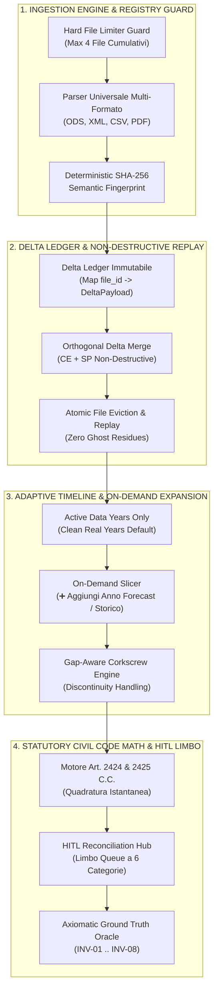

# 🧠 Concept Map: Architettura Formale Nodo 3 (CE & SP Engine)

## 🎯 1. Obiettivo Strategico & Filosofia di Sistema
Garantire un'infrastruttura deterministica a prova di guasto per l'ingestione, riconciliazione civilistica (Art. 2424 & 2425 C.C.) e proiezione temporale dei bilanci aziendali, fondata su:
1. **Adaptive Data-Driven Viewport**: Visualizzazione di base vincolata ai soli anni con dati contabili reali estratti (zero zeri spuri), con espansione on-demand (`➕ Aggiungi Anno Forecast/Storico`).
2. **Hard File Limiter Guard (Max 4 File)**: Blocco rigido sia client-side che server-side (HTTP 422) su qualsiasi combinazione o caricamento cumulativo superiore a 4 file attivi.
3. **Delta Ledger Replay**: Ingestione non distruttiva, idempotente e con rollback atomico chirurgico per singolo file badge (eliminazione residui fantasma INV-03).
4. **Validazione Assiomatica ad Invarianti Matematici**: Quadratura perfetta al centesimo (Δ = 0.00€) su 5/5 bilanci reali.

---

## 🏛️ 2. Le 4 Macro-Aree Concettuali

---

## ⚖️ 3. Istanze degli 8 Invarianti Matematici Formali (INV-01 .. INV-08)

| ID Invariante | Nome Formale | Formula Matematica / Condizione di Controllo | Trauma Sanato |
| :--- | :--- | :--- | :--- |
| **INV-01** | **Quadratura Patrimoniale Assoluta** | $\forall Y, \quad \left\| \sum \text{Attivo}(Y) - \sum \text{PassivoNetto}(Y) \right\| \le 0.01€$ | Sbilancio SP su edit o discrepanze di parsing. Risolto via `balanceSPQuickFix` e riserva di riconciliazione. |
| **INV-02** | **Parità Subvoci-Riga Madre** | $\forall K \in \text{VociMadre}, \forall Y, \quad \left\| \text{Valore}(K, Y) - \sum_{i \in \text{Sub}(K, Y)} \text{SubItem}_i \right\| \le 0.01€$ | Disallineamento tra sub-voci e totali civilistici. Risolto con aggregazione preventiva deterministica. |
| **INV-03** | **Zero Ghost Residues on Reset/Eviction** | $\text{State}_{\text{reset}} \equiv \text{CreateInitialState}() \implies |\text{Subitems}| = 0 \land |\text{Limbo}| = 0$ | Residui di sub-voci o eccezioni orfane dopo il reset. Risolto con reset rigenerativo atomico. |
| **INV-04** | **Preservazione Storica su Horizon Shift** | $\forall Y, \quad \text{State.records}[Y]_{\text{post-shift}} \equiv \text{State.records}[Y]_{\text{pre-shift}}$ | Cancellazione o perdita dei dati storici/forecast durante l'aggiunta o rimozione di colonne. |
| **INV-05** | **Ortogonalità e Idempotenza del Delta Merge** | $\text{Merge}(S, \Delta_{CE}) \implies S.sp \text{ inalterato}; \quad \text{Merge}(\text{Merge}(S, \Delta), \Delta) \equiv \text{Merge}(S, \Delta)$ | Sovrascrittura distruttiva di SP caricando CE, o duplicazione dati al re-upload dello stesso file. |
| **INV-06** | **Hard Registry Saturation Ceiling** | $|\text{state.uploadedFilesRegistry}| \le 4 \quad \land \quad \text{IncomingBatch} \le (4 - |\text{Registry}|)$ | Exploit cumulativo multi-batch con caricamento di oltre 4 file. |
| **INV-07** | **Signed-Magnitude Parity** | $\forall \text{Riga}, \quad \text{Sign}(\text{Parent}) \cdot |\text{Parent}| \equiv \sum \text{Sign}(\text{Sub}_i) \cdot |\text{Sub}_i| \pm 0.01€$ | Supporto per poste contabili a segno negativo (rimanenze, perdite, oneri netti). |
| **INV-08** | **Gap-Aware Corkscrew Stability** | $Y_t - Y_{t-k} > 1 \implies \text{StatutoryLock}(Y_t) \land |\text{Attivo}(Y_t) - \text{PassivoNetto}(Y_t)| \le 0.01€$ | Distorsione patrimoniale nel salto di anni non consecutivi (divisori ⚡ GAP). |
