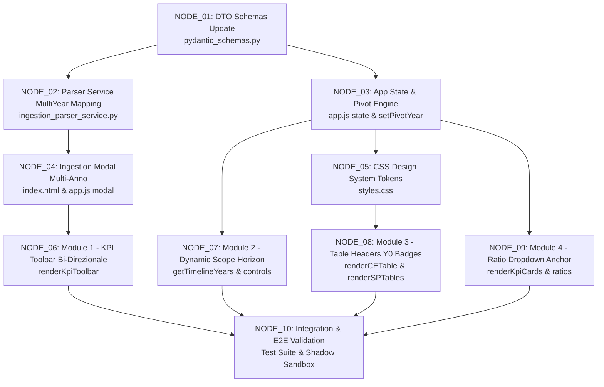

# 🌲 Structural Tree & Kahn DAG: Timeline Bi-Direzionale Perno-Centrata (Worker Brief v1.0.0)

🛡️ [NK-ASSIST - NK-App-Concept-Architect]

> [!NOTE]
> **Ambito Architetturale:** Mappatura strutturale dei file impattati, dipendenze dei componenti e Kahn Directed Acyclic Graph (DAG) per la riprogettazione temporale del Nodo 3.
> **Stato:** PROPOSTA WORKER INDIPENDENTE (Zero-Bias Briefing)

---

## 📁 1. Mappa dei File Impattati

```
G:/Il mio Drive/Antigravity/agent-ide/nodo3-ce-sp/
├── src_app/
│   ├── backend/
│   │   ├── pydantic_schemas.py           [MODIFY] Update IngestionResult & MultiYearModel metadata
│   │   ├── ingestion_parser_service.py   [MODIFY] Expose multi-year metadata & detected years list
│   │   ├── main_api_server.py            [READ ONLY] Endpoint REST /api/v1/ingest/parse_pdf
│   │   └── civil_code_math_engine.py     [STRICT READ ONLY - NO MODIFICATION]
│   └── frontend/
│       ├── index.html                    [MODIFY] #comparativeYearModal -> #pivotYearSelectionModal & Dynamic Controls
│       ├── styles.css                    [MODIFY] Classes for .pivot-badge, .calendar-badge, timeline layout
│       └── app.js                        [MODIFY] State management (Y0 pivot), 4 UI modules, event listeners
└── nk_tracking/
    └── reports_and_briefs/
        └── worker_brief_v1.0.0/
            ├── concept_map_worker.md      [NEW] Mappa Concettuale
            ├── structural_tree_worker.md  [NEW] Mappa Strutturale & DAG
            └── implementation_plan_worker.md [NEW] Piano Attuativo Atomico
```

---

## 🧬 2. Modifiche di Dettaglio nei Componenti

### A. Backend (`src_app/backend/`)

1. [`pydantic_schemas.py`](file:///G:/Il%20mio%20Drive/Antigravity/agent-ide/nodo3-ce-sp/src_app/backend/pydantic_schemas.py):
   - **`MultiYearModel`**: Aggiunta del campo `pivot_year: int = 2025` per tracciare esplicitamente l'Anno Perno ($Y_0$).
   - **`IngestionResult`**: Estensione di `detected_years: List[int]` e supporto per `multi_year_years: List[int]` e `extracted_data_by_year: Dict[int, Dict[str, Any]]`.

2. [`ingestion_parser_service.py`](file:///G:/Il%20mio%20Drive/Antigravity/agent-ide/nodo3-ce-sp/src_app/backend/ingestion_parser_service.py):
   - Aggiornamento di `create_ingestion_result()` per restituire l'elenco ordinato di tutti gli anni identificati nei documenti ERP/ODS (`detected_years`) e mappare i dati per ciascun anno senza sovrascritture.

3. [`civil_code_math_engine.py`](file:///G:/Il%20mio%20Drive/Antigravity/agent-ide/nodo3-ce-sp/src_app/backend/civil_code_math_engine.py):
   - **[STRICT READ ONLY]**: Invariato. Continua ad elaborare i record indicizzati per anno assoluto `int`.

---

### B. Frontend (`src_app/`)

1. [`index.html`](file:///G:/Il%20mio%20Drive/Antigravity/agent-ide/nodo3-ce-sp/src_app/index.html):
   - **Evoluzione Modale Ingestion**: Trasformazione della modale `#comparativeYearModal` nella nuova modale **`#pivotYearSelectionModal`** con selettore dinamico dell'Anno Perno ($Y_0$).
   - **Toolbar KPI Superiore**: Aggiornamento del markup del container `#kpiYearToolbar` con controlli bi-direzionali.
   - **Controlli Orizzonte Temporale (Scope)**: Aggiunta pulsantiera/slider per la gestione del range visibile $[Y_0 - m_{past}, Y_0 + m_{future}]$.

2. [`styles.css`](file:///G:/Il%20mio%20Drive/Antigravity/agent-ide/nodo3-ce-sp/src_app/styles.css):
   - Stili per `.pivot-badge-container`, `.pivot-badge-y0`, `.pivot-badge-ypast`, `.pivot-badge-yfuture`.
   - Stili per i sub-badge solari `.calendar-badge`.
   - Stili per la visualizzazione glowing di $Y_0$ (Amber Gold border + star icon).

3. [`app.js`](file:///G:/Il%20mio%20Drive/Antigravity/agent-ide/nodo3-ce-sp/src_app/app.js):
   - **`state`**:
     - `state.pivotYear = 2025` ($Y_0$)
     - `state.scopePastYears = 2` ($m_{past}$)
     - `state.scopeFutureYears = 2` ($m_{future}$)
   - **Funzioni Core**:
     - `setPivotYear(newY0)`: Ricalcola l'indicizzazione relativa temporale in tutta l'applicazione.
     - `getTimelineYears()`: Restituisce l'array ordinato degli anni `[Y0 - m_past, ..., Y0, ..., Y0 + m_future]`.
     - `renderCETable()` & `renderSPTables()`: Rendering dinamico degli header con doppi badge.
     - `renderKpiToolbar()`: Builder della toolbar KPI centrata su $Y_0$.
     - `showPivotYearSelectionModal(detectedYears)`: Gestione modale HITL per elezione $Y_0$.

---

## 🔗 3. Kahn Directed Acyclic Graph (DAG)

Il grafo aciclico diretto delle dipendenze di implementazione (Kahn DAG):



---

## 📐 4. Algoritmo di Ordinamento e Calcolo Timeline Relativa

```javascript
// Dynamic Timeline Calculation Algorithm
function getTimelineYears() {
  const Y0 = state.pivotYear || 2025;
  const mPast = state.scopePastYears || 2;
  const mFuture = state.scopeFutureYears || 2;
  
  const years = [];
  // Historical past (descending or chronological)
  for (let i = mPast; i >= 1; i--) {
    years.push({
      year: Y0 - i,
      offset: -i,
      label: `Y-${i}`,
      type: 'past',
      badgeClass: 'pivot-badge-ypast'
    });
  }
  // Pivot Year Y0
  years.push({
    year: Y0,
    offset: 0,
    label: '★ Y0',
    type: 'pivot',
    badgeClass: 'pivot-badge-y0'
  });
  // Future projections
  for (let j = 1; j <= mFuture; j++) {
    years.push({
      year: Y0 + j,
      offset: j,
      label: `Y+${j}`,
      type: 'future',
      badgeClass: 'pivot-badge-yfuture'
    });
  }
  return years;
}
```
