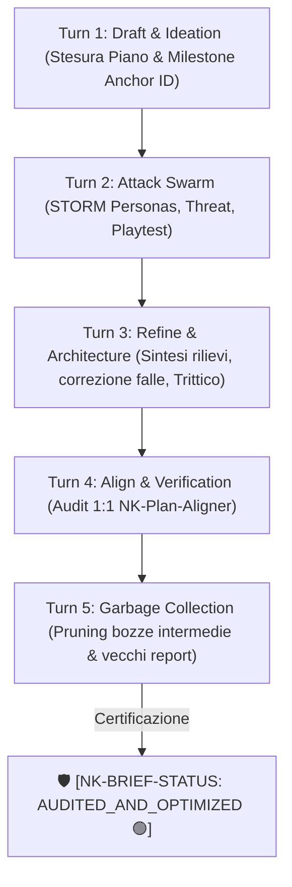
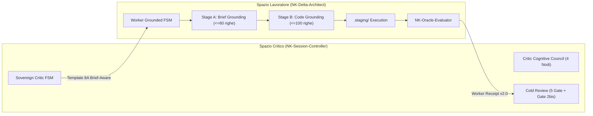

# 🏛️ NK Genome: Concept Map & Briefing Master (Ecosistema NK — Release v1.0)

> **Badge di Certificazione:** 🛡️ [NK-BRIEF-STATUS: AUDITED_AND_OPTIMIZED 🟢]  
> **Data Consolidamento:** 2026-08-20  
> **Versione Protocollo:** v1.0 (Official Baseline Release, Self-Cleaning Ecosystem, Brief-Aware Handoff, Actor-Critic & CRV 4.0 4-Phases)  
> **Macro-Aree Coinvolte:** 🌐 INTERACTION, 🧠 COGNITIVE, 💾 PERSISTENCE, 🔌 INTEGRATION

---

## 🎯 1. Visione Concettuale & Filosofia (Release v1.0)

La Release v1.0 introduce innovazioni architetturali cardine per eliminare l'amnesia contestuale, le allucinazioni operative, l'accumulo di residui e l'esecuzione cieca nel paradigma multi-agente:

1. **Brief-Aware Handoff & Brief Anchor Capsule (<= 350 token):** Risolve il disaccoppiamento cognitivo tra la pianificazione concettuale (Trittico di Sessione) e l'esecuzione fisica del codice. Ogni handoff incorpora una capsula compatta ad alta densità semantica con il `Milestone Anchor ID` e le coordinate del piano, garantendo coerenza strategica senza saturare la finestra di contesto.
2. **Decoupled Asymmetric Actor-Critic & Two-Stage Grounding:** Separa nettamente il ruolo del Sovrano Critico (`NK-Session-Controller`) da quello del Lavoratore (`NK-Delta-Architect`). Il Critico possiede visibilità panottica (Trittico, DAST, Logs, SAST), mentre il Worker opera con perimetro chirurgico e l'obbligo di Two-Stage Grounding (Stage A concettuale + Stage B fisico).
3. **Auto-Brief Swarm FSM a 5 Turni Concatenati:** Supera il vecchio modello di broadcast mono-turno a perdere, introducendo un ciclo deterministico dialettico completo: Draft -> Attack Swarm -> Refine -> Align -> Garbage Collection.
4. **Self-Cleaning Ecosystem & Pre-Flight Health Check:** Automazione nativa della distruzione dei residui, de-allocazione sandbox in `%TEMP%`, rolling window retention sui report e scansione deterministica al boot dell'Hub.

---

## 🔄 2. Auto-Brief Swarm FSM (Loop Concatenato a 5 Turni)

### I 5 Turni Concatenati:
- **Turn 1 (Draft & Ideation):** Definizione dell'ipotesi di soluzione, perimetri e stesura del Draft preliminare su `"G:/Il mio Drive/Antigravity/nk_genome/implementation_plan.md"`.
- **Turn 2 (Attack Swarm):** Invocazione parallela dei sub-agenti dialettici:
  - `[DAST Investigator]`: Analisi empirica runtime su console, DOM e rete.
  - `[Skeptic / STORM Personas]`: Ricerca di falle logiche, asserzioni deboli e test fittizi.
  - `[Threat & Boundary Auditor]`: Verifica lock I/O Windows, compatibilità di encoding e saturazione memoria.
- **Turn 3 (Refine & Solution Architecture):** Sintesi dei feedback, eliminazione dei punti critici e consolidamento dei documenti del Trittico.
- **Turn 4 (Align & Verification):** Attivazione di `NK-Plan-Aligner` per confermare la perfetta coerenza 1:1 tra Visione (`concept_map.md`), Topologia (`structural_tree.md`) e Piano Esecutivo (`implementation_plan.md`).
- **Turn 5 (Garbage Collection):** Rimozione fisica di tutte le bozze intermedie, canvas temporanei (`idea_canvas.md`, `brief_nk_*`) e report storici associati a questa ideazione.

---

## 🔀 3. Dual-Mode Execution Switch & Asymmetric Actor-Critic Topology

### Modalità Operative:
* **Mode A (Trittico-Driven):** Obbligatoria per feature complesse, nuove componenti o modifiche architetturali (>100 LOC). Richiede Trittico completo, Auto-Brief Swarm FSM e Two-Stage Grounding.
* **Mode B (Fast-Track):** Riservata a bug fix puntuali (LOC <= 100, zero boundary impact). Fast AST check e Grounding Stage B.

---

## 🛡️ 4. Protocollo di Cold Review a 5 Gate Deterministiche

Il Critico valida le ricevute del Worker tramite 5 Gate bloccanti prima di consentire il commit:
1. **Gate 1 (Scope Audit):** File/funzioni conformi al Blocco 2 (`REJECT_SCOPE_CREEP`).
2. **Gate 2 (Code Grounding Audit):** Lettura reale del codice sorgente su disco (`REJECTED_BLIND_EXECUTION`).
3. **Gate 2bis (Brief Grounding Forensic Audit):** Lettura reale di `implementation_plan.md` nel transcript e validazione del Milestone Anchor ID (`REJECT_FAKE_BRIEF_GROUNDING`).
4. **Gate 3 (Preservation Guard):** Integrità di tipi, commenti e codice circostante (`REJECT_CLEAN_SLATE`).
5. **Gate 4 (Truth Verification):** Test con exit code 0 ed evidenze concrete dall'Oracolo (`REJECT_TEST_FAILED`).
6. **Gate 5 (Delegation Audit):** Delega a sub-agenti Builder ed Oracolo, zero bypass DDI (`REJECT_SUBAGENT_BYPASS`).
