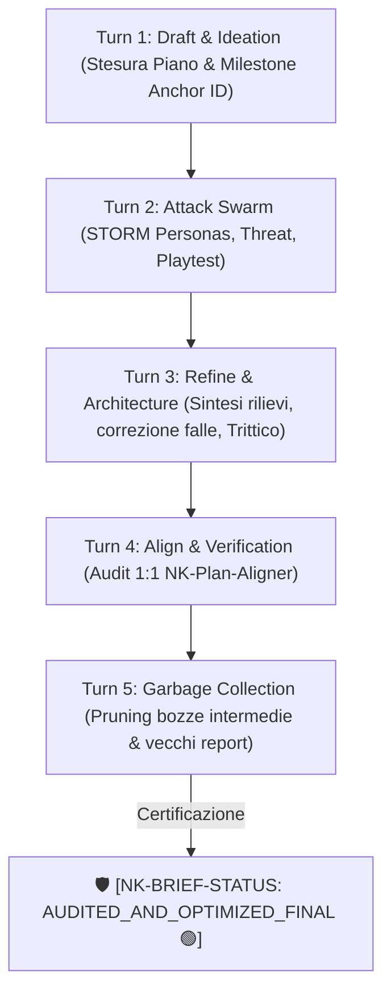

# 🏛️ NK Genome: Concept Map & Briefing Master (Release v1.1.0-Universal)

> **Badge di Certificazione:** 🛡️ [NK-BRIEF-STATUS: AUDITED_AND_OPTIMIZED_FINAL 🟢]  
> **Milestone Anchor Primaria:** `NK-MS-20260822-UNIVERSAL-STABILIZATION`  
> **Data Consolidamento:** 2026-08-22  
> **Versione Protocollo:** v1.1.0-Universal (Full ACID 2PC Engine, Zero-Mock DAST Sandbox, AST Guard Validation, 3-Tier Episodic Memory, Permanent 49-Test Suite)  
> **Macro-Aree Coinvolte:** 🌐 INTERACTION, 🧠 COGNITIVE, 💾 PERSISTENCE, 🔌 INTEGRATION

---

## 🎯 1. Visione Concettuale & Filosofia (v1.1.0-Universal)

La Release v1.1.0-Universal consolida l'architettura per agenti autonomi su Windows e cloud filesystem (Google Drive):

1. **Garanzie Fisiche ACID & 2PC a Basso Livello OS:** Mutex nominati Win32 thread-bound (`CreateMutexW`), recovery automatica da processi terminati anomalamente (`WAIT_ABANDONED_0`), Write-Ahead Logging con TTL 60s, verifica crittografica duale SHA-256 e CRC-32, e swap atomico tramite `MoveFileExW` con Shadow Swap Fallback per tollerare lock Google Drive (`WinError 32`/`WinError 5`).
2. **Zero-Mock SBFL & Dynamic Execution Sandbox:** Isolamento assoluto dell'ambiente di audit dinamico in `%TEMP%\nk_sandbox_<uuid>\`, tracciamento istruzione per istruzione tramite `trace.Trace` nativo, localizzazione statistica dei guasti (Ochiai, Tarantula, DStar $\alpha=2.0$ con calibrazione Def-Use), e terminazione gerarchica asincrona dei processi via `taskkill /F /T` pre-kill.
3. **AST Structural Mapping & Guard Validation Pre-Commit:** Mappatura topologica dei simboli, blast radius via Personalized PageRank ($\alpha=0.85$, $\epsilon=10^{-6}$), Karpathy Surgical Slicing, e validazione AST pre-commit con supporto completo a Python 3.10+ (PEP 634 Pattern Matching) e Python 3.12+ (PEP 695 Type Parameters e TypeAlias).
4. **3-Tier Episodic Memory Engine:** Memoria gerarchica ad altissima densità informativa:
   - Tier 1 Core Memory: Hard cap $\le 350$ token per ciascuno dei 4 domini NK.
   - Tier 2 Local Recall JSONL: Sliding window a 200 eventi con compattazione rolling a 10 snapshot deterministici.
   - Tier 3 Archival Cold Store: Motore ibrido Pure Python BM25 + Dense Cosine con Reciprocal Rank Fusion ($k=60$).
5. **Invisible Self-Healing Loop a Perimetro Blindato:** Capacità di auto-triage fino a 3 iterazioni confinata esclusivamente alla Macro-Fase 1 (Build & Stage). In Macro-Fase 2, l'Auditor opera in modalità 100% Strict Read-Only.
6. **Permanent Test Suite Mandate (`[RULE-01.10]`):** La suite completa di 49 unit test risiede permanentemente in `tests/`, garantendo il rispetto del Ratchet Mandate anti-regressione.

---

## 🔄 2. Auto-Brief Swarm FSM (Loop Concatenato a 5 Turni)

