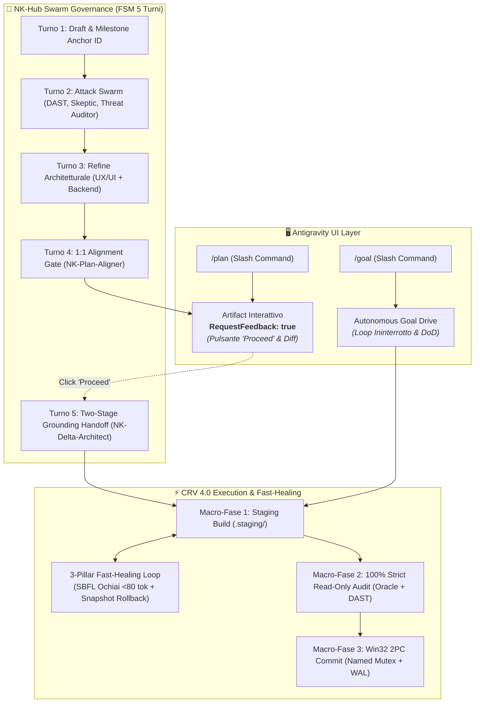

# 🏛️ NK Genome: Implementation Plan Master (Release v2.6.0-DualEngine-Symbiosis)
### *Integrazione Simbiotica dei Comandi `/plan` & `/goal` di Antigravity nell'Ecosistema NK-Hub*

> **Badge di Certificazione:** 🛡️ [NK-BRIEF-STATUS: AUDITED_AND_OFFICIAL_v2.6.0 🟢]  
> **Milestone Anchor ID:** `NK-MS-20260924-PLAN-GOAL-INTEGRATION-v2.6.0`  
> **Versione Target:** `v2.6.0-DualEngine-Symbiosis`  
> **Dominio:** Nexus Keystone Hub — Meta-Framework Agentico, CRV 4.0, Antigravity Slash Commands (`/plan` & `/goal`), Native Artifacts & 3-Pillar Fast-Healing

---

## 🎯 1. Panoramica & Bounded Context

Con la release **v2.6.0-DualEngine-Symbiosis**, l'ecosistema Nexus Keystone realizza la **piena convergenza simbiotica** tra l'esperienza utente e le feature native di **Google Antigravity** e il motore di governance deterministica di **Nexus Keystone (NK-Hub)**:

1. **Integrazione Dual-Mirroring per `/plan`:**
   - Sincronizzazione automatica tra il Genoma persistente (`nk_genome/implementation_plan.md`) e l'Artifact nativo Antigravity con `RequestFeedback: true`.
   - L'utente ottiene la visual card interattiva con pulsante **"Proceed"** nell'IDE/Desktop App prima dell'ingresso nella fase di scrittura codice.
2. **Integrazione Dual-Engine per `/goal`:**
   - La modalità goal-driven ininterrotta (`[RULE-01.12]`) viene alimentata dai **3 Pilastri di Fast-Healing Zero-Mock** in `.staging/` (`auto_heal_pipeline.py`, `sbfl_pytest_bridge.py`, `healing_snapshot_rollback.py`).
   - Cicli di auto-riparazione (max 3) guidati da SBFL Ochiai $<80$ token con Strict Monotonic Fitness Gate e ripristino istantaneo in caso di regressione.
3. **Preservazione dei Ratchet di Qualità:**
   - Suite permanente di 78 Golden Tests validata al 100% di PASS.
   - AST Guard statico certificato su tutti i 48 moduli di piattaforma (0 violazioni).
   - Fast-Stat Session Bootstrap Gate garantito a $<50$ ms (SLA $<120$ ms).

---

## 🛠️ 2. Mappatura & Sinergia dei Flussi Operativi

### Matrice di Integrazione Funzionale:
| Comando / Modalità | Responsabilità Antigravity (UI/UX) | Responsabilità Nexus Keystone (Meta-Platform) | Risultato Combinato |
| :--- | :--- | :--- | :--- |
| **`/plan`** | Rendering dell'Artifact, formattazione grafica, tasto interattivo **"Proceed"** per blocco/sblocco esecuzione. | Auto-Brief Swarm FSM (Turni 1-4), assegnazione `Milestone Anchor ID`, audit 1:1 di `NK-Plan-Aligner`. | **Zero-Blind Execution:** Piano verificato al 100% dai sub-agenti e approvato visivamente dall'utente con 1 clic. |
| **`/goal`** | Mandato di autonomia ininterrotta senza pause per domande banali fino alla *Definition of Done*. | Fast-Healing Loop in `.staging/`, estrazione automatica errori SBFL Ochiai $<80$ tok, Strict Monotonic Gate, Rollback SHA-256. | **Zero-Permission Ping-Pong:** Auto-riparazione reale in staging con convergenza autonoma garantita. |

---

## 🧪 3. Invarianti di Governance & Salvaguardia Ratchet

1. **Ratchet Rule (`[RULE-01.10]`):** La suite permanente di 78 Golden Tests deve mantenere costantemente il 100.0% di PASS.
2. **Project Isolation Mandate (`[RULE-PROJECT-ISOLATION]`):** Nessun codice di prodotto viene scritto all'interno dell'Hub; ogni target vive nella propria cartella autonoma esterna.
3. **Zero-Mock Mandate (`[RULE-01.2]`):** Ogni test convalida processi, sandbox e filesystem reali su Windows.
4. **Fast-Stat Bootstrap Guarantee (`[RULE-00.4]` / `[RULE-00.5]`):** Tempo di bootstrap sempre $<120$ ms.
