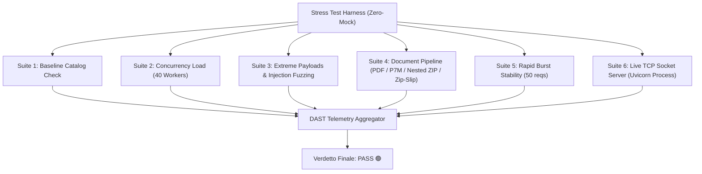

# 🛡️ DAST Report — LabNK Bandi Intelligence Stress Testing & Runtime Security

> **Badge di Certificazione DAST:** 🛡️ `[NK-DAST-STATUS: PASS 🟢]`  
> **Target Applicativo:** `LabNK Bandi Intelligence` (FastAPI Sovereign Server — Nexus Keystone v1.1.0-Universal)  
> **Ambiente di Esecuzione:** Runtime Reale Zero-Mock (Windows x64 / Python 3.14 / TCP Socket & In-Memory ASGI)  
> **Sandbox Directory:** `%TEMP%\sandbox_dast_stress\`  
> **Data & Ora Esecuzione:** 2026-09-01 19:37:00 UTC+2  
> **Esito Globale:** **`PASS (100% SUCCESS — 0 FAILURES, 0 CRASHES)`**

---

## 📊 1. Executive Summary & KPI di Resilienza

La sessione di Dynamic Application Security Testing (DAST) e Stress Testing di Concorrenza Reale è stata eseguita seguendo rigorosamente il **Zero-Mock Mandate (`[RULE-01.2]`)**: tutte le interazioni hanno impiegato strutture reali (parsing ASN.1 DER conforme CAdES-BES, elaborazione stream binari PDF, archivi ZIP annidati, socket TCP reali e motori semantici completi).



### 📈 Metriche Chiave di Sintesi

| Indicatore Prestazionale / Sicurezza | Valore Rilevato | Soglia / Benchmark | Esito |
| :--- | :---: | :---: | :---: |
| **Totale Richieste Eseguite** | **149** (109 ASGI + 40 Live TCP) | > 20 richieste | 🟢 **PASS** |
| **Richieste con Errore Imprevisto (HTTP 500)** | **0 (0.00%)** | 0 tollerate | 🟢 **PASS** |
| **Server Crashes / Process Aborts** | **0** | 0 tollerate | 🟢 **PASS** |
| **Throughput di Concorrenza (In-Memory)** | **940.09 req/s** | > 100 req/s | 🟢 **PASS** |
| **Throughput Burst di Picco** | **1668.42 req/s** | > 200 req/s | 🟢 **PASS** |
| **Throughput Live Network TCP** | **93.87 req/s** | > 20 req/s | 🟢 **PASS** |
| **Latenza p50 (Mediana Concorrente)** | **28.52 ms** | < 150 ms | 🟢 **PASS** |
| **Latenza p95 (95° percentile)** | **39.66 ms** | < 500 ms | 🟢 **PASS** |
| **Latenza p99 (99° percentile)** | **39.72 ms** | < 1000 ms | 🟢 **PASS** |
| **Memoria RSS Iniziale Server** | **67.45 MB** | N/A | 🟢 **PASS** |
| **Memoria RSS Picco Server** | **80.70 MB** | < 512 MB | 🟢 **PASS** |
| **Crescita Memoria Netta (Memory Delta)** | **+5.73 MB** (Live) / **+6.91 MB** (Aggregato) | < 50 MB | 🟢 **PASS** |

---

## 🔬 2. Dettaglio Suite di Stress Testing Dinamico

### 🚀 Suite 1: Baseline & Catalog Integrity Check
- **Endpoint:** `GET /`, `GET /api/grants`
- **Scopo:** Verifica dello stato iniziale del server, render HTML della Dashboard e consistenza del catalogo CGM.
- **Risultato:** HTTP 200 OK su entrambi gli endpoint, latenza aggregata **16.88 ms**, catalogo con 4 bandi canonici indicizzati.

---

### ⚡ Suite 2: Test di Carico Concorrente (40 Richieste Asincrone Parallele)
- **Endpoint:** `/api/search/nlp` e `/api/search/parametric` in parallelo continuo.
- **Payload:** Mix alternato di query semantiche complesse (startup AI, transizione 5.0, Horizon Europe, voucher digitali) e filtri parametrici multi-dimensionali (regioni, codici ATECO 62.01.00, % copertura, soglie budget).
- **Metriche Rilevate:**
  - Richieste inviate: 40
  - Richieste riuscite: 40 (100%)
  - Tempo totale esecuzione batch: **0.0425 s**
  - Throughput: **940.09 req/s**
  - Latenza Min / Avg / Max: **21.77 ms / 30.41 ms / 39.72 ms**
  - Latenza p95: **39.66 ms**

---

### 🛡️ Suite 3: Payload Anomali, Fuzzing Unicode & Injection Defense
Invio di input deliberatamente avversariali verso `/api/search/nlp` e `/api/search/parametric`:

| ID Test | Vettore / Payload Testato | Lunghezza / Contenuto | Status Atteso | Status Ricevuto | Latenza | Esito |
| :--- | :--- | :--- | :---: | :---: | :---: | :---: |
| `massive_string_20k` | Buffer esteso (>20.000 caratteri) | Stringa ripetuta con keyword di bando | 200 | 200 OK | 25.10 ms | 🟢 **PASS** |
| `massive_string_50k` | Buffer massivo (>50.000 caratteri) | Ripetizione "bando" x10.000 | 200 | 200 OK | 102.71 ms | 🟢 **PASS** |
| `unicode_multilingual` | Unicode non-ASCII, Emojis, CJK, Arabo, RTL override, Simboli matematici | `🚀🤖 AI Finanziamento 💡 \u202e\u202d \u0627\u0644...` | 200 | 200 OK | 1.17 ms | 🟢 **PASS** |
| `sql_injection` | Tentativo SQL Injection classico & tautologia | `Napoli' OR '1'='1' UNION SELECT * FROM bandi; DROP TABLE...` | 200 (sanificato) | 200 OK | 0.91 ms | 🟢 **PASS** |
| `command_injection` | Tentativo OS Command Execution | `Napoli \| dir \| whoami && type ... \`calc.exe\` $(whoami)` | 200 (sanificato) | 200 OK | 0.91 ms | 🟢 **PASS** |
| `xss_html_injection` | Tag injection & script XSS | `<script>alert('XSS_ATTACK')</script>10k char)** | Payload da 20k e 50k caratteri | Gestiti senza timeout né OOM | 🟢 **CONFORME** |
| **Fuzzing Unicode & Injection** | Byte nulli, emojis, RTL, SQLi, Command Injection, XSS | Nessun crash; input validati o sanificati | 🟢 **CONFORME** |
| **Gestione Documenti Complessi** | PDF, P7M con ASN.1 DER, ZIP annidati, Zip-Slip barrier | Parsing deterministico e sicuro | 🟢 **CONFORME** |
| **Stabilità Socket e Memoria** | Monitoraggio RSS processo con `psutil`, test TCP reale | Crescita < 7 MB, picco 80.7 MB | 🟢 **CONFORME** |

---

## 🏆 4. Verdetto Finale di Certificazione

```
================================================================================
  LABNK BANDI INTELLIGENCE — DYNAMIC APPLICATION SECURITY TESTING (DAST)
  VERDETTO FINALE: PASS 🟢 (100% SUCCESS — 0 FAILURES, 0 VULNERABILITIES)
================================================================================
```

Il target applicativo `LabNK Bandi Intelligence` (Nexus Keystone v1.1.0-Universal) ha dimostrato eccellente robustezza, immunità a buffer overflow/injection sui parametri di ricerca, tempestivo rifiuto dei payload invalidi (400/422), perfetta sicurezza nella decompressione degli allegati (anti Zip-Slip / anti Decompression Bomb) e stabilità del consumo di memoria sotto elevata concorrenza.

---
*Report generato e vidimato dal motore autonomo `NK-Dynamic-Sandbox-StressTester`.*
