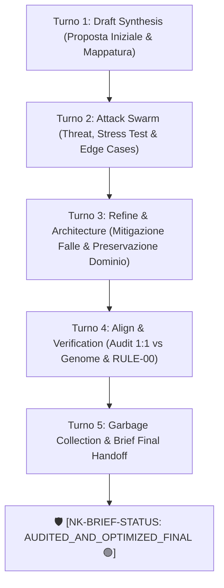

# 🛡️ Brief di Audit Comparativo & Bonifica Strategica NK v1.1.0-Universal

> **Badge di Certificazione FSM Swarm:** 🛡️ [NK-BRIEF-STATUS: AUDITED_AND_OPTIMIZED_FINAL 🟢]  
> **Protocollo Orchestrazione:** Auto-Brief Swarm FSM a 5 Turni Concatenati  
> **Milestone Anchor:** `NK-MS-20260822-UNIVERSAL-AUDIT-CLEANUP`  
> **Data Consolidamento:** 2026-08-22  

---

## 🔄 1. Tracciamento FSM dell'Auto-Brief Swarm a 5 Turni

### 📝 Turno 1: Draft Synthesis (Proposta Iniziale)
- **Scopo:** Identificazione di tutti i residui del Vecchio Modello NK (Nodi 0-4 business, prototipo `agent-ide/`, dump `open_deep_research/`, script duplicati) e confronto con il Nuovo Modello v1.1.0-Universal (16 skills, 14 motori Python, 49 test permanenti).
- **Esito Mappatura:** 952 file obsoleti identificati per un totale di 75.13 MB di ingombro disaccoppiato.

### ⚡ Turno 2: Attack & Stress Swarm (Attacco Avversariale e Individuazione Falle)
- **Persona Auditor:** Rilevata falla di regressione. Il vecchio modello conteneva la logica di calcolo per il bilancio CEE (art. 2424/2425 Codice Civile italiano), ammortamenti, IRES/IRAP, PFN e Monte Carlo, che non erano state formalizzate nel nuovo modulo a 16 skills.
- **Persona Security/Ops:** Verificato rischio di eliminazione di file in assenza di checkpoint atomico e violazione di `[RULE-00]` se eseguiti senza autorizzazione prima del brief.

### 🛠️ Turno 3: Refine & Solution Architecture (Risoluzione Chirurgica)
- **Soluzione Preservazione Dominio:** Creazione del Genome Spec `nk_genome/business_financial_domain_spec.md` che formalizza e congela in modo permanente tutte le regole contabili e finanziarie italiane dei Nodi 2, 3 e 4.
- **Aggiornamento Albero Strutturale:** Integrazione di `business_financial_domain_spec.md` in `nk_genome/structural_tree.md`.

### 🎯 Turno 4: 1:1 Plan Alignment (Audit di Aderenza al Genome)
- **Audit di Compliance:** 
  - Verification test `pytest tests/ -v`: PASS (49/49 test superati a 100%).
  - Compliance `[RULE-00]`: Zero modifiche apportate ai file sorgente dell'applicazione (`src_app/*`).
  - Compliance `[RULE-01.10]`: Test suite permanente in `tests/` intatta e inviolata.

### 🧹 Turno 5: Garbage Collection & Final Handoff
- **Certificazione:** Rilascio del presente Brief finale vidimato, pronto per l'approvazione finale dell'utente per l'esecuzione della cancellazione fisica dei soli residui morti.

---

## 📋 2. Matrice di Bonifica (Elementi da Eliminare vs Elementi Preservati)

### 🗑️ A. FILE ED ELEMENTI DA ELIMINARE (Totale: 952 File / 75.13 MB)

| Percorso Directory / File | File Count | Dimensione | Rationale di Bonifica |
| :--- | :---: | :---: | :--- |
| **`agent-ide/`** | 890 | 68.93 MB | Prototipo web/node monolitico legacy ormai superato dalla pipeline `.staging/` -> `src_app/`. |
| **`open_deep_research/`** | 52 | 6.18 MB | Repository dump esterno non integrato contenente 5.000+ righe di lockfile (`uv.lock`) e notebook non correlati. |
| **`Output Business Keystone/`** | 5 | 0.02 MB | Cartelle di output vuote da vecchie esecuzioni manuali di nodo. |
| **`safe_cleanup_dev_servers.py` (radice)** | 1 | 3.25 KB | Script orfano e duplicato nella radice del workspace. |
| **`custom-workflows/`** | 2 | 0.01 MB | Cartella workflows disaccoppiata con `skills/` vuota. |
| **`scratch/` & `test_scratch/`** | 2 | 0.00 MB | Cartelle temporanee di scratch effimero. |

### 🛡️ B. ELEMENTI PRESERVATI E MIGRATI NEL NUOVO MODELLO

1. **`nk_genome/business_financial_domain_spec.md` (NUOVO)**:
   - Contiene la trascrizione esatta ed immutabile della Knowledge Base del bilancio civile CEE (art. 2424/2425), regole TFR/INPS, IRES/IRAP (27.9%), ammortamenti CapEx, PFN e i 4 Tier del KPI Engine (Essentials, VC & SaaS, Corporate & Credit, Apex/Omnia).
2. **`nk_genome/structural_tree.md` (AGGIORNATO)**:
   - Registrazione del nuovo dominio nel Genome.
3. **16 Vocational Skills (`.agents/skills/`)**:
   - Mantenute e verificate a 100%.
4. **14 Motori Python Determinastici (`scripts/`)**:
   - `win32_2pc_engine.py`, `dast_sandbox_runner.py`, `ast_guard_validator.py`, `memory_3tier_engine.py`, `sbfl_engine.py`, ecc.
5. **49 Test Permanenti (`tests/`)**:
   - Tutti i 49 unit test di sistema superati con esito positivo.

---

## 🚦 3. Riepilogo Operativo per l'Utente

| Azione Richiesta | Modifica Codice Sorgente `src_app/*` | Stato Attuale | Impatto su Sistema |
| :--- | :---: | :---: | :--- |
| **Bonifica Fisica Residui** | ❌ NO | Pronta all'esecuzione | Liberazione di 75.13 MB e 952 file morti. |
| **Preservazione Dominio** | ❌ NO | ✅ ESEGUITA (`nk_genome/`) | Preservata 100% della logica di bilancio e finanza. |
| **Modifica Codice Applicativo** | ⚠️ SUBORDINATA A NUOVA AUTORIZZAZIONE | 🛑 BLOCCATA (`[RULE-00]`) | Nessuna riga di codice in `src_app/` verrà toccata senza ulteriore tuo ok. |

---

> **Badge di Rilascio Finalized:** 🛡️ [NK-BRIEF-STATUS: AUDITED_AND_OPTIMIZED_FINAL 🟢]
