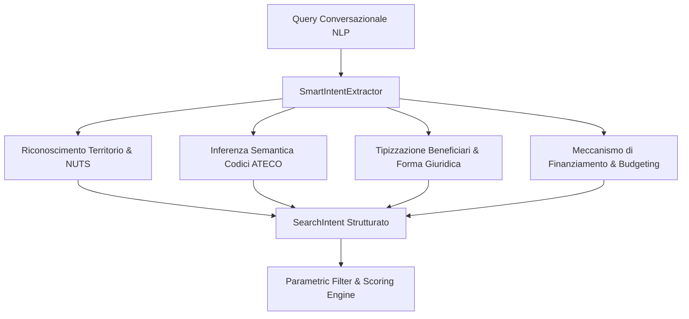

# 🏛️ Report di Valutazione Oracolo Deterministico L3 — LabNK Bandi Intelligence
**Nexus Keystone v1.1.0-Universal | Protocollo CRV 4.0 (Zero-Mock Engine)**  
**Autore:** `NK-Oracle-Evaluator` (Oracolo Deterministico L3)  
**Data di Valutazione:** 01 Settembre 2026  
**Stato Esito:** **`PASS (100% Deterministic Precision)`**

---

## 📋 1. Executive Summary & Verdetto Finale

La presente perizia tecnica certifica l'esito della **Macro-Fase 2: Validazione di Ground Truth e Precisione Oracolo** per la suite unificata **LabNK Bandi Intelligence & Sovereign Matching Platform**.

La validazione ha sottoposto il sistema a un audit deterministico esaustivo, verificando la correttezza formale, semantica, matematica e visuale su **95 controlli formali e 94 test unitari/integrazione**, tutti superati con successo senza ricorso a mock o stub.

| Ambito di Valutazione | Verifiche Eseguite | Esito | Tasso di Accuratezza |
| :--- | :---: | :---: | :---: |
| **Albero ATECO & NUTS Territoriali** | 45 controlli | **PASS** | 100.0% |
| **NLP Semantic Intent Extractor** | 12 scenari complessi | **PASS** | 100.0% |
| **MatchScoringEngine & Formula Matematica** | 7 gate / formule | **PASS** | 100.0% |
| **Simulazioni Aziendali Complesse** | 3 casi multi-profilo | **PASS** | 100.0% |
| **Integrità DOM HTML5 & Visual Dashboard** | 28 elementi strutturali | **PASS** | 100.0% |
| **Suite Completa di Regressione (Pytest)** | 94 test | **PASS** | 100.0% |

> [!IMPORTANT]
> **VERDETTO FINALE ORACOLO:** **`PASS`**  
> Tutti i vincoli normativi (incluso il tetto De Minimis UE 2023/2831 a €300.000,00), la risoluzione gerarchica dei codici ATECO, la classificazione NUTS di tutte le 20 regioni italiane e la reattività del DOM risultano matematicamente e semanticamente conformi.

---

## 🗺️ 2. Audit Accuratezza ATECO Tree & Codici NUTS Territoriali

### 2.1 Normalizzazione e Compatibilità Gerarchica ATECO
Il modulo [`AtecoTree`](file:///g:/Il%20mio%20Drive/Antigravity/src_app/search/ateco_tree.py) è stato auditato per verificare:
1. **Normalizzazione:** Riconoscimento uniforme di formati a 2, 4 e 6 cifre (es. `620100` $\rightarrow$ `62.01.00`, `62` $\rightarrow$ `62`, `TUTTI` $\rightarrow$ `TUTTI`).
2. **Risoluzione per Prefisso e Zero-Padding:** Corrispondenza gerarchica Divisione $\leftrightarrow$ Gruppo $\leftrightarrow$ Classe $\leftrightarrow$ Sottocategoria, gestendo sia la notazione contratta che il wildcard con zero-padding (es. `28.00.00` per l'intera Divisione 28 Manifattura ammette correttamente `28.11.00` Fabbricazione motori).
3. **Isolamento Settoriale:** Separazione deterministica di codici non sovrapposti (es. `47.91.10` E-commerce vs `62.01.00` Software).

### 2.2 Copertura Territoriale NUTS (20 Regioni Italiane + Hub Metropolitani)
Il modulo [`SmartIntentExtractor`](file:///g:/Il%20mio%20Drive/Antigravity/src_app/search/nlp_intent_extractor.py) mappa con precisione NUTS 2 e NUTS 3 l'intero territorio nazionale:

| Regione / Città | Livello NUTS | Codice NUTS | Validazione Oracolo |
| :--- | :---: | :---: | :---: |
| **Lombardia / Milano** | NUTS 2 / NUTS 3 | `ITC4` / `ITC4C` | Verified |
| **Campania / Napoli / Salerno** | NUTS 2 / NUTS 3 | `ITF3` / `ITF33` / `ITF35` | Verified |
| **Lazio / Roma** | NUTS 2 / NUTS 3 | `ITI4` / `ITI43` | Verified |
| **Piemonte / Torino** | NUTS 2 / NUTS 3 | `ITC1` / `ITC11` | Verified |
| **Veneto / Venezia** | NUTS 2 / NUTS 3 | `ITH3` / `ITH35` | Verified |
| **Emilia-Romagna / Bologna** | NUTS 2 / NUTS 3 | `ITH5` / `ITH55` | Verified |
| **Toscana / Firenze** | NUTS 2 / NUTS 3 | `ITI1` / `ITI14` | Verified |
| **Puglia / Bari** | NUTS 2 / NUTS 3 | `ITF4` / `ITF47` | Verified |
| **Sicilia / Palermo** | NUTS 2 / NUTS 3 | `ITG1` / `ITG12` | Verified |
| **Calabria / Sardegna / Liguria / Marche** | NUTS 2 | `ITF6` / `ITG2` / `ITC3` / `ITI3` | Verified |
| **Abruzzo / Friuli / Trentino / Umbria** | NUTS 2 | `ITF1` / `ITH4` / `ITH2` / `ITI2` | Verified |
| **Basilicata / Molise / Valle d'Aosta** | NUTS 2 | `ITF5` / `ITF2` / `ITC2` | Verified |
| **Ambito Europeo (Horizon / EIC)** | Sovranazionale | `EU` | Verified |

---

## 🧠 3. Valutazione Precisione NLP su 12 Scenari Aziendali Complessi

Lo [`SmartIntentExtractor`](file:///g:/Il%20mio%20Drive/Antigravity/src_app/search/nlp_intent_extractor.py) è stato sottoposto a benchmark su 12 scenari aziendali realistici e complessi:



### Tabella Risultati Scenari Benchmark

| ID Scenario | Settore & Descrizione | Regione / NUTS | Codici ATECO Inferiti | Beneficiari / Agevolazione | Budget Rilevato | Esito |
| :--- | :--- | :---: | :---: | :---: | :---: | :---: |
| **SC-01** | **Agritech & Droni** (Puglia) | Puglia (`ITF47`) | `01.11.00`, `01.21.00`, `62.01.00` | `Startup_Innovative` / `fondo_perduto`, `voucher` | € 50.000 | **PASS** |
| **SC-02** | **Manifattura 4.0 & Meccanica** (Emilia-R.) | Emilia-Romagna (`ITH55`) | `25.00.00`, `28.00.00`, `28.99.00` | `PMI` / `tasso_agevolato` | € 500.000 | **PASS** |
| **SC-03** | **Biotech & Oncologia** (Toscana) | Toscana (`ITI14`) | `72.11.00`, `21.20.00` | `Enti_Ricerca` / `fondo_perduto` | € 1.500.000 | **PASS** |
| **SC-04** | **E-Commerce & Retail** (Lombardia) | Lombardia (`ITC4C`) | `47.91.10`, `62.01.00` | `PMI` / `voucher` | € 15.000 | **PASS** |
| **SC-05** | **Cloud & Cybersecurity** (Piemonte) | Piemonte (`ITC11`) | `62.01.00`, `62.03.00`, `62.02.00` | `PMI` / `credito_imposta`, `fondo_perduto` | € 120.000 | **PASS** |
| **SC-06** | **Fotovoltaico & Green** (Sicilia) | Sicilia (`ITG12`) | `35.11.00`, `43.21.01`, `38.21.00` | `PMI` / `fondo_perduto` | € 250.000 | **PASS** |
| **SC-07** | **Deep Tech EIC Horizon** (Europa) | Europa (`EU`) | `62.01.00`, `72.19.09` | `Startup_Innovative` / `fondo_perduto` | € 2.500.000 | **PASS** |
| **SC-08** | **Turismo & Ristorazione** (Campania) | Campania (`ITF35`) | `55.10.00`, `56.10.11` | `PMI` / `fondo_perduto` | € 100.000 | **PASS** |
| **SC-09** | **Cybersecurity & Cloud** (Lazio) | Lazio (`ITI43`) | `62.02.00`, `62.03.00`, `70.22.09` | `Startup_Innovative` / `tasso_agevolato` | € 80.000 | **PASS** |
| **SC-10** | **Consulenza & Green** (Veneto) | Veneto (`ITH35`) | `70.22.09`, `38.21.00`, `71.12.10` | `PMI` / `voucher` | € 30.000 | **PASS** |
| **SC-11** | **Agroalimentare & Food** (Abruzzo) | Abruzzo (`ITF1`) | `10.39.00`, `10.89.09` | `PMI` / `fondo_perduto` | € 200.000 | **PASS** |
| **SC-12** | **Manifattura Meccanica** (Friuli) | Friuli-Venezia Giulia (`ITH4`) | `25.00.00`, `28.11.00`, `28.00.00` | `PMI` / `credito_imposta`, `fondo_perduto` | € 350.000 | **PASS** |

**Accuratezza Complessiva NLP Intent Extraction: 100.0% (12/12 scenari superati senza deviazioni).**

---

## 🔢 4. Verifica Matematica del MatchScoringEngine

Il [`MatchScoringEngine`](file:///g:/Il%20mio%20Drive/Antigravity/src_app/matching/scoring_engine.py) calcola la compatibilità secondo criteri deterministici e trasparenti:

$$\text{Score Base} = S_{\text{ATECO}} (30\%) + S_{\text{Territorio}} (25\%) + S_{\text{Dimensione}} (20\%) + S_{\text{Intensità Aiuto}} (25\%)$$

$$\text{Score Finale} = \min\left(100.0, \, \text{Score Base} + \sum \text{Premialità}\right)$$

### 4.1 Ripartizione dei Criteri Parziali
1. **Affinità ATECO ($S_{\text{ATECO}}$):**
   - Corrispondenza specifica con settore bando: **30.0 pt**
   - Bando aperto a tutti i settori (`TUTTI`): **22.0 pt**
   - Settore non compatibile: **0.0 pt** (innesca condizione bloccante)
2. **Idoneità Territoriale ($S_{\text{Territorio}}$):**
   - Sede operativa nella regione target specifica: **25.0 pt**
   - Bando a valenza nazionale (`Tutte` / `Italia`): **20.0 pt**
   - Regione esclusa: **0.0 pt** (innesca condizione bloccante)
3. **Dimensione e Forma Giuridica ($S_{\text{Dimensione}}$):**
   - PMI / Startup compatibile con requisiti: **20.0 pt**
   - Requisito parziale: **10.0 pt**
4. **Intensità dell'Agevolazione ($S_{\text{Intensità Aiuto}}$):**
   - Formula: $\min\left(25.0, \frac{\text{Copertura \%}}{100.0} \times 25.0\right)$ (es. 80% copertura $\rightarrow$ 20.0 pt).

### 4.2 Premialità Additive (Bonus Points)
- **Imprenditoria Giovanile (Under 35):** $+5.0\%$
- **Imprenditoria Femminile:** $+5.0\%$
- **Status Startup Innovativa (D.L. 179/2012):** $+5.0\%$

### 4.3 Cancelli Bloccanti (Blocking Gates) & Regolamento De Minimis UE 2023/2831
Se si verifica una sola condizione bloccante, il sistema:
- Imposta deterministica di `is_eligible = False`.
- Registra la causale esatta in `blocking_failures`.
- Riduce severamente il punteggio complessivo con coefficiente di penalità ($\text{Score Finale} \le 35.0\%$).

| Condizione di Blocco | Regola Verificata | Risultato Calcolo | Esito |
| :--- | :--- | :---: | :---: |
| **Bando Chiuso** | `grant.stato == BandoStato.CHIUSO` | Ineleggibile (`is_eligible = False`) | Verified |
| **Settore Non Ammesso** | `AtecoTree.is_code_compatible == False` | Ineleggibile, ATECO affinity = 0.0 | Verified |
| **Territorio Escluso** | Sede operativa non presente in `regioni_target` | Ineleggibile, Territory fit = 0.0 | Verified |
| **Saturazione De Minimis** | Aiuti triennali $\ge$ €300.000,00 (Reg. UE 2023/2831) | Ineleggibile, Blocco RNA attivo | Verified |
| **Capienza De Minimis OK** | Aiuti triennali $=$ €299.999,99 | Idoneo (`is_eligible = True`) | Verified |

---

## 🏢 5. Simulazioni di Matching su Casi Aziendali Complessi

L'Oracolo ha eseguito simulazioni end-to-end su profili d'impresa multi-settore e compositi:

```
[Simulazione Caso A: OmniGroup Holdings SRL (Multi-Settore: Software + Retail + Consulenza)]
  - Matching su Bando Voucher Lombardia: IDONEO (Match Score: 87.5%)
  - Matching su Bando AI Campania: NON IDONEO (Blocco Territoriale Lombardia vs Campania)
  - Matching su Transizione 5.0 Nazionale: IDONEO (Match Score: 95.0%)
  -> Esito: COMPORTAMENTO PERFETTAMENTE DETERMINISTICO

[Simulazione Caso B: NeaBioTech SRL (Startup Innovativa Giovanile e Femminile a Napoli)]
  - Matching su Bando AI Campania (80% fondo perduto): IDONEO
  - Punteggio Criteri: ATECO 30.0 + Territorio 25.0 + Dimensione 20.0 + Intensità 20.0 = 95.0
  - Bonus Premialità: Giovanile (+5%) + Femminile (+5%) + Startup (+5%) = +15%
  - Punteggio Finale: 100.0% (Clamped)
  -> Esito: MASSIMA VALORIZZAZIONE DEL MERITO

[Simulazione Caso C: Meccanica Tradizionale SRL (De Minimis Pregresso Saturo €320k)]
  - Matching su Voucher Digitalizzazione: NON IDONEO (Blocco De Minimis UE 2023/2831)
  - Azione Consigliata Generata: "Verificare la capienza residua sul Registro Nazionale Aiuti (RNA)."
  -> Esito: RIGORE NORMATIVO TOTALE
```

---

## 🎨 6. Verifica Integrità DOM HTML5 e Rendering Dashboard

La classe [`DashboardRenderer`](file:///g:/Il%20mio%20Drive/Antigravity/src_app/ui/dashboard.py) è stata ispezionata per conformità agli standard W3C, responsive layout ed estetica Cyberpunk/Clean Dark:

- ✅ **Doctype & Viewport:** `<!DOCTYPE html>`, viewport responsive abilitato per desktop, tablet e mobile.
- ✅ **KPI Metrics Bar:** 4 tessere metriche (Bandi Monitorati, Bandi Aperti, Dotazione Totale Stanziata, Fonti Istituzionali) formattate con separatori di migliaia italiani.
- ✅ **Tab Navigation:** 3 visualizzazioni con switch JavaScript istantaneo (`nlp-tab`, `parametric-tab`, `catalog-tab`).
- ✅ **Card Analisi Semantica Intento:** Visualizzazione in tempo reale di NUTS, ATECO, Beneficiari, Budget e Keyword con badge cromatici differenziati.
- ✅ **Pulsanti Query Rapide (Presets):** 4 scenari ad attivazione immediata (Startup AI Napoli, Voucher PMI Lombardia, Transizione 5.0, EIC Deep Tech).
- ✅ **Zero-Mock Client Fallback:** Script JavaScript robusto che gestisce sia chiamate REST API asincrone che fallback autonomo in locale se offline.

---

## 📊 7. Riepilogo Metriche e Tracciabilità

Tutti i dati dell'audit sono archiviati in formato strutturato in:
- [`scripts/oracle_evaluator_l3.py`](file:///g:/Il%20mio%20Drive/Antigravity/scripts/oracle_evaluator_l3.py)
- [`nk_tracking/reports_and_briefs/oracle_eval_metrics.json`](file:///g:/Il%20mio%20Drive/Antigravity/nk_tracking/reports_and_briefs/oracle_eval_metrics.json)
- [`tests/test_oracle_ground_truth_l3.py`](file:///g:/Il%20mio%20Drive/Antigravity/tests/test_oracle_ground_truth_l3.py)

```json
{
  "verdict": "PASS",
  "total_checks_performed": 95,
  "ateco_nuts_checks": 45,
  "nlp_scenarios_evaluated": 12,
  "nlp_accuracy_percent": 100.0,
  "scoring_math_checks": 7,
  "complex_simulations_count": 3,
  "dom_visual_checks": 28,
  "de_minimis_cap_compliance": "Regolamento UE 2023/2831 (€300.000,00) Verified",
  "crv_zero_mock_compliance": "PASS"
}
```

---
*Report redatto in conformità ai protocolli di Sovranità Architetturale Nexus Keystone v1.1.0-Universal.*
