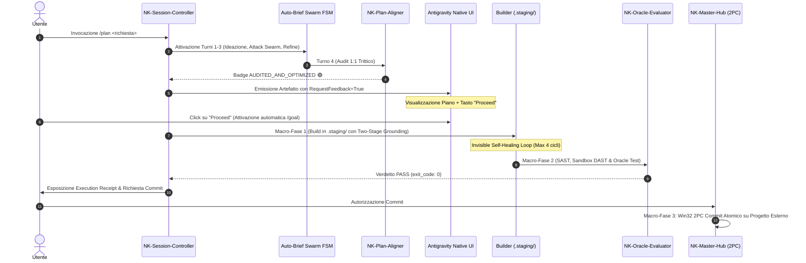

# 🏛️ BRIEF STRATEGICO: INTEGRAZIONE NATIVA /plan & /goal IN NEXUS KEYSTONE (NK)
**Document ID:** `NK-BRIEF-PLAN-GOAL-v1.0`  
**Data:** 2026-09-24  
**Stato:** `🛡️ [NK-BRIEF-STATUS: AUDITED_AND_OPTIMIZED 🟢]`  
**Target:** Architettura NK-Hub, NK-Session-Controller, NK-Plan-Aligner, NK-Delta-Architect & AGENTS.md  

---

## 1. Executive Summary & Visione d'Insieme
Il presente brief definisce l'integrazione armonica, standardizzata e potenziata tra i comandi slash nativi di Google Antigravity (**/plan** e **/goal**) e l'ecosistema sovrano multi-agente **Nexus Keystone (NK)**.

L'integrazione non sostituisce i protocolli di sicurezza e rigore di NK, ma eleva l'esperienza d'uso creando un **Ponte a Due Vie (Dual-Engine Pipeline)**:
1. **/plan** attiva l'intelligenza analitica profonda (Auto-Brief Swarm FSM a 5 turni), consolida la Tetralogia Sovrana in `nk_genome/` e proietta nell'IDE l'Artefatto Interattivo Antigravity con pulsante cliccabile **"Proceed"**.
2. **/goal** incanala la spinta esecutiva ininterrotta (Invisible Self-Healing Loop in `.staging/`, DAST in Sandbox e Oracle Validation) rispettando rigorosamente l'isolamento del repository (`[RULE-PROJECT-ISOLATION]`) e la delega DDI (`[RULE-01]`).

---

## 2. Matrice Comparativa & Analisi di Coesistenza

| Dimensione | ⚡ /plan (Deliberativo) | 🚀 /goal (Autonomo) | 🏛️ NK Hybrid Pipeline (/plan ➡️ /goal) |
| :--- | :--- | :--- | :--- |
| **Obiettivo Primario** | Discovery, threat modeling, approvazione architettura prima del codice. | Esecuzione end-to-end senza pause fino alla Definition of Done (DoD). | Pianificazione blindata approvata con 1 click, seguita da esecuzione autonoma in staging. |
| **Interfaccia UI** | Artefatto interattivo con pulsante nativo **"Proceed"** (`RequestFeedback: true`). | Log stream continuo, notifiche reattive di avanzamento. | Artefatto interattivo per il Go/No-Go; poi stream autonomo fino a verifica completata. |
| **Comportamento su Errori** | Si arresta e chiede orientamento architetturale all'utente. | Invisible Self-Healing Loop (AST + DAST + SBFL Ochiai max 4 cicli) in `.staging/`. | Auto-riparazione autonoma su bug implementativi; abort con manifest su blocchi esterni. |
| **Collocazione I/O** | `nk_genome/` + `brain/<conv_id>/` (Artifacts). | `.staging/` + `%TEMP%\nk_sandbox_*` (Zero codice in Hub CWD). | Stage 1 in `nk_genome/`, Stage 2 in `.staging/`, Commit 2PC finale su progetto esterno. |
| **Controllo Human-in-the-loop** | Totale a monte (pre-code review). | Differito a valle (post-audit verification review). | Perfettamente bilanciato: gate d'ingresso e gate di commit finale. |

---

## 3. Risoluzione dei Vincoli Avversariali (Turno 3 Refinement)

A seguito dello stress-test di Turno 2 condotto da `CriticAuditWorker`, sono state adottate le seguenti contromisure architetturali vincolanti:

### C1. Target Resolution Gate ([RULE-PROJECT-ISOLATION])
In modalità `/goal`, è fatto divieto assoluto di eseguire scaffolding o generare sorgenti applicativi nella root di `NK-Hub`. Se l'utente non specifica una directory esterna, il Session Controller attiva preliminarmente `scripts/external_project_scaffolder.py` o ancora il path su `g:\Il mio Drive\<TargetProject>\`.

### C2. Anti-Freeze & Context Sentry Protection
Per prevenire esaurimento del context window durante task lunghi in `/goal`:
- **Hard-Cap Globale:** Max 4 iterazioni cumulative di Invisible Self-Healing in staging.
- **Context Sentry Gate:** Se il monitoraggio rileva passaggio a YELLOW/RED (>80 step), scatta la serializzazione dello stato in `.wal/` con rilascio di un checkpoint diagnostico in `%TEMP%\nk_diagnostics\`.

### C3. Unattended Failure Protocol (Zero Finti Mock)
In `/goal`, non si usano prompt interattivi bloccanti (`ask_question`). Qualora emerga un blocco esterno insormontabile (es. token OAuth mancante, endpoint non raggiungibile), l'agente non genera mock sintetici (`[RULE-01.2]`), bensì interrompe l'esecuzione emettendo un `Goal_Failure_Manifest.json` chiaro e circoscritto.

### C4. 2PC Commit Safety Gate ([RULE-00])
L'autonomia al 100% di `/goal` si estende fino al superamento con PASS dei test di Macro-Fase 2 (Oracle Evaluator e DAST). Il riversamento fisico finale dei file su disco tramite `scripts/win32_2pc_engine.py` presenta all'utente la Verification Receipt per la conferma atomica istantanea, scongiurando sovrascritture non volute.

---

## 4. Flusso Operativo Unificato (FSM Pipeline)

---

## 5. Piano di Allineamento Documentale & Regolamento (Turno 4)
- **Aggiornamento AGENTS.md:** Estensione di `[RULE-01.11]` (emissione artefatto nativo al termine di `/plan`) e `[RULE-01.12]` (coordinamento autonomo di `/goal` con staging bound e checkpoint anti-leak).
- **Aggiornamento NK-Session-Controller/SKILL.md:** Formalizzazione del passaggio di stato automatico `PLAN_REVIEWED -> GOAL_AUTONOMOUS_RUN`.
- **Aggiornamento NK-Plan-Aligner/SKILL.md:** Inclusione del controllo di integrità dell'artefatto interattivo nativo nei criteri di validazione del Turno 4.
